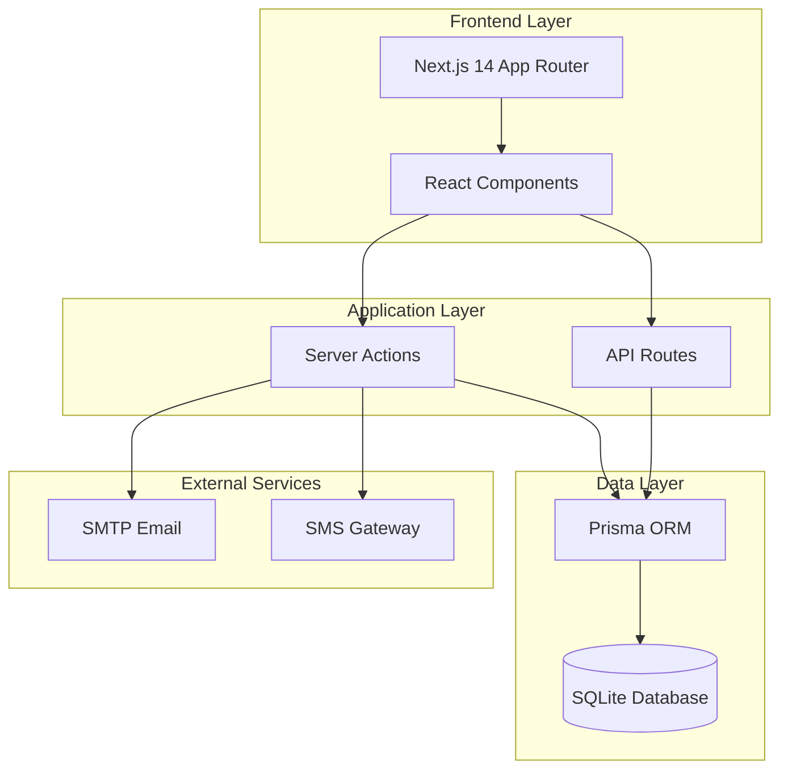

# Honda SPICE ERP System Documentation
**Version:** 1.0 (Baseline)  
**Date:** 2026-02-03  
**Status:** 📌 Production Baseline

---

## 📋 Document Information

| Attribute | Value |
|-----------|-------|
| **System Name** | Honda SPICE ERP (Sales, Parts, Insurance, CRM, Enterprise) |
| **Organization** | Honda Oto Cộng Hòa |
| **Document Type** | System Documentation Baseline |
| **Version** | 1.0 |
| **Last Updated** | 2026-02-03 |
| **Technology Stack** | Next.js 14, React 18, TypeScript, Prisma, SQLite |

---

## 📖 Table of Contents

1. [System Overview](#1-system-overview)
2. [Architecture](#2-architecture)
3. [Modules](#3-modules)
4. [Data Model](#4-data-model)
5. [Technology Stack](#5-technology-stack)
6. [User Roles & Permissions](#6-user-roles--permissions)
7. [Integration Points](#7-integration-points)
8. [Development Guidelines](#8-development-guidelines)
9. [Recent Changes](#9-recent-changes)
10. [References](#10-references)

---

## 1. System Overview

### 1.1 Purpose

Honda SPICE ERP là hệ thống quản lý tổng thể cho đại lý Honda, tích hợp toàn bộ quy trình từ CRM, bán hàng, dịch vụ, phụ tùng, bảo hiểm đến kế toán.

### 1.2 Business Objectives

| Objective | Target | Impact |
|-----------|--------|--------|
| **Lead Conversion** | 15% → 25% | Tăng doanh thu bán hàng |
| **Customer Satisfaction** | CSAT ≥ 4.5/5.0 | Tăng retention rate |
| **Process Efficiency** | Giảm 50% thời gian báo giá | Tăng năng suất |
| **Service Quality** | +30% appointments | Tăng dịch vụ sau bán |
| **Inventory Control** | -25% vốn tồn kho | Giảm chi phí |

### 1.3 Scope

**In Scope:**
- ✅ Customer Relationship Management (CRM)
- ✅ Sales Operations (Quotation, Test Drive, Delivery)
- ✅ Service Management (Appointments, Repair Orders)
- ✅ Parts & Inventory Management
- ✅ Insurance Contract Management
- ✅ Accounting & Financial Reporting
- ✅ Master Data Management
- ✅ System Administration

**Out of Scope:**
- ❌ Mobile Native Apps (iOS/Android)
- ❌ E-commerce / Online Sales
- ❌ AI Chatbot / Virtual Assistant
- ❌ IoT Vehicle Tracking
- ❌ Blockchain Integration

---

## 2. Architecture

### 2.1 System Architecture



### 2.2 Module Structure

```
Honda SPICE ERP
│
├─ 📊 Dashboard (Tổng Quan)
│   ├─ KPI Overview
│   ├─ Sales Analytics
│   └─ Service Analytics
│
├─ 👥 CRM
│   ├─ Lead Management
│   ├─ Customer 360° View
│   ├─ Loyalty Program
│   ├─ Marketing Campaigns
│   └─ Complaint Handling
│
├─ 🚗 Sales
│   ├─ Quotation Management
│   ├─ Test Drive Scheduling
│   ├─ Deposit Management
│   ├─ VIN Allocation
│   └─ PDS & Delivery
│
├─ 🔧 Service
│   ├─ Appointment Booking
│   ├─ Reception
│   ├─ Repair Orders
│   ├─ Technician Workflow
│   ├─ QC & Settlement
│   └─ Bay Management
│
├─ 📦 Parts
│   ├─ Inventory Management
│   ├─ Stock Movements
│   ├─ Purchase Requisition
│   ├─ Aging Analysis
│   ├─ Pricing Management
│   └─ Stock Take
│
├─ 🛡️ Insurance
│   ├─ Contract Management
│   ├─ Claims Processing
│   └─ Renewal Reminders
│
├─ 💰 Accounting
│   ├─ General Ledger
│   ├─ AR/AP Management
│   ├─ Tax Reports
│   ├─ P&L / Balance Sheet
│   └─ Cash Flow
│
├─ 📊 Master Data
│   ├─ Nhân Sự (Employees)
│   ├─ Đối Tác (Suppliers, Insurance Companies)
│   ├─ Phụ Tùng & Kho (Warehouses, UOMs, Part Categories, Part Locations)
│   ├─ Xe & Thanh Toán (Vehicle Models, Colors, Payment Methods)
│   ├─ Accessories
│   ├─ Service Catalog
│   └─ System Settings
│
└─ ⚙️ Administration
    ├─ User Management
    ├─ Role & Permissions
    ├─ System Monitoring
    └─ Audit Logs
```

### 2.3 Navigation Architecture

**Menu Hierarchy (3-Level):**

```
Level 0: Module Groups (Dashboard, CRM, Sales, Service, Parts, Insurance, Accounting, Master Data, Admin)
Level 1: Sub-Groups (only for Master Data: Nhân Sự, Đối Tác, Phụ Tùng & Kho, Xe & Thanh Toán)
Level 2: Pages/Features
```

**Example - Master Data (3-Level):**
```
Master Data (Level 0)
  ├─ Nhân Sự (Level 1)
  │   └─ Nhân Viên (Level 2)
  ├─ Đối Tác (Level 1)
  │   ├─ Nhà Cung Cấp (Level 2)
  │   └─ Công Ty Bảo Hiểm (Level 2)
  ├─ Phụ Tùng & Kho (Level 1)
  │   ├─ Kho Hàng (Level 2)
  │   ├─ Đơn Vị Tính (Level 2)
  │   ├─ Danh Mục Phụ Tùng (Level 2)
  │   └─ Vị Trí Phụ Tùng (Level 2)
  └─ Xe & Thanh Toán (Level 1)
      ├─ Màu Xe (Level 2)
      ├─ Dòng Xe (Level 2)
      └─ Phương Thức Thanh Toán (Level 2)
```

---

## 3. Modules

### 3.1 Dashboard (Tổng Quan)

**Purpose:** Cung cấp overview về hoạt động kinh doanh

**Key Features:**
- KPI Cards (Revenue, Leads, Service Orders, Inventory)
- Sales Charts (By Model, By Month, By Sales Consultant)
- Service Charts (Bay Utilization, Service Type Distribution)
- Live Metrics (Today's appointments, Pending quotations)

**Routes:**
- `/dashboard`

---

### 3.2 CRM Module

**Purpose:** Quản lý khách hàng và leads

**Key Features:**
- Lead Board (Kanban view by stages)
- Customer Database (360° view)
- Loyalty Program Management
- Marketing Campaign Execution
- Complaint Tracking

**Routes:**
- `/crm/leads`
- `/crm/customers`
- `/crm/loyalty`
- `/crm/campaigns`
- `/crm/complaints`

**Database Tables:**
- `leads` - Lead records with scoring
- `customers` - Customer master data
- `loyalty_tiers` - Tier definitions
- `loyalty_points` - Points transactions
- `marketing_campaigns` - Campaign definitions
- `complaints` - Customer complaints

---

### 3.3 Sales Module

**Purpose:** Quản lý quy trình bán hàng

**Key Features:**
- Quotation Management (Create, Send, Track)
- Test Drive Scheduling
- Deposit Tracking
- VIN Allocation
- PDS (Pre-Delivery Service)
- Vehicle Delivery

**Routes:**
- `/sales/quotations`
- `/sales/test-drives`
- `/sales/deposits`
- `/sales/vin-allocation`
- `/sales/deliveries`

**Database Tables:**
- `quotations` - Quotation records
- `quotation_items` - Line items (vehicle, accessories, services)
- `test_drives` - Test drive bookings
- `deposits` - Deposit records
- `deliveries` - Delivery records
- `vehicles` - VIN inventory

**Business Flow:**
```
Lead → Quotation → Test Drive → Deposit → VIN Allocation → PDS → Delivery → Customer
```

---

### 3.4 Service Module

**Purpose:** Quản lý dịch vụ sau bán hàng

**Key Features:**
- Online Appointment Booking
- Service Reception
- Repair Order Management
- Technician Assignment
- Bay Management
- QC & Settlement
- Service History Tracking

**Routes:**
- `/service/appointments`
- `/service/reception`
- `/service/repair-orders`
- `/service/bay-management`
- `/service/qc`

**Database Tables:**
- `appointments` - Service appointments
- `repair_orders` - RO records
- `repair_order_items` - RO line items (services, parts, labor)
- `service_bays` - Bay definitions
- `bay_assignments` - Bay allocation
- `service_history` - Customer service history

**Business Flow:**
```
Appointment → Reception → RO Creation → Technician Assignment → Work → QC → Settlement → Delivery
```

---

### 3.5 Parts Module

**Purpose:** Quản lý tồn kho phụ tùng

**Key Features:**
- Inventory Tracking (Real-time)
- Stock Movements (IN/OUT/ADJUST/TRANSFER)
- Purchase Requisition
- Aging Analysis
- Pricing Management
- Stock Take (Kiểm kê)
- Backorder Management

**Routes:**
- `/parts/inventory`
- `/parts/movements`
- `/parts/purchases`
- `/parts/aging`
- `/parts/pricing`
- `/parts/stock-take`
- `/parts/backorder`

**Database Tables:**
- `parts` - Part master data
- `part_stock` - Inventory levels by warehouse
- `stock_movements` - All stock transactions
- `purchase_requisitions` - PR records
- `stock_take` - Stock take records
- `part_pricing` - Pricing tiers

---

### 3.6 Insurance Module

**Purpose:** Quản lý hợp đồng bảo hiểm

**Key Features:**
- Insurance Contract Management
- Insurance Product Catalog
- Claims Processing
- Renewal Reminders
- Commission Calculation

**Routes:**
- `/insurance/contracts`
- `/insurance/products`
- `/insurance/claims`
- `/insurance/renewals`

**Database Tables:**
- `insurance_contracts` - Contract records
- `insurance_products` - Product definitions
- `insurance_claims` - Claim records
- `insurance_companies` - Master data

---

### 3.7 Accounting Module

**Purpose:** Quản lý tài chính và kế toán

**Key Features:**
- General Ledger
- Chart of Accounts
- AR/AP Management
- Tax Reports
- P&L Statement
- Balance Sheet
- Cash Flow Statement
- Fixed Assets

**Routes:**
- `/accounting/ledger`
- `/accounting/accounts`
- `/accounting/ar`
- `/accounting/ap`
- `/accounting/tax`
- `/accounting/reports`
- `/accounting/assets`

**Database Tables:**
- `chart_of_accounts` - Account definitions
- `journal_entries` - Journal records
- `ar_invoices` - Receivable invoices
- `ap_invoices` - Payable invoices
- `tax_reports` - Tax submissions

---

### 3.8 Master Data Module

**Purpose:** Quản lý dữ liệu chuẩn hóa

**Current Implementation (10 items in 4 sub-groups):**

#### Sub-Group 1: Nhân Sự (1 item)
- **Nhân Viên** (`/master-data/employees`)
  - Employee management
  - Role assignments
  - Department structure

#### Sub-Group 2: Đối Tác (2 items)
- **Nhà Cung Cấp** (`/master-data/suppliers`)
  - Supplier master data
  - Contact information
  - Payment terms

- **Công Ty Bảo Hiểm** (`/master-data/insurance-companies`)
  - Insurance company profiles
  - Product offerings
  - Commission rates

#### Sub-Group 3: Phụ Tùng & Kho (4 items)
- **Kho Hàng** (`/master-data/warehouses`)
  - Warehouse definitions
  - Location management

- **Đơn Vị Tính** (`/master-data/uoms`)
  - Unit of measure definitions
  - Conversion factors

- **Danh Mục Phụ Tùng** (`/master-data/part-categories`)
  - Part categorization
  - Taxonomy structure

- **Vị Trí Phụ Tùng** (`/master-data/part-locations`)
  - Physical locations in warehouse
  - Bin/shelf management

#### Sub-Group 4: Xe & Thanh Toán (3 items)
- **Màu Xe** (`/master-data/vehicle-colors`)
  - Color definitions
  - Color codes

- **Dòng Xe** (`/master-data/vehicle-models`)
  - Model definitions
  - Specifications
  - Base pricing

- **Phương Thức Thanh Toán** (`/master-data/payment-methods`)
  - Payment method definitions
  - Processing rules

#### Additional Master Data (not in menu)
- Accessories Master
- Service Catalog
- Service Bays
- Scoring Rules
- System Settings

**Database Tables:**
- `employees`
- `suppliers`
- `insurance_companies`
- `warehouses`
- `uoms`
- `part_categories`
- `part_locations`
- `vehicle_colors`
- `vehicle_models`
- `payment_methods`
- `accessories`
- `service_catalog`
- `service_bays`
- `scoring_rules`
- `system_settings`

---

### 3.9 Administration Module

**Purpose:** System administration and monitoring

**Key Features:**
- User Management (CRUD)
- Role & Permission Management
- System Monitoring (Performance, Logs)
- Audit Logs
- Backup & Restore
- System Configuration

**Routes:**
- `/admin/users`
- `/admin/roles`
- `/admin/monitoring`
- `/admin/audit-logs`
- `/admin/backup`
- `/admin/settings`

**Database Tables:**
- `users` - System users
- `roles` - Role definitions
- `permissions` - Permission matrix
- `user_roles` - User-role assignments
- `activity_logs` - Audit trail
- `system_logs` - Error/warning logs

---

## 4. Data Model

### 4.1 Core Entities

**Business Entities:**
- `leads` - Potential customers
- `customers` - Registered customers
- `vehicles` - VIN inventory
- `quotations` - Sales quotations
- `repair_orders` - Service orders
- `parts` - Part inventory
- `insurance_contracts` - Insurance policies

**Master Data Entities:**
- `employees`
- `suppliers`
- `insurance_companies`
- `warehouses`
- `vehicle_models`
- `part_categories`
- `service_catalog`

**Transaction Entities:**
- `stock_movements`
- `journal_entries`
- `loyalty_points`
- `marketing_campaigns`

**Supporting Entities:**
- `users`
- `roles`
- `permissions`
- `activity_logs`
- `system_settings`

### 4.2 Database Schema

**Location:** `prisma/schema.prisma`

**Total Models:** 100+ Prisma models

**Key Relationships:**
```
Customer 1---N Quotations
Customer 1---N RepairOrders
Customer 1---N InsuranceContracts
Customer 1---N LoyaltyPoints

Quotation 1---N QuotationItems
RepairOrder 1---N RepairOrderItems

Part 1---N StockMovements
Part 1---N PartStock (by Warehouse)

Employee N---1 Department
Employee N---N Skills
```

---

## 5. Technology Stack

### 5.1 Frontend

| Technology | Version | Purpose |
|------------|---------|---------|
| **Next.js** | 14.x | React framework with App Router |
| **React** | 18.x | UI library |
| **TypeScript** | 5.x | Type safety |
| **Tailwind CSS** | 3.x | Styling |
| **Radix UI** | Latest | Accessible components |
| **Lucide React** | Latest | Icon library |
| **Recharts** | 2.x | Charts and graphs |
| **React Hook Form** | 7.x | Form management |
| **Zod** | 3.x | Schema validation |

### 5.2 Backend

| Technology | Version | Purpose |
|------------|---------|---------|
| **Node.js** | 20.x LTS | Runtime |
| **Prisma** | 5.x | ORM |
| **SQLite** | 3.x | Database (dev/production) |
| **Next.js API Routes** | 14.x | API endpoints |
| **Server Actions** | Next.js 14 | Server-side mutations |

### 5.3 Development Tools

| Tool | Purpose |
|------|---------|
| **pnpm** | Package manager |
| **ESLint** | Linting |
| **Prettier** | Code formatting |
| **Git** | Version control |
| **VS Code** | IDE |

### 5.4 File Structure

```
c:/Honda/Antigravity/
├── app/                    # Next.js 14 App Router
│   ├── (main)/            # Main application routes
│   │   ├── dashboard/
│   │   ├── crm/
│   │   ├── sales/
│   │   ├── service/
│   │   ├── parts/
│   │   ├── insurance/
│   │   ├── accounting/
│   │   ├── master-data/
│   │   └── admin/
│   ├── api/               # API routes
│   └── layout.tsx         # Root layout
│
├── components/            # Reusable components
│   ├── ui/               # UI primitives (Radix)
│   ├── crm/              # CRM components
│   ├── sales/            # Sales components
│   ├── service/          # Service components
│   ├── parts/            # Parts components
│   ├── master/           # Master data components
│   ├── Sidebar.tsx       # Main sidebar navigation
│   └── Header.tsx        # Application header
│
├── lib/                  # Shared utilities
│   ├── prisma.ts         # Prisma client
│   ├── menu-list.ts      # Menu configuration
│   ├── utils.ts          # Helper functions
│   └── validations.ts    # Zod schemas
│
├── prisma/               # Database
│   ├── schema.prisma     # Database schema
│   ├── seed.ts           # Seed data
│   └── dev.db            # SQLite database file
│
├── types/                # TypeScript types
│   ├── master-data.types.ts
│   ├── crm.types.ts
│   └── ...
│
├── docs/                 # Documentation
│   ├── requirements/     # BRD, FRD
│   ├── design/           # ERD, UI Specs, API Specs
│   ├── implementation/   # Implementation docs
│   └── testing/          # UAT plans, test cases
│
└── public/               # Static assets
```

---

## 6. User Roles & Permissions

### 6.1 Role Matrix

| Role | Modules | Permissions |
|------|---------|-------------|
| **Admin** | All | Full CRUD access |
| **Manager** | All | Read all, Approve workflows |
| **Sales Consultant** | CRM, Sales, Customers | CRUD Leads, Quotations, Test Drives |
| **Service Advisor** | Service, Customers | CRUD Appointments, Repair Orders |
| **Technician** | Service (limited) | Update job status, Request parts |
| **Parts Manager** | Parts, Inventory | Full Parts module access |
| **Accountant** | Accounting, Reports | Full Accounting access, Read-only others |
| **Receptionist** | CRM (limited), Service | Create Leads, Book Appointments |

### 6.2 Permission System

**Format:** `MODULE.ACTION`

**Examples:**
- `MASTER_DATA.READ`
- `MASTER_DATA.CREATE`
- `MASTER_DATA.UPDATE`
- `MASTER_DATA.DELETE`
- `SALES.CREATE_QUOTATION`
- `SALES.APPROVE_DISCOUNT`
- `SERVICE.CREATE_RO`
- `ACCOUNTING.VIEW_REPORTS`

---

## 7. Integration Points

### 7.1 Internal Integrations

| Integration | Components | Purpose |
|-------------|------------|---------|
| **CRM → Sales** | Lead → Customer → Quotation | Lead conversion |
| **Sales → Inventory** | Quotation → VIN Allocation | Vehicle inventory |
| **Service → Parts** | Repair Order → Part Request | Parts consumption |
| **Sales → Accounting** | Quotation → Invoice | Revenue recognition |
| **Service → Accounting** | Repair Order → Invoice | Service revenue |
| **All → Activity Logs** | All modules → Audit trail | Compliance |

### 7.2 External Integrations

| Integration | Type | Status |
|-------------|------|--------|
| **Email (SMTP)** | Notifications | ✅ Planned |
| **SMS Gateway** | Reminders | ✅ Planned |
| **Excel Import/Export** | Data exchange | ✅ Implemented |
| **PDF Generation** | Documents | ✅ Planned |

---

## 8. Development Guidelines

### 8.1 Coding Standards

**TypeScript:**
- Use strict mode
- Define interfaces for all data structures
- Avoid `any` type

**React Components:**
- Use functional components
- Use hooks (useState, useEffect, etc.)
- Keep components small and focused
- Extract reusable logic to custom hooks

**Styling:**
- Use Tailwind CSS utility classes
- Follow design system colors and spacing
- Responsive design (mobile-first)

**Naming Conventions:**
- Components: PascalCase (`EmployeeManagement.tsx`)
- Files: kebab-case for routes (`employee-management/`)
- Variables: camelCase (`selectedEmployee`)
- Constants: UPPER_SNAKE_CASE (`MAX_FILE_SIZE`)

### 8.2 Common Patterns

**SelectItem Empty Value Fix:**
```typescript
// BAD - Empty string causes runtime error
<SelectItem value="">All</SelectItem>

// GOOD - Use "all" with conversion logic
<Select 
    value={selectedValue || "all"} 
    onValueChange={(val) => setSelectedValue(val === "all" ? "" : val)}
>
    <SelectItem value="all">All Items</SelectItem>
</Select>
```

**Generic Master Data Grid:**
- Use `GenericMasterDataGrid` component
- Define columns configuration
- Implement search and filters
- Support pagination

**Form Validation:**
- Use Zod schemas
- React Hook Form integration
- Display inline validation errors

### 8.3 Database Conventions

**Table Naming:**
- Lowercase with underscores: `vehicle_models`
- Plural form for entities: `customers`, `parts`

**Column Naming:**
- Lowercase with underscores: `created_at`, `model_name`
- Foreign keys: `{entity}_id` (e.g., `customer_id`)

**Timestamp Columns:**
- `created_at` - Record creation timestamp
- `updated_at` - Last update timestamp
- `deleted_at` - Soft delete timestamp (nullable)

---

## 9. Recent Changes

### 9.1 Master Data Enhancement (2026-02-03)

**Summary:** Comprehensive Master Data module improvements

**Changes:**
1. ✅ Fixed SelectItem empty value bugs (EmployeeManagement, SupplierManagement)
2. ✅ Added Phụ Tùng menu items (Part Categories, Part Locations)
3. ✅ Moved Master Data menu before Admin
4. ✅ Created 4 sub-groups for Master Data (3-level hierarchy)

**Impact:**
- Bug-free filter dropdowns
- Complete Master Data menu coverage
- Better menu organization
- Scalable navigation pattern

**Details:** See [`docs/implementation/reports/master_data_enhancement_v1.0.md`](file:///c:/Honda/Antigravity/docs/implementation/reports/master_data_enhancement_v1.0.md)

### 9.2 Previous Major Versions

- **v0.9** - Master Data UAT completion
- **v0.8** - CRM and Parts restoration from backup
- **v0.7** - Service module implementation
- **v0.6** - Sales module implementation
- **v0.5** - Initial dashboard and CRM

---

## 10. References

### 10.1 Requirements Documentation

| Document | Version | Path |
|----------|---------|------|
| **BRD** | 2.2 | `docs/requirements/BRD/brd_honda_dms_v2.2.md` |
| **FRD - Master Data** | 1.2 | `docs/requirements/FRD/frd_master_data_v1.2.md` |
| **FRD - CRM** | 1.0 | `docs/requirements/FRD/frd_crm_v1.0.md` |
| **FRD - Sales** | 1.1 | `docs/requirements/FRD/frd_sales_v1.1.md` |
| **FRD - Service** | 1.0 | `docs/requirements/FRD/frd_service_v1.0.md` |
| **FRD - Parts** | 1.0 | `docs/requirements/FRD/frd_parts_v1.0.md` |
| **FRD - Insurance** | 1.3 | `docs/requirements/FRD/frd_insurance_v1.3.md` |
| **FRD - Accounting** | 1.0 | `docs/requirements/FRD/frd_accounting_v1.0.md` |
| **FRD - Admin** | 2.1 | `docs/requirements/FRD/frd_admin_v2.1.md` |

### 10.2 Design Documentation

| Document | Version | Path |
|----------|---------|------|
| **ERD Master Data** | 1.2 | `docs/design/database/erd/erd_master_data_v1.2.md` |
| **ERD Description** | 1.2 | `docs/design/database/erd/erd_description_v1.2.md` |

### 10.3 Testing Documentation

| Document | Version | Path |
|----------|---------|------|
| **UAT Plan** | 5.0 | `docs/design/testing/uat_plan_full_system_v5.0.md` |
| **UAT Scenarios** | 5.0 | `docs/design/testing/uat_scenarios_full_system_v5.0.md` |
| **UAT Execution Log** | 5.0 | `docs/implementation/uat/uat_execution_log_full_system_v5.0.md` |

### 10.4 Implementation Reports

| Document | Date | Path |
|----------|------|------|
| **Master Data Enhancement** | 2026-02-03 | `docs/implementation/reports/master_data_enhancement_v1.0.md` |

---

## 📝 Appendix

### A. Glossary

| Term | Definition |
|------|------------|
| **BRD** | Business Requirements Document |
| **FRD** | Functional Requirements Document |
| **ERD** | Entity Relationship Diagram |
| **UAT** | User Acceptance Testing |
| **CRUD** | Create, Read, Update, Delete |
| **VIN** | Vehicle Identification Number |
| **PDS** | Pre-Delivery Service |
| **RO** | Repair Order |
| **KTV** | Kỹ Thuật Viên (Technician) |
| **AR** | Accounts Receivable |
| **AP** | Accounts Payable |
| **P&L** | Profit & Loss |
| **KPI** | Key Performance Indicator |

### B. Acronyms

- **SPICE**: Sales, Parts, Insurance, CRM, Enterprise
- **DMS**: Dealer Management System
- **ERP**: Enterprise Resource Planning
- **CRM**: Customer Relationship Management
- **ORM**: Object-Relational Mapping
- **API**: Application Programming Interface
- **UI**: User Interface
- **UX**: User Experience

---

## 🔒 Version Control

| Version | Date | Changes | Author |
|---------|------|---------|--------|
| 1.0 | 2026-02-03 | Initial baseline release | Antigravity |

---

## ✅ Sign-off

**Status:** ✅ Production Baseline  
**Approved By:** System Architect  
**Date:** 2026-02-03  
**Ready for Git:** ✅ Yes

---

**Document Path:** `C:\Honda\Antigravity\docs\SYSTEM_DOCUMENTATION_v1.0.md`  
**Last Updated:** 2026-02-03 12:30  
**Maintained By:** Antigravity Development Team
