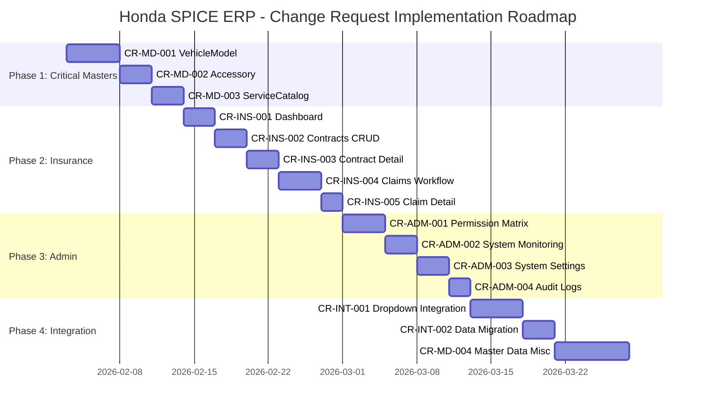
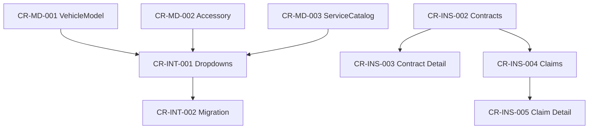

# Change Requests - Honda SPICE ERP System

**Ngày tạo**: 30/01/2026  
**Phiên bản**: 1.0  
**Người tạo**: Antigravity - Business Analyst  
**Nguồn phân tích**: UI Reference (Figma Wireframes) + System Implementation Analysis + Master Data Analysis

---

## 📋 TỔNG QUAN CHANGE REQUESTS

### Thống Kê

| Nhóm CR | Số Lượng | Tổng Effort | Mức Độ Ưu Tiên |
|---------|----------|-------------|-----------------|
| **Master Data Management** | 4 CRs | 18 ngày | 🔴 CRITICAL |
| **Insurance Module** | 5 CRs | 15 ngày | 🔴 CRITICAL |
| **Admin Module** | 4 CRs | 12 ngày | 🟡 HIGH |
| **Dropdown Integration** | 2 CRs | 8 ngày | 🟡 HIGH |
| **TỔNG** | **15 CRs** | **53 ngày** | - |

### Roadmap Tổng Thể



---

## 🔴 NHÓM 1: MASTER DATA MANAGEMENT (CRITICAL)

---

### CR-MD-001: VehicleModel Master Data Management

**Mức độ ưu tiên**: 🔴 CRITICAL  
**Effort estimate**: 5 ngày  
**Dependencies**: Không  
**UI Reference**: Không có trong Refs (cần tạo mới dựa trên pattern tương tự)

#### Business Context

Trong nghiệp vụ bán xe, **danh mục xe (VehicleModel)** là master data quan trọng nhất. Hiện tại hệ thống không có màn hình quản lý, dẫn đến:

1. **Inconsistent Data**: Sales nhập tay `model_interest` trong Lead → Sai chính tả, không chuẩn
   - Ví dụ: "Honda City", "HONDA CITY", "City", "city", "City 2024" → Không thể báo cáo
2. **Manual Pricing**: Base price hardcoded trong code → Khó cập nhật khi có thay đổi giá
3. **No Product Control**: Không kiểm soát được danh sách xe đang bán, xe ngừng bán

**Tác động nghiệp vụ**:
- ❌ Sales Dashboard: Không thể group by model chính xác
- ❌ Quotation: Không tự động fill base_price từ master
- ❌ Inventory: Không track được VIN theo model chuẩn

#### Functional Requirements

##### FR-MD-001-01: CRUD VehicleModel
- **Create**: Form tạo model mới với fields:
  - `model_code` (auto-generated: MOD/2026/001)
  - `model_name` (required, text, max 100 chars)
  - `category` (dropdown: SEDAN, SUV, HATCHBACK, MPV)
  - `base_price` (required, currency VND)
  - `status` (default: ACTIVE)
- **Read**: Table với pagination (20 items/page)
  - Columns: Model Code, Name, Category, Base Price, Status, Actions
  - Sort by: created_at DESC
- **Update**: Inline edit hoặc dialog
- **Delete**: Soft delete (status = INACTIVE)

##### FR-MD-001-02: Search & Filter
- Search box: Tìm theo `model_name` hoặc `model_code`
- Filter:
  - Category (dropdown multi-select)
  - Status (ACTIVE/INACTIVE)
  - Price range (slider)

##### FR-MD-001-03: Bulk Operations
- **Import Excel**: Upload file .xlsx với template
  - Columns: Model Code, Model Name, Category, Base Price
  - Validation: Duplicate check, price > 0
- **Export Excel**: Download danh sách hiện tại

##### FR-MD-001-04: Audit Trail
- Log mọi thay đổi (Create, Update, Delete) vào `activity_logs`
- Fields: user_id, action, entity=VehicleModel, entity_id, details (JSON)

#### UI Reference

**Không có trong Refs**, cần tạo mới dựa trên pattern:
- Layout: Tương tự `PartsStockTake.tsx` (table + search + filters)
- Form dialog: Tương tự `QuotationForm.tsx` (multi-step nếu cần)
- Bulk import: Tương tự `PickingPacking.tsx` (file upload)

**Wireframe mô tả**:
```
┌─────────────────────────────────────────────────────────┐
│ Master Data / Vehicle Models                    [+ New] │
├─────────────────────────────────────────────────────────┤
│ [Search: Model name or code...]  [Category ▼] [Status ▼]│
│ [Import Excel] [Export Excel]                           │
├──────┬──────────┬──────────┬──────────────┬────────┬────┤
│ Code │ Name     │ Category │ Base Price   │ Status │ Act│
├──────┼──────────┼──────────┼──────────────┼────────┼────┤
│ MOD/ │ City RS  │ SEDAN    │ 559,000,000₫ │ ACTIVE │ ✎ 🗑│
│ 001  │          │          │              │        │    │
├──────┼──────────┼──────────┼──────────────┼────────┼────┤
│ MOD/ │ CR-V L   │ SUV      │ 1,029,000,000│ ACTIVE │ ✎ 🗑│
│ 002  │          │          │              │        │    │
└──────┴──────────┴──────────┴──────────────┴────────┴────┘
```

#### Acceptance Criteria

- [ ] Admin có thể tạo, sửa, xóa (soft delete) VehicleModel qua UI
- [ ] Search & filter hoạt động chính xác
- [ ] Import Excel: Validate và hiển thị lỗi nếu có
- [ ] Export Excel: Download file với format chuẩn
- [ ] Audit log ghi nhận mọi thay đổi
- [ ] API endpoints:
  - `GET /api/vehicle-models` ✅ (đã có)
  - `POST /api/vehicle-models` ✅ (đã có)
  - `PATCH /api/vehicle-models/[id]` ❌ (cần tạo)
  - `DELETE /api/vehicle-models/[id]` ❌ (cần tạo)

#### Technical Notes

**Database**: ✅ Table `VehicleModel` đã có  
**API**: ⚠️ Thiếu PATCH, DELETE  
**UI**: ❌ Chưa có  

**Implementation checklist**:
1. Create API endpoints: PATCH, DELETE
2. Create UI page: `app/(main)/master/vehicle-models/page.tsx`
3. Create component: `components/master/VehicleModelManagement.tsx`
4. Create form dialog: `components/master/VehicleModelForm.tsx`
5. Add to sidebar navigation

---

### CR-MD-002: Accessory Master Data Management

**Mức độ ưu tiên**: 🔴 CRITICAL  
**Effort estimate**: 3 ngày  
**Dependencies**: Không  
**UI Reference**: Tương tự `PartsPricing.tsx`

#### Business Context

**Phụ kiện (Accessory)** là sản phẩm bổ sung quan trọng trong nghiệp vụ bán xe:
- Tăng doanh thu: Phụ kiện có margin cao (30-50%)
- Upsell opportunity: Sales suggest phụ kiện khi tạo Quotation
- Customization: Khách hàng cá nhân hóa xe

**Vấn đề hiện tại**:
- Hardcoded list trong `QuotationForm.tsx` → Không thể cập nhật
- Không có giá chính thức → Sales tự ước lượng
- Không track được phụ kiện nào bán chạy

#### Functional Requirements

##### FR-MD-002-01: CRUD Accessory
- **Create**: Form với fields:
  - `accessory_code` (auto: ACC-001, ACC-002...)
  - `accessory_name` (required)
  - `category` (dropdown: INTERIOR, EXTERIOR, TECH, SAFETY)
  - `price` (required, VND)
  - `compatible_models` (multi-select từ VehicleModel)
  - `installation_required` (boolean)
  - `warranty_period_months` (number)
  - `status` (ACTIVE/INACTIVE)

##### FR-MD-002-02: Compatibility Matrix
- UI hiển thị bảng: Accessory x VehicleModel
- Admin tick vào ô để đánh dấu compatible
- Ví dụ: "Body Kit Sport" chỉ compatible với City RS, Civic RS

##### FR-MD-002-03: Pricing History
- Track lịch sử thay đổi giá
- Table: Date, Old Price, New Price, Changed By

#### UI Reference

**Refs**: `PartsPricing.tsx` (layout tương tự)

**Wireframe**:
```
┌─────────────────────────────────────────────────────────┐
│ Master Data / Accessories                       [+ New] │
├─────────────────────────────────────────────────────────┤
│ [Search...]  [Category ▼] [Compatible Model ▼]         │
├──────┬──────────────┬──────────┬──────────┬────────┬────┤
│ Code │ Name         │ Category │ Price    │ Status │ Act│
├──────┼──────────────┼──────────┼──────────┼────────┼────┤
│ ACC- │ Floor Mat    │ INTERIOR │ 500,000₫ │ ACTIVE │ ✎ 🗑│
│ 001  │ Premium      │          │          │        │    │
├──────┼──────────────┼──────────┼──────────┼────────┼────┤
│ ACC- │ Body Kit     │ EXTERIOR │2,000,000₫│ ACTIVE │ ✎ 🗑│
│ 002  │ Sport        │          │          │        │    │
└──────┴──────────────┴──────────┴──────────┴────────┴────┘
```

#### Acceptance Criteria

- [ ] CRUD Accessory hoạt động đầy đủ
- [ ] Compatibility matrix: Admin có thể assign accessories to models
- [ ] Pricing history: Log mọi thay đổi giá
- [ ] API: PATCH, DELETE endpoints

---

### CR-MD-003: ServiceCatalog Master Data Management

**Mức độ ưu tiên**: 🔴 CRITICAL  
**Effort estimate**: 3 ngày  
**Dependencies**: Không  
**UI Reference**: Tương tự `PartsPricing.tsx`

#### Business Context

**Danh mục dịch vụ (ServiceCatalog)** chuẩn hóa các dịch vụ bảo trì:
- **Standard Services**: Oil Change, Tire Rotation, Brake Inspection
- **Repair Services**: Engine Repair, Transmission Repair
- **Inspection Services**: 10,000km Inspection, 20,000km Inspection

**Vấn đề hiện tại**:
- Service Advisor nhập tay tên dịch vụ → Không chuẩn
- Labor hours và labor rate hardcoded → Khó điều chỉnh
- Không thể tính toán tự động chi phí dịch vụ

#### Functional Requirements

##### FR-MD-003-01: CRUD ServiceCatalog
- **Create**: Form với fields:
  - `service_code` (auto: SVC-001)
  - `service_name` (required)
  - `category` (dropdown: MAINTENANCE, REPAIR, INSPECTION, BODYWORK)
  - `labor_hours` (decimal, required)
  - `labor_rate` (VND/hour, required)
  - `parts_required` (multi-select từ Parts)
  - `recommended_interval_km` (number, optional)
  - `status` (ACTIVE/INACTIVE)

##### FR-MD-003-02: Service Package Builder
- Admin có thể tạo "Service Package" (combo nhiều services)
- Ví dụ: "10K Inspection Package" = Oil Change + Tire Rotation + Brake Check
- Discount cho package

##### FR-MD-003-03: Pricing Calculator
- Auto-calculate: `total_cost = (labor_hours * labor_rate) + sum(parts.price)`
- Display trong form

#### UI Reference

**Refs**: `PartsPricing.tsx`

#### Acceptance Criteria

- [ ] CRUD ServiceCatalog đầy đủ
- [ ] Service Package Builder hoạt động
- [ ] Pricing calculator tự động tính
- [ ] API: PATCH, DELETE endpoints

---

### CR-MD-004: Remaining Master Data (ServiceBay, ScoringRule, SystemSetting)

**Mức độ ưu tiên**: 🟡 HIGH  
**Effort estimate**: 7 ngày  
**Dependencies**: CR-MD-001, CR-MD-002, CR-MD-003  

**Bao gồm**:
1. **ServiceBay Management** (2 ngày)
   - CRUD bays
   - Equipment configuration
   - Capacity management
2. **ScoringRule Management** (3 ngày)
   - Visual rule builder (JSON editor)
   - Test simulator
3. **SystemSetting Management** (2 ngày)
   - Type-safe editing
   - Category grouping

---

## 🔴 NHÓM 2: INSURANCE MODULE (CRITICAL)

---

### CR-INS-001: Insurance Dashboard (Overview)

**Mức độ ưu tiên**: 🔴 CRITICAL  
**Effort estimate**: 3 ngày  
**Dependencies**: Không  
**UI Reference**: ✅ `InsuranceOverview.tsx` (Figma)

#### Business Context

**Insurance Dashboard** là màn hình tổng quan cho nghiệp vụ bảo hiểm xe:
- **KPIs**: Active Policies, Claims In Progress, Premium YTD, Commission YTD
- **Alerts**: Policies expiring soon (renewal opportunity)
- **Renewal Rate**: Metric quan trọng để đánh giá customer retention

**Nghiệp vụ bảo hiểm xe**:
1. Dealer bán bảo hiểm cho khách hàng (VCX, TNDS)
2. Nhận hoa hồng từ công ty bảo hiểm (10-15% phí bảo hiểm)
3. Hỗ trợ khách hàng claim khi có sự cố

#### Functional Requirements

##### FR-INS-001-01: KPI Cards
- **Active Policies**: Count từ `insurance_contracts` WHERE status = 'ACTIVE'
- **Claims In Progress**: Count từ `insurance_claims` WHERE status IN ('SUBMITTED', 'REVIEWING', 'APPROVED')
- **Premium YTD**: SUM(premium_amount) WHERE YEAR(start_date) = current_year
- **Commission YTD**: Premium YTD * 0.12 (12% commission rate)

##### FR-INS-001-02: Expiring Policies Widget
- List policies WHERE `end_date` BETWEEN today AND today+30
- Display: Customer, Policy Number, Vehicle, Expiry Date, Premium
- Action button: "Gia hạn" (Renew) → Navigate to renewal form

##### FR-INS-001-03: Renewal Rate Chart
- Calculate: (Renewed Policies / Expiring Policies) * 100
- Display: Percentage + Progress bar
- Filter: This Month, Last Month, YTD

#### UI Reference

**Refs**: ✅ `InsuranceOverview.tsx` (lines 1-140)

**Key UI elements**:
- 4 KPI cards với gradient backgrounds (blue, yellow, green, purple)
- Expiring policies list với yellow alert styling
- Renewal rate với circular progress

#### Acceptance Criteria

- [ ] Dashboard hiển thị 4 KPIs chính xác
- [ ] Expiring policies list real-time data
- [ ] Renewal rate calculation đúng
- [ ] "Tạo Hợp Đồng Mới" button navigate to contract form
- [ ] "Gia hạn" button pre-fill renewal form với data từ old contract

---

### CR-INS-002: Insurance Contracts CRUD

**Mức độ ưu tiên**: 🔴 CRITICAL  
**Effort estimate**: 3 ngày  
**Dependencies**: Không  
**UI Reference**: ✅ `InsurancePolicies.tsx` (Figma)

#### Business Context

**Insurance Contracts** quản lý hợp đồng bảo hiểm:
- **Types**: VCX (Vật chất xe), TNDS BB (Trách nhiệm dân sự bắt buộc), TNDS TN (Tự nguyện)
- **Lifecycle**: DRAFT → ACTIVE → EXPIRED/CANCELLED
- **Renewal**: Khi hợp đồng gần hết hạn, tạo hợp đồng mới (renewal)

#### Functional Requirements

##### FR-INS-002-01: Create Contract
- Form fields:
  - `customer_id` (search dropdown từ Customers)
  - `vehicle_id` (optional, link to VIN)
  - `insurance_type` (dropdown: VCX, TNDS BB, TNDS TN)
  - `insurance_company` (dropdown: VNI, PTI, BIC, PVI)
  - `policy_number` (text, required)
  - `premium_amount` (VND, required)
  - `coverage_amount` (VND, required)
  - `start_date`, `end_date` (date pickers)
  - `notes` (textarea)

##### FR-INS-002-02: List Contracts
- Table columns: Policy Number, Customer, Vehicle (Plate + Model), Type, Period, Premium, Status
- Filters:
  - Status (ACTIVE, EXPIRED, CANCELLED)
  - Insurance Type
  - Expiring within (7 days, 30 days, 90 days)
- Search: Policy Number, Customer Name, Plate Number

##### FR-INS-002-03: Update Contract
- Edit dialog (same form as Create)
- Validation: Không cho edit nếu có claims đang pending

##### FR-INS-002-04: Delete Contract
- Soft delete (status = CANCELLED)
- Confirmation dialog: "Bạn có chắc muốn hủy hợp đồng này?"

#### UI Reference

**Refs**: ✅ `InsurancePolicies.tsx` (lines 1-110)

**Key UI elements**:
- Alert banner: "3 policies expiring within 30 days"
- Table với status badges (green=Active, yellow=Expiring)
- "Days left" indicator cho expiring policies

#### Acceptance Criteria

- [ ] Create contract form validation đầy đủ
- [ ] List contracts với search & filter
- [ ] Update contract (không cho edit nếu có active claims)
- [ ] Delete contract (soft delete)
- [ ] API: POST, PATCH, DELETE

---

### CR-INS-003: Insurance Contract Detail

**Mức độ ưu tiên**: 🔴 CRITICAL  
**Effort estimate**: 3 ngày  
**Dependencies**: CR-INS-002  
**UI Reference**: ✅ `InsurancePolicyDetail.tsx` (Figma)

#### Business Context

**Contract Detail** hiển thị đầy đủ thông tin hợp đồng bảo hiểm:
- Customer info, Vehicle info
- Policy details (coverage, premium, period)
- Claims history (list of claims related to this contract)
- Documents (policy PDF, customer ID scan)

#### Functional Requirements

##### FR-INS-003-01: Contract Information Display
- Sections:
  - **Policy Info**: Policy Number, Type, Company, Status
  - **Customer Info**: Name, Phone, Email, Address
  - **Vehicle Info**: Plate Number, Model, VIN, Year
  - **Coverage**: Coverage Amount, Premium, Deductible
  - **Period**: Start Date, End Date, Days Remaining

##### FR-INS-003-02: Claims History
- Table: Claim Number, Date, Type, Amount, Status
- Click row → Navigate to Claim Detail

##### FR-INS-003-03: Document Management
- Upload policy PDF
- Upload customer ID scan
- Preview documents inline (PDF viewer)

##### FR-INS-003-04: Status Transitions
- Workflow: DRAFT → ACTIVE → EXPIRED/CANCELLED
- Button actions:
  - DRAFT: "Activate" → status = ACTIVE
  - ACTIVE: "Cancel" → status = CANCELLED
  - ACTIVE (near expiry): "Renew" → Create new contract

#### UI Reference

**Refs**: ✅ `InsurancePolicyDetail.tsx` (lines 1-300+)

#### Acceptance Criteria

- [ ] Display full contract info
- [ ] Claims history table
- [ ] Document upload & preview
- [ ] Status transition buttons
- [ ] Renew button pre-fill new contract form

---

### CR-INS-004: Insurance Claims Workflow

**Mức độ ưu tiên**: 🔴 CRITICAL  
**Effort estimate**: 4 ngày  
**Dependencies**: CR-INS-002  
**UI Reference**: ✅ `InsuranceClaimsList.tsx` (Figma)

#### Business Context

**Claims Workflow** quản lý quy trình bồi thường:
1. Customer gặp sự cố → Liên hệ dealer
2. Dealer tạo claim → Upload photos, estimate repair cost
3. Insurance company review → Approve/Reject
4. Dealer sửa xe → Submit invoice
5. Insurance company pay → Dealer nhận tiền

**Workflow states**:
- SUBMITTED → REVIEWING → APPROVED → PAID
- SUBMITTED → REVIEWING → REJECTED

#### Functional Requirements

##### FR-INS-004-01: Create Claim
- Form fields:
  - `contract_id` (dropdown từ active contracts)
  - `incident_date` (date picker)
  - `incident_type` (dropdown: COLLISION, THEFT, FIRE, FLOOD, OTHER)
  - `incident_description` (textarea, required)
  - `claim_amount` (VND, required)
  - `documents` (file upload: photos, police report)

##### FR-INS-004-02: List Claims
- KPI cards: Pending, Processing, Approved, Paid
- Table columns: Claim Number, Policy, Customer, Vehicle, Date, Age (days open), Claim Amount, Approved Amount, Status, Work Order
- Filters: Status (tabs)
- Search: Claim Number, Customer, Plate Number

##### FR-INS-004-03: Approval Workflow
- **Reviewer role**: Insurance Manager
- Actions:
  - "Approve" → status = APPROVED, set `approved_amount`
  - "Reject" → status = REJECTED, require `rejection_reason`
- Email notification to customer

##### FR-INS-004-04: Payment Tracking
- After repair done → Service Advisor click "Request Payment"
- Insurance Manager review invoice → Click "Mark as Paid"
- status = PAID, set `paid_at`

#### UI Reference

**Refs**: ✅ `InsuranceClaimsList.tsx` (lines 1-201)

**Key UI elements**:
- 4 KPI cards với border-left color coding
- Status filter tabs (Tất cả, Chờ xử lý, Đang xử lý, Đã duyệt, Đã chi trả)
- "Tuổi" column với color coding (green < 3 days, yellow 3-7 days, red > 7 days)
- Link to Work Order (service repair order)

#### Acceptance Criteria

- [ ] Create claim form với validation
- [ ] List claims với KPIs
- [ ] Approval workflow (Approve/Reject)
- [ ] Payment tracking
- [ ] Email notifications
- [ ] Link to Work Order

---

### CR-INS-005: Insurance Claim Detail

**Mức độ ưu tiên**: 🔴 CRITICAL  
**Effort estimate**: 2 ngày  
**Dependencies**: CR-INS-004  
**UI Reference**: ✅ `InsuranceClaimDetail.tsx` (Figma)

#### Business Context

**Claim Detail** hiển thị chi tiết yêu cầu bồi thường:
- Incident info (photos, description)
- Approval history (who approved, when, comments)
- Payment info (invoice, payment date)

#### Functional Requirements

##### FR-INS-005-01: Incident Information
- Display: Date, Type, Description
- Photo gallery (lightbox view)
- Police report (PDF preview)

##### FR-INS-005-02: Approval Section
- Form:
  - `approved_amount` (VND, editable)
  - `reviewer_comments` (textarea)
  - Buttons: "Approve", "Reject"
- Validation: approved_amount <= claim_amount

##### FR-INS-005-03: Payment Section
- Display: Invoice Number, Invoice Date, Invoice Amount
- Upload invoice PDF
- Button: "Mark as Paid"

##### FR-INS-005-04: Audit Trail
- Timeline: All status changes
- Display: Date, User, Action, Comments

#### UI Reference

**Refs**: ✅ `InsuranceClaimDetail.tsx`

#### Acceptance Criteria

- [ ] Display incident info với photo gallery
- [ ] Approval form với validation
- [ ] Payment tracking
- [ ] Audit trail timeline

---

## 🟡 NHÓM 3: ADMIN MODULE (HIGH)

---

### CR-ADM-001: Permission Matrix Editor

**Mức độ ưu tiên**: 🟡 HIGH  
**Effort estimate**: 4 ngày  
**Dependencies**: Không  
**UI Reference**: ✅ `UserRoleManagement.tsx` (partial)

#### Business Context

**Permission Matrix** là core của RBAC (Role-Based Access Control):
- Define roles: Admin, Sales Manager, Sales, Service Manager, Technician
- Assign permissions: CRM.READ, CRM.WRITE, SALES.READ, etc.
- Enforce access control: Middleware check permissions

**Vấn đề hiện tại**:
- Roles hardcoded (7 roles cố định)
- Không thể tạo custom role
- Không thể edit permissions

#### Functional Requirements

##### FR-ADM-001-01: Permission Matrix Grid
- UI: Checkbox grid
- Rows: Permissions (group by module)
- Columns: Roles
- Admin tick vào ô để assign permission to role

##### FR-ADM-001-02: Create Custom Role
- Form:
  - `name` (required, unique)
  - `description` (optional)
  - Permissions (checkbox list)
- Validation: Name không trùng

##### FR-ADM-001-03: Clone Role
- Button: "Clone from..." → Select existing role
- Copy all permissions → Admin có thể modify

##### FR-ADM-001-04: Delete Role
- Validation: Không cho delete nếu có users assigned
- Confirmation: "X users will lose access"

#### UI Reference

**Refs**: ✅ `UserRoleManagement.tsx` (lines 108-137) - Roles sidebar

**Wireframe mô tả**:
```
┌─────────────────────────────────────────────────────────┐
│ Permission Matrix                           [+ New Role]│
├─────────────────────────────────────────────────────────┤
│                  │ Admin │ Sales Mgr │ Sales │ Service │
├──────────────────┼───────┼───────────┼───────┼─────────┤
│ CRM              │       │           │       │         │
│  - View Leads    │   ☑   │     ☑     │   ☑   │    ☐    │
│  - Edit Leads    │   ☑   │     ☑     │   ☑   │    ☐    │
│  - Delete Leads  │   ☑   │     ☑     │   ☐   │    ☐    │
├──────────────────┼───────┼───────────┼───────┼─────────┤
│ Sales            │       │           │       │         │
│  - View Quotes   │   ☑   │     ☑     │   ☑   │    ☐    │
│  - Create Quotes │   ☑   │     ☑     │   ☑   │    ☐    │
└──────────────────┴───────┴───────────┴───────┴─────────┘
```

#### Acceptance Criteria

- [ ] Permission matrix grid hoạt động
- [ ] Create custom role
- [ ] Clone role
- [ ] Delete role (với validation)
- [ ] API: POST /api/admin/roles, PATCH /api/admin/roles/[id], DELETE /api/admin/roles/[id]

---

### CR-ADM-002: System Monitoring Dashboard

**Mức độ ưu tiên**: 🟡 HIGH  
**Effort estimate**: 3 ngày  
**Dependencies**: Không  
**UI Reference**: ✅ `SystemMonitoring.tsx` (Figma)

#### Business Context

**System Monitoring** giúp Admin theo dõi health của hệ thống:
- **Performance**: CPU, Memory, Disk usage
- **Active Users**: Who's online
- **Error Rate**: Failed API requests
- **Database**: Connection pool status

#### Functional Requirements

##### FR-ADM-002-01: Real-time Metrics
- **CPU Usage**: Percentage + chart (last 1 hour)
- **Memory Usage**: Percentage + chart
- **Disk Usage**: GB used / GB total
- **Active Users**: Count + list (name, last activity)

##### FR-ADM-002-02: API Performance
- **Response Time**: Average (last 1 hour)
- **Error Rate**: Percentage
- **Top Slow Endpoints**: Table (endpoint, avg time, count)

##### FR-ADM-002-03: Database Metrics
- **Connection Pool**: Active / Max connections
- **Query Performance**: Slow queries (> 1s)

##### FR-ADM-002-04: Alerts Configuration
- Admin set thresholds:
  - CPU > 80% → Send email
  - Error rate > 5% → Send email
  - Disk > 90% → Send email

#### UI Reference

**Refs**: ✅ `SystemMonitoring.tsx`

#### Acceptance Criteria

- [ ] Real-time metrics display
- [ ] Charts update every 30s
- [ ] Alert configuration
- [ ] Email notifications

---

### CR-ADM-003: System Settings Management

**Mức độ ưu tiên**: 🟡 HIGH  
**Effort estimate**: 3 ngày  
**Dependencies**: Không  
**UI Reference**: Không có (cần tạo mới)

#### Business Context

**System Settings** cho phép Admin config hệ thống qua UI:
- Company info (name, logo, address)
- Email settings (SMTP)
- SMS settings (API key)
- Notification preferences
- Feature flags

#### Functional Requirements

##### FR-ADM-003-01: Settings Categories
- **General**: Company name, logo, address, phone
- **Email**: SMTP host, port, username, password, from_address
- **SMS**: Provider (Twilio, Nexmo), API key, sender_id
- **Notifications**: Enable/disable (email, SMS, push)
- **Features**: Enable/disable beta features

##### FR-ADM-003-02: Type-safe Editing
- `data_type` field: string, number, boolean, json
- UI render:
  - string → text input
  - number → number input
  - boolean → toggle switch
  - json → JSON editor (Monaco)

##### FR-ADM-003-03: Validation
- Email: Valid email format
- Phone: Valid phone format
- SMTP: Test connection button

#### Acceptance Criteria

- [ ] Settings grouped by category
- [ ] Type-safe editing
- [ ] Validation
- [ ] Test connection buttons

---

### CR-ADM-004: Advanced Audit Logs

**Mức độ ưu tiên**: 🟡 HIGH  
**Effort estimate**: 2 ngày  
**Dependencies**: Không  
**UI Reference**: Không có (cần tạo mới)

#### Business Context

**Audit Logs** track mọi hành động trong hệ thống:
- Security: Detect suspicious activity
- Compliance: Audit trail cho ISO/GDPR
- Troubleshooting: Debug issues

#### Functional Requirements

##### FR-ADM-004-01: Advanced Filters
- **User**: Dropdown (all users)
- **Action**: CREATE, UPDATE, DELETE, LOGIN, LOGOUT
- **Entity**: Dropdown (all entities)
- **Date Range**: Date picker
- **IP Address**: Text input

##### FR-ADM-004-02: Export Logs
- Format: CSV, Excel
- Include: Timestamp, User, Action, Entity, Entity ID, Details, IP

##### FR-ADM-004-03: Diff Viewer
- For UPDATE actions: Show before/after comparison
- UI: Side-by-side diff (like Git diff)

#### Acceptance Criteria

- [ ] Advanced filters
- [ ] Export logs
- [ ] Diff viewer for UPDATE actions

---

## 🟡 NHÓM 4: DROPDOWN INTEGRATION (HIGH)

---

### CR-INT-001: Master Data Dropdown Integration

**Mức độ ưu tiên**: 🟡 HIGH  
**Effort estimate**: 5 ngày  
**Dependencies**: CR-MD-001, CR-MD-002, CR-MD-003  

#### Business Context

Thay thế tất cả text inputs bằng dropdowns từ Master Data:
- **VehicleModel**: 6 màn hình (Lead, Quotation, Test Drive, VIN, etc.)
- **Accessory**: 2 màn hình (Quotation, Contract)
- **ServiceCatalog**: 3 màn hình (Service Quote, Repair Order, Quotation)

#### Functional Requirements

##### FR-INT-001-01: VehicleModel Dropdowns
**Màn hình**: Lead Form
- Field: `model_interest`
- Old: Text input
- New: Dropdown (searchable)
- Data source: `GET /api/vehicle-models?status=ACTIVE`
- Display: `model_name` (e.g., "Honda City RS")
- Value: `model_code` (e.g., "MOD/001")

**Màn hình**: Quotation Form
- Fields: `model`, `version`
- Old: Text inputs
- New: 
  - `model`: Dropdown từ VehicleModel
  - `version`: Dropdown (hardcoded: L, G, RS, E)
- Auto-fill: `base_price` from selected VehicleModel

**Màn hình**: Test Drive Form
- Field: `model`
- New: Dropdown từ VehicleModel

**Màn hình**: VIN Form
- Fields: `model`, `version`
- New: Dropdowns (same as Quotation)

##### FR-INT-001-02: Accessory Multi-select
**Màn hình**: Quotation Form
- Field: `accessories` (JSON array)
- Old: Hardcoded list
- New: Multi-select dropdown
- Data source: `GET /api/accessories?status=ACTIVE&compatible_model={selected_model}`
- Display: `accessory_name` + `price`
- Auto-calculate: `total_accessories = sum(selected.price)`

##### FR-INT-001-03: ServiceCatalog Multi-select
**Màn hình**: Service Quote Form
- Field: `services` (JSON array)
- Old: Manual input
- New: Multi-select dropdown
- Data source: `GET /api/services-catalog?status=ACTIVE`
- Display: `service_name` + `labor_hours` + `labor_rate`
- Auto-calculate: `total_labor = sum(labor_hours * labor_rate)`

#### Acceptance Criteria

- [ ] All 12 dropdowns implemented
- [ ] Auto-fill base_price in Quotation
- [ ] Auto-calculate totals
- [ ] Searchable dropdowns (type to filter)
- [ ] Validation: Required fields

---

### CR-INT-002: Data Migration & Cleanup

**Mức độ ưu tiên**: 🟡 HIGH  
**Effort estimate**: 3 ngày  
**Dependencies**: CR-INT-001  

#### Business Context

Migrate existing text data → Master data references:
- Extract unique values từ `model_interest`, `model`, etc.
- Create VehicleModel records
- Update foreign keys

#### Functional Requirements

##### FR-INT-002-01: Data Extraction
- Script: Extract unique values
- Output: Excel file for review
- Admin review → Approve/Reject

##### FR-INT-002-02: Data Migration
- Script: Create VehicleModel records
- Update Lead.model_interest → VehicleModel.id
- Update Quotation.model → VehicleModel.id

##### FR-INT-002-03: Data Cleanup
- Delete invalid records (typos, duplicates)
- Validation report

#### Acceptance Criteria

- [ ] Migration script
- [ ] Validation report
- [ ] Rollback plan

---

## 📊 IMPLEMENTATION ROADMAP

### Phase 1: Critical Masters (Week 1-2)
- **Week 1**: CR-MD-001 (VehicleModel), CR-MD-002 (Accessory)
- **Week 2**: CR-MD-003 (ServiceCatalog), Start CR-INS-001

### Phase 2: Insurance Module (Week 3-4)
- **Week 3**: CR-INS-001, CR-INS-002, CR-INS-003
- **Week 4**: CR-INS-004, CR-INS-005

### Phase 3: Admin Module (Week 5-6)
- **Week 5**: CR-ADM-001, CR-ADM-002
- **Week 6**: CR-ADM-003, CR-ADM-004

### Phase 4: Integration (Week 7-8)
- **Week 7**: CR-INT-001 (Dropdown Integration)
- **Week 8**: CR-INT-002 (Data Migration), CR-MD-004 (Remaining Masters)

---

## 📋 DEPENDENCIES MATRIX



---

## 🎯 SUCCESS METRICS

### Technical Metrics
- ✅ 15/15 CRs implemented
- ✅ 100% test coverage cho new features
- ✅ 0 critical bugs in UAT
- ✅ API response time < 200ms

### Business Metrics
- ✅ Data consistency: 100% (no typos, no duplicates)
- ✅ User adoption: 90% users sử dụng dropdowns (không nhập tay)
- ✅ Time saved: 30% faster data entry
- ✅ Error reduction: 80% fewer data entry errors

---

**Người phê duyệt**: Antigravity - Business Analyst  
**Ngày phê duyệt**: 30/01/2026  
**Trạng thái**: ✅ Ready for Review
