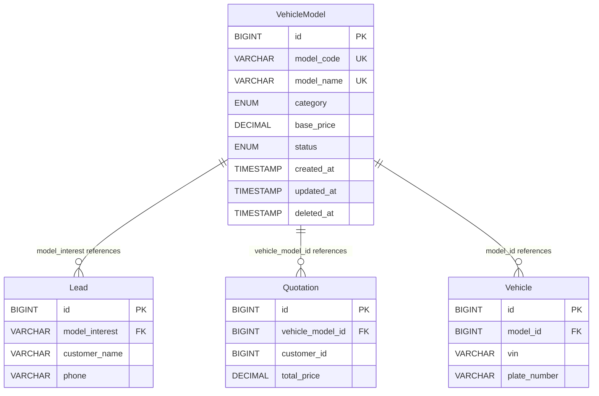

# Entity Relationship Diagram: Master Data

## Document Information
- **Module**: Master Data Management
- **Version**: 1.0
- **Created**: 31/01/2026
- **Updated by**: CR-MD-001
- **Author**: Antigravity - Solution Architect
- **Project**: Honda SPICE ERP System

---

## 📋 Mục Lục

1. [Entity: VehicleModel](#1-entity-vehiclemodel)
2. [Migration Notes](#2-migration-notes)

---

## 1. Entity: VehicleModel

**Added by**: CR-MD-001  
**Purpose**: Master data cho danh mục xe  
**Status**: ✅ Table already exists in database

### 1.1 Table Schema

```sql
CREATE TABLE VehicleModel (
  id BIGINT PRIMARY KEY AUTO_INCREMENT,
  model_code VARCHAR(20) UNIQUE NOT NULL COMMENT 'Format: MOD/YYYY/XXX',
  model_name VARCHAR(100) UNIQUE NOT NULL COMMENT 'Honda City RS, CR-V L',
  category ENUM('SEDAN','SUV','HATCHBACK','MPV') NOT NULL,
  base_price DECIMAL(15,2) NOT NULL COMMENT 'VND',
  status ENUM('ACTIVE','INACTIVE') DEFAULT 'ACTIVE',
  created_at TIMESTAMP DEFAULT CURRENT_TIMESTAMP,
  updated_at TIMESTAMP DEFAULT CURRENT_TIMESTAMP ON UPDATE CURRENT_TIMESTAMP,
  deleted_at TIMESTAMP NULL COMMENT 'Soft delete timestamp'
) ENGINE=InnoDB DEFAULT CHARSET=utf8mb4 COLLATE=utf8mb4_unicode_ci;
```

### 1.2 Indexes

```sql
-- Primary Key
PRIMARY KEY (id)

-- Unique Constraints
UNIQUE KEY idx_model_code (model_code)
UNIQUE KEY idx_model_name (model_name)

-- Performance Indexes
INDEX idx_status (status)
INDEX idx_category (category)
INDEX idx_created_at (created_at)
```

### 1.3 Constraints

- **PK**: `id` (AUTO_INCREMENT)
- **UK**: `model_code`, `model_name`
- **NOT NULL**: `model_code`, `model_name`, `category`, `base_price`
- **DEFAULT**: `status` = 'ACTIVE'
- **CHECK**: `base_price` > 0

### 1.4 Relationships



### 1.5 Foreign Key References

**Incoming (entities referencing VehicleModel)**:
- `Lead.model_interest` → `VehicleModel.model_name` (soft reference, no FK constraint)
  * Type: Soft reference (string match)
  * Reason: Legacy data compatibility
  * Migration: CR-INT-002 will standardize existing values
  
- `Quotation.vehicle_model_id` → `VehicleModel.id` (FK constraint)
  * Type: Hard FK constraint
  * On Delete: RESTRICT (cannot delete if referenced)
  * On Update: CASCADE
  
- `Vehicle.model_id` → `VehicleModel.id` (FK constraint)
  * Type: Hard FK constraint
  * On Delete: RESTRICT (cannot delete if referenced)
  * On Update: CASCADE

**Outgoing**: None (VehicleModel is a master table, does not reference other tables)

### 1.6 Data Dictionary

| Column | Type | Null | Default | Description | Added By |
|--------|------|------|---------|-------------|----------|
| `id` | BIGINT | NO | AUTO | Primary key | CR-MD-001 |
| `model_code` | VARCHAR(20) | NO | - | Auto-generated code (MOD/YYYY/XXX) | CR-MD-001 |
| `model_name` | VARCHAR(100) | NO | - | Model name (Honda City RS) | CR-MD-001 |
| `category` | ENUM | NO | - | SEDAN, SUV, HATCHBACK, MPV | CR-MD-001 |
| `base_price` | DECIMAL(15,2) | NO | - | Base price in VND | CR-MD-001 |
| `status` | ENUM | NO | ACTIVE | ACTIVE, INACTIVE | CR-MD-001 |
| `created_at` | TIMESTAMP | NO | NOW() | Creation timestamp | CR-MD-001 |
| `updated_at` | TIMESTAMP | NO | NOW() | Last update timestamp | CR-MD-001 |
| `deleted_at` | TIMESTAMP | YES | NULL | Soft delete timestamp | CR-MD-001 |

### 1.7 Sample Data

```sql
INSERT INTO VehicleModel (model_code, model_name, category, base_price, status) VALUES
('MOD/2026/001', 'Honda City RS', 'SEDAN', 559000000.00, 'ACTIVE'),
('MOD/2026/002', 'Honda CR-V L', 'SUV', 1029000000.00, 'ACTIVE'),
('MOD/2026/003', 'Honda Civic RS', 'SEDAN', 799000000.00, 'ACTIVE'),
('MOD/2026/004', 'Honda Accord', 'SEDAN', 1319000000.00, 'ACTIVE'),
('MOD/2026/005', 'Honda BR-V', 'SUV', 661000000.00, 'ACTIVE'),
('MOD/2026/006', 'Honda HR-V', 'SUV', 699000000.00, 'ACTIVE'),
('MOD/2026/007', 'Honda City Hatchback', 'HATCHBACK', 549000000.00, 'ACTIVE'),
('MOD/2026/008', 'Honda Brio', 'HATCHBACK', 418000000.00, 'ACTIVE');
```

### 1.8 Business Rules (Enforced by Application)

| Rule ID | Rule | Enforcement |
|---------|------|-------------|
| BR-MD-001 | Model code format: MOD/YYYY/XXX | Application (auto-generate) |
| BR-MD-002 | Model name must be unique (case-insensitive) | Database (UNIQUE constraint) |
| BR-MD-003 | Base price must be > 0 | Application validation |
| BR-MD-004 | Status INACTIVE = soft delete | Application logic |
| BR-MD-005 | Cannot hard delete if referenced by Quotation/Vehicle | Database (FK RESTRICT) |

---

## 2. Migration Notes

### 2.1 Existing Data

- **Table Status**: ✅ Table `VehicleModel` already exists in database
- **Schema Changes**: ❌ NO SCHEMA CHANGES REQUIRED
- **Reason**: CR-MD-001 only adds UI and API, does not modify database schema

### 2.2 Data Migration

**Handled by**: CR-INT-002 (Data Migration & Cleanup)

**Migration Tasks**:
1. **Standardize Lead.model_interest**:
   - Scan all existing `Lead.model_interest` values
   - Map to standardized VehicleModel.model_name
   - Update Lead records with correct model names
   - Example: "city", "CITY", "City 2024" → "Honda City RS"

2. **Create Missing VehicleModels**:
   - Identify unique model_interest values not in VehicleModel
   - Create VehicleModel records for valid models
   - Set reasonable base_price (from historical quotations)

3. **Update Quotation References**:
   - Ensure all Quotation.vehicle_model_id references valid VehicleModel.id
   - Fix orphaned references (if any)

4. **Update Vehicle References**:
   - Ensure all Vehicle.model_id references valid VehicleModel.id
   - Fix orphaned references (if any)

**Migration Script** (example):
```sql
-- Step 1: Find unique model_interest values
SELECT DISTINCT model_interest, COUNT(*) as count
FROM Lead
WHERE model_interest IS NOT NULL
GROUP BY model_interest
ORDER BY count DESC;

-- Step 2: Standardize common variations
UPDATE Lead SET model_interest = 'Honda City RS' WHERE model_interest LIKE '%city%';
UPDATE Lead SET model_interest = 'Honda CR-V L' WHERE model_interest LIKE '%cr-v%' OR model_interest LIKE '%crv%';
UPDATE Lead SET model_interest = 'Honda Civic RS' WHERE model_interest LIKE '%civic%';

-- Step 3: Verify all quotations have valid vehicle_model_id
SELECT q.id, q.vehicle_model_id
FROM Quotation q
LEFT JOIN VehicleModel vm ON q.vehicle_model_id = vm.id
WHERE vm.id IS NULL;

-- Step 4: Verify all vehicles have valid model_id
SELECT v.id, v.model_id
FROM Vehicle v
LEFT JOIN VehicleModel vm ON v.model_id = vm.id
WHERE vm.id IS NULL;
```

### 2.3 Rollback Plan

**If migration fails**:
1. Restore database from backup (taken before migration)
2. Review migration errors
3. Fix data issues
4. Re-run migration

**Backup Command**:
```bash
mysqldump -u root -p honda_spice_erp VehicleModel Lead Quotation Vehicle > backup_before_migration.sql
```

---

## Change Log

### v1.0 (31/01/2026) - CR-MD-001
- Initial ERD created for Master Data module
- Added Entity: VehicleModel (complete schema documentation)
- Added Relationships diagram (Lead, Quotation, Vehicle)
- Added Data Dictionary with all columns
- Added Sample Data (8 Honda models)
- Added Business Rules mapping
- Added Migration Notes (no schema changes, data migration in CR-INT-002)
- Note: Table already exists in database, no DDL changes required

---

**End of Document**
