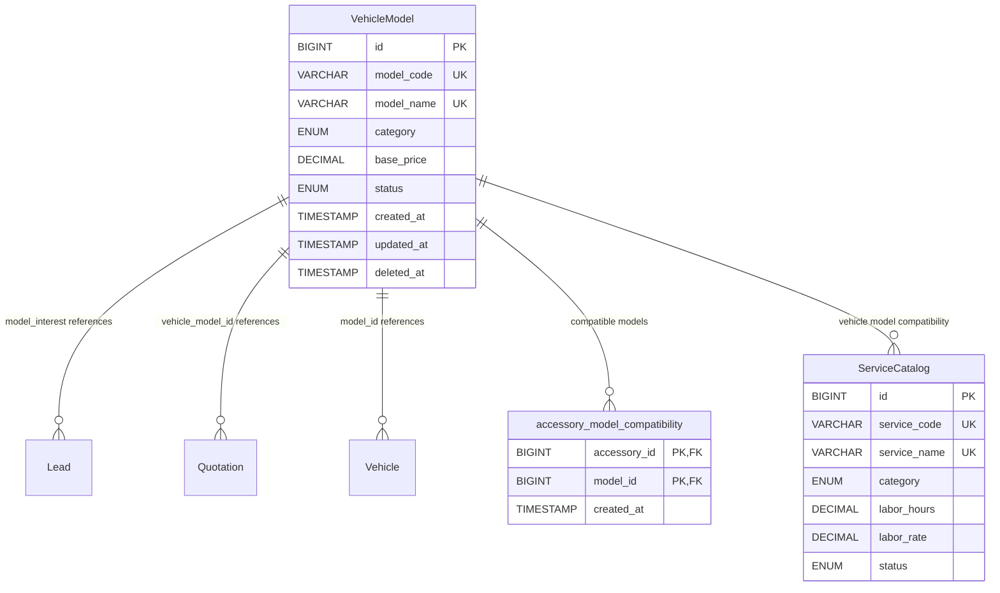
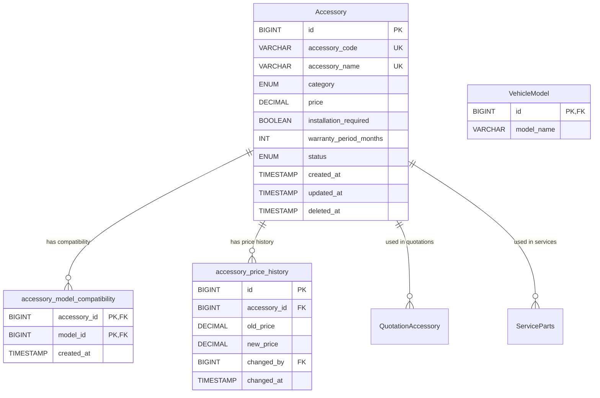
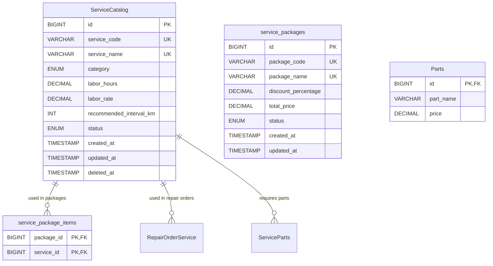
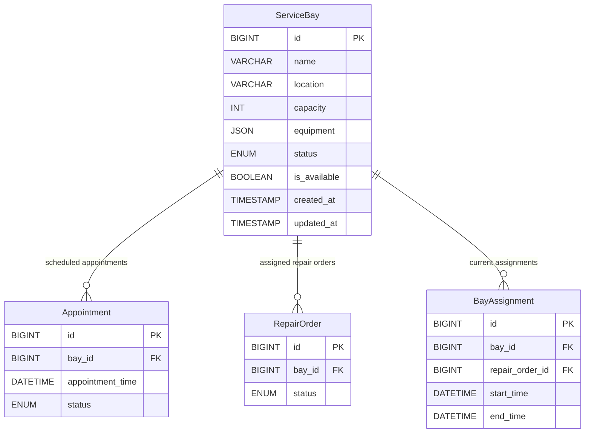
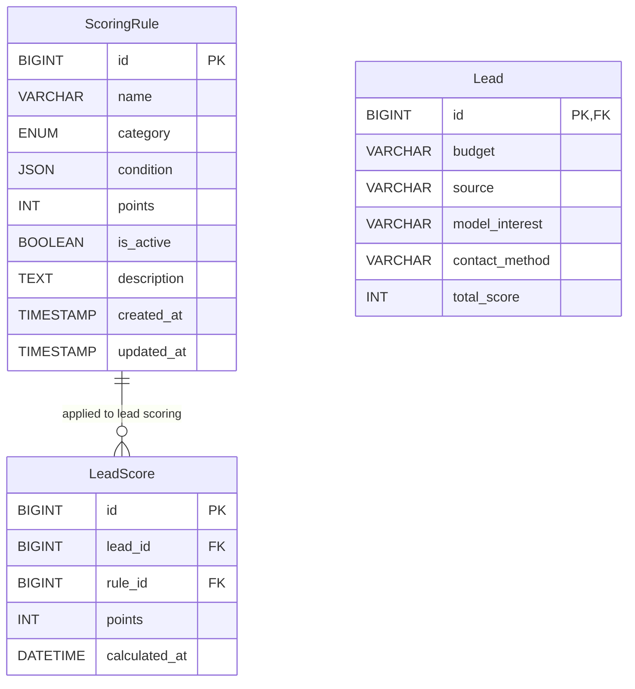
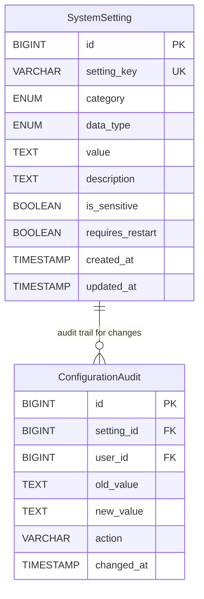

# Entity Relationship Diagram: Master Data

## Document Information
- **Module**: Master Data Management
- **Version**: 1.2
- **Created**: 02/02/2026
- **Updated by**: CR-20260202-001
- **Author**: Antigravity - Solution Architect
- **Project**: Honda SPICE ERP System

---

## 📋 Mục Lục

1. [Entity: VehicleModel](#1-entity-vehiclemodel)
2. [Entity: Accessory](#2-entity-accessory)
3. [Entity: ServiceCatalog](#3-entity-servicecatalog)
4. [Entity: ServiceBay](#4-entity-servicebay)
5. [Entity: ScoringRule](#5-entity-scoringrule)
6. [Entity: SystemSetting](#6-entity-systemsetting)
7. [Migration Notes](#7-migration-notes)
8. [Entity: Employee](#8-entity-employee)
9. [Entity: Supplier](#9-entity-supplier)
10. [Entity: Warehouse](#10-entity-warehouse)
11. [Entity: UOM](#11-entity-uom)
12. [ERD Diagram](#12-erd-diagram-complete)

---

## 1. Entity: VehicleModel

**Added by**: CR-MD-001  
**Purpose**: Master data cho danh mục xe  
**Status**: ✅ Table already exists in database  
**Enhanced by**: CR-MD-002 (compatibility), CR-MD-003 (services), CR-MD-004 (integration)

### 1.1 Table Schema

```sql
CREATE TABLE VehicleModel (
  id BIGINT PRIMARY KEY AUTO_INCREMENT,
  model_code VARCHAR(20) UNIQUE NOT NULL COMMENT 'Format: MOD/YYYY/XXX',
  model_name VARCHAR(100) UNIQUE NOT NULL COMMENT 'Honda City RS, CR-V L',
  category ENUM('SEDAN','SUV','HATCHBACK','MPV') NOT NULL,
  base_price DECIMAL(15,2) NOT NULL COMMENT 'VND',
  status ENUM('ACTIVE','INACTIVE') DEFAULT 'ACTIVE',
  created_at TIMESTAMP DEFAULT CURRENT_TIMESTAMP,
  updated_at TIMESTAMP DEFAULT CURRENT_TIMESTAMP ON UPDATE CURRENT_TIMESTAMP,
  deleted_at TIMESTAMP NULL COMMENT 'Soft delete timestamp'
) ENGINE=InnoDB DEFAULT CHARSET=utf8mb4 COLLATE=utf8mb4_unicode_ci;
```

### 1.2 Indexes

```sql
-- Primary Key
PRIMARY KEY (id)

-- Unique Constraints
UNIQUE KEY idx_model_code (model_code)
UNIQUE KEY idx_model_name (model_name)

-- Performance Indexes
INDEX idx_status (status)
INDEX idx_category (category)
INDEX idx_created_at (created_at)
```

### 1.3 Relationships

**Enhanced by CR-MD-002/003/004**:



### 1.4 Sample Data

```sql
INSERT INTO VehicleModel (model_code, model_name, category, base_price, status) VALUES
('MOD/2026/001', 'Honda City RS', 'SEDAN', 559000000.00, 'ACTIVE'),
('MOD/2026/002', 'Honda CR-V L', 'SUV', 1029000000.00, 'ACTIVE'),
('MOD/2026/003', 'Honda Civic RS', 'SEDAN', 799000000.00, 'ACTIVE'),
('MOD/2026/004', 'Honda Accord', 'SEDAN', 1319000000.00, 'ACTIVE'),
('MOD/2026/005', 'Honda BR-V', 'SUV', 661000000.00, 'ACTIVE'),
('MOD/2026/006', 'Honda HR-V', 'SUV', 699000000.00, 'ACTIVE'),
('MOD/2026/007', 'Honda City Hatchback', 'HATCHBACK', 549000000.00, 'ACTIVE'),
('MOD/2026/008', 'Honda Brio', 'HATCHBACK', 418000000.00, 'ACTIVE');
```

---

## 2. Entity: Accessory

**Added by**: CR-MD-002  
**Purpose**: Master data cho phụ kiện xe  
**Status**: ✅ Table already exists in database  
**Enhanced by**: CR-MD-003 (service compatibility), CR-MD-004 (integration)

### 2.1 Table Schema

```sql
CREATE TABLE Accessory (
  id BIGINT PRIMARY KEY AUTO_INCREMENT,
  accessory_code VARCHAR(20) UNIQUE NOT NULL COMMENT 'Format: ACC-XXX',
  accessory_name VARCHAR(200) UNIQUE NOT NULL COMMENT 'Floor Mat Premium, Body Kit Sport',
  category ENUM('INTERIOR','EXTERIOR','TECH','SAFETY') NOT NULL,
  price DECIMAL(15,2) NOT NULL COMMENT 'VND',
  installation_required BOOLEAN DEFAULT FALSE COMMENT 'Requires technician installation',
  warranty_period_months INT DEFAULT 12 COMMENT 'Warranty period in months',
  status ENUM('ACTIVE','INACTIVE') DEFAULT 'ACTIVE',
  created_at TIMESTAMP DEFAULT CURRENT_TIMESTAMP,
  updated_at TIMESTAMP DEFAULT CURRENT_TIMESTAMP ON UPDATE CURRENT_TIMESTAMP,
  deleted_at TIMESTAMP NULL COMMENT 'Soft delete timestamp'
) ENGINE=InnoDB DEFAULT CHARSET=utf8mb4 COLLATE=utf8mb4_unicode_ci;
```

### 2.2 Indexes

```sql
-- Primary Key
PRIMARY KEY (id)

-- Unique Constraints
UNIQUE KEY idx_accessory_code (accessory_code)
UNIQUE KEY idx_accessory_name (accessory_name)

-- Performance Indexes
INDEX idx_status (status)
INDEX idx_category (category)
INDEX idx_price (price)
INDEX idx_created_at (created_at)
```

### 2.3 Supporting Tables

**New Table: accessory_model_compatibility**
```sql
CREATE TABLE accessory_model_compatibility (
  accessory_id BIGINT NOT NULL,
  model_id BIGINT NOT NULL,
  created_at TIMESTAMP DEFAULT CURRENT_TIMESTAMP,
  PRIMARY KEY (accessory_id, model_id),
  FOREIGN KEY (accessory_id) REFERENCES Accessory(id) ON DELETE CASCADE,
  FOREIGN KEY (model_id) REFERENCES VehicleModel(id) ON DELETE CASCADE
) ENGINE=InnoDB DEFAULT CHARSET=utf8mb4 COLLATE=utf8mb4_unicode_ci;
```

**New Table: accessory_price_history**
```sql
CREATE TABLE accessory_price_history (
  id BIGINT PRIMARY KEY AUTO_INCREMENT,
  accessory_id BIGINT NOT NULL,
  old_price DECIMAL(15,2) COMMENT 'Previous price',
  new_price DECIMAL(15,2) NOT NULL COMMENT 'New price after change',
  changed_by BIGINT COMMENT 'User who changed price',
  changed_at TIMESTAMP DEFAULT CURRENT_TIMESTAMP,
  FOREIGN KEY (accessory_id) REFERENCES Accessory(id) ON DELETE CASCADE,
  FOREIGN KEY (changed_by) REFERENCES User(id)
) ENGINE=InnoDB DEFAULT CHARSET=utf8mb4 COLLATE=utf8mb4_unicode_ci;
```

### 2.4 Relationships



### 2.5 Sample Data

```sql
-- Accessories
INSERT INTO Accessory (accessory_code, accessory_name, category, price, installation_required, warranty_period_months, status) VALUES
('ACC-001', 'Floor Mat Premium', 'INTERIOR', 500000.00, FALSE, 12, 'ACTIVE'),
('ACC-002', 'Body Kit Sport', 'EXTERIOR', 2000000.00, TRUE, 24, 'ACTIVE'),
('ACC-003', 'Dashboard Camera', 'TECH', 3500000.00, TRUE, 12, 'ACTIVE'),
('ACC-004', 'Seat Covers Premium', 'INTERIOR', 1200000.00, FALSE, 12, 'ACTIVE'),
('ACC-005', 'Roof Rack', 'EXTERIOR', 1800000.00, TRUE, 24, 'ACTIVE'),
('ACC-006', 'Window Tinting', 'EXTERIOR', 800000.00, TRUE, 12, 'ACTIVE'),
('ACC-007', 'Car Cover', 'EXTERIOR', 600000.00, FALSE, 6, 'ACTIVE'),
('ACC-008', 'Emergency Kit', 'SAFETY', 400000.00, FALSE, 12, 'ACTIVE');

-- Compatibility Matrix
INSERT INTO accessory_model_compatibility (accessory_id, model_id) VALUES
(1, 1), (1, 2), (1, 3), -- Floor Mat fits all models
(2, 1), (2, 3), -- Body Kit fits City and Civic
(3, 1), (3, 2), (3, 3), (3, 4), -- Camera fits sedans
(4, 1), (4, 3), -- Seat covers fit City and Civic
(5, 2), (5, 6), -- Roof rack fits SUVs
(6, 1), (6, 2), (6, 3), (6, 4), -- Tinting fits all
(7, 1), (7, 2), (7, 3), (7, 4), (7, 5), (7, 6), -- Cover fits all
(8, 1), (8, 2), (8, 3), (8, 4), (8, 5), (8, 6); -- Emergency kit fits all
```

---

## 3. Entity: ServiceCatalog

**Added by**: CR-MD-003  
**Purpose**: Master data cho danh mục dịch vụ  
**Status**: ✅ Table already exists in database  
**Enhanced by**: CR-MD-002 (parts compatibility), CR-MD-004 (system integration)

### 3.1 Table Schema

```sql
CREATE TABLE ServiceCatalog (
  id BIGINT PRIMARY KEY AUTO_INCREMENT,
  service_code VARCHAR(20) UNIQUE NOT NULL COMMENT 'Format: SVC-XXX',
  service_name VARCHAR(200) UNIQUE NOT NULL COMMENT 'Oil Change, 10K Inspection',
  category ENUM('MAINTENANCE','REPAIR','INSPECTION','BODYWORK') NOT NULL,
  labor_hours DECIMAL(5,2) NOT NULL COMMENT 'Labor hours required',
  labor_rate DECIMAL(15,2) NOT NULL COMMENT 'Labor rate per hour (VND)',
  recommended_interval_km INT COMMENT 'Recommended service interval in km',
  status ENUM('ACTIVE','INACTIVE') DEFAULT 'ACTIVE',
  created_at TIMESTAMP DEFAULT CURRENT_TIMESTAMP,
  updated_at TIMESTAMP DEFAULT CURRENT_TIMESTAMP ON UPDATE CURRENT_TIMESTAMP,
  deleted_at TIMESTAMP NULL COMMENT 'Soft delete timestamp'
) ENGINE=InnoDB DEFAULT CHARSET=utf8mb4 COLLATE=utf8mb4_unicode_ci;
```

### 3.2 Indexes

```sql
-- Primary Key
PRIMARY KEY (id)

-- Unique Constraints
UNIQUE KEY idx_service_code (service_code)
UNIQUE KEY idx_service_name (service_name)

-- Performance Indexes
INDEX idx_status (status)
INDEX idx_category (category)
INDEX idx_labor_hours (labor_hours)
INDEX idx_created_at (created_at)
```

### 3.3 Supporting Tables

**New Table: service_packages**
```sql
CREATE TABLE service_packages (
  id BIGINT PRIMARY KEY AUTO_INCREMENT,
  package_code VARCHAR(20) UNIQUE NOT NULL COMMENT 'Format: PKG-XXX',
  package_name VARCHAR(200) UNIQUE NOT NULL COMMENT '10K Inspection Package',
  discount_percentage DECIMAL(5,2) DEFAULT 0.00 COMMENT 'Discount percentage 0-50',
  total_price DECIMAL(15,2) COMMENT 'Calculated total price',
  status ENUM('ACTIVE','INACTIVE') DEFAULT 'ACTIVE',
  created_at TIMESTAMP DEFAULT CURRENT_TIMESTAMP,
  updated_at TIMESTAMP DEFAULT CURRENT_TIMESTAMP ON UPDATE CURRENT_TIMESTAMP
) ENGINE=InnoDB DEFAULT CHARSET=utf8mb4 COLLATE=utf8mb4_unicode_ci;
```

**New Table: service_package_items**
```sql
CREATE TABLE service_package_items (
  package_id BIGINT NOT NULL,
  service_id BIGINT NOT NULL,
  PRIMARY KEY (package_id, service_id),
  FOREIGN KEY (package_id) REFERENCES service_packages(id) ON DELETE CASCADE,
  FOREIGN KEY (service_id) REFERENCES ServiceCatalog(id) ON DELETE CASCADE
) ENGINE=InnoDB DEFAULT CHARSET=utf8mb4 COLLATE=utf8mb4_unicode_ci;
```

### 3.4 Relationships



### 3.5 Sample Data

```sql
-- Service Catalog
INSERT INTO ServiceCatalog (service_code, service_name, category, labor_hours, labor_rate, recommended_interval_km, status) VALUES
('SVC-001', 'Oil Change', 'MAINTENANCE', 0.5, 200000.00, 10000, 'ACTIVE'),
('SVC-002', 'Tire Rotation', 'MAINTENANCE', 0.25, 200000.00, 10000, 'ACTIVE'),
('SVC-003', 'Brake Inspection', 'INSPECTION', 0.5, 200000.00, 20000, 'ACTIVE'),
('SVC-004', '10K Inspection', 'INSPECTION', 1.5, 200000.00, 10000, 'ACTIVE'),
('SVC-005', '20K Inspection', 'INSPECTION', 2.0, 200000.00, 20000, 'ACTIVE'),
('SVC-006', 'Engine Diagnostic', 'REPAIR', 1.0, 300000.00, NULL, 'ACTIVE'),
('SVC-007', 'Transmission Service', 'REPAIR', 2.0, 350000.00, 40000, 'ACTIVE'),
('SVC-008', 'Air Conditioning Service', 'REPAIR', 1.5, 250000.00, 20000, 'ACTIVE'),
('SVC-009', 'Wheel Alignment', 'REPAIR', 1.0, 250000.00, 20000, 'ACTIVE'),
('SVC-010', 'Body Work Repair', 'BODYWORK', 4.0, 400000.00, NULL, 'ACTIVE');

-- Service Packages
INSERT INTO service_packages (package_code, package_name, discount_percentage, total_price, status) VALUES
('PKG-001', '10K Inspection Package', 10.00, 450000.00, 'ACTIVE'),
('PKG-002', '20K Major Service', 15.00, 850000.00, 'ACTIVE'),
('PKG-003', 'AC Service Package', 5.00, 475000.00, 'ACTIVE');

-- Package Items
INSERT INTO service_package_items (package_id, service_id) VALUES
(1, 4), (1, 1), (1, 2), -- 10K Package: Inspection + Oil + Tire
(2, 5), (2, 1), (2, 3), (2, 7), -- 20K Package: Inspection + Oil + Brake + Transmission
(3, 8), (3, 9); -- AC Package: AC Service + Wheel Alignment
```

---

## 4. Entity: ServiceBay

**Added by**: CR-MD-004  
**Purpose**: Quản lý bays trong service center  
**Status**: ✅ Table already exists in database  
**Usage**: Service scheduling and utilization tracking

### 4.1 Table Schema

```sql
CREATE TABLE ServiceBay (
  id BIGINT PRIMARY KEY AUTO_INCREMENT,
  name VARCHAR(100) NOT NULL COMMENT 'Bay 1, Bay 2, Bay 3',
  location VARCHAR(100) COMMENT 'Area A, Area B, Workshop',
  capacity INT DEFAULT 1 COMMENT 'Maximum vehicles per bay',
  equipment JSON COMMENT 'Array of equipment: ["Lift", "Scanner", "Tire Changer"]',
  status ENUM('ACTIVE','INACTIVE','MAINTENANCE') DEFAULT 'ACTIVE',
  is_available BOOLEAN DEFAULT TRUE COMMENT 'Currently available for assignments',
  created_at TIMESTAMP DEFAULT CURRENT_TIMESTAMP,
  updated_at TIMESTAMP DEFAULT CURRENT_TIMESTAMP ON UPDATE CURRENT_TIMESTAMP
) ENGINE=InnoDB DEFAULT CHARSET=utf8mb4 COLLATE=utf8mb4_unicode_ci;
```

### 4.2 Indexes

```sql
-- Primary Key
PRIMARY KEY (id)

-- Performance Indexes
INDEX idx_status (status)
INDEX idx_is_available (is_available)
INDEX idx_location (location)
INDEX idx_created_at (created_at)
```

### 4.3 Relationships



### 4.4 Sample Data

```sql
INSERT INTO ServiceBay (name, location, capacity, equipment, status, is_available) VALUES
('Bay 1', 'Area A', 1, '["Lift", "Diagnostic Scanner", "Tire Changer", "Wheel Balancer"]', 'ACTIVE', TRUE),
('Bay 2', 'Area A', 1, '["Lift", "Diagnostic Scanner", "Air Compressor", "Brake Lathe"]', 'ACTIVE', TRUE),
('Bay 3', 'Area B', 2, '["Heavy Duty Lift", "Truck Scanner", "Large Tire Machine"]', 'ACTIVE', TRUE),
('Bay 4', 'Area B', 1, '["Paint Booth", "Spray Guns", "Dust Extractor"]', 'ACTIVE', FALSE),
('Bay 5', 'Workshop', 1, '["Engine Stand", "Transmission Jack", "Engine Hoist"]', 'MAINTENANCE', FALSE);
```

---

## 5. Entity: ScoringRule

**Added by**: CR-MD-004  
**Purpose**: Quản lý lead scoring logic  
**Status**: ✅ Table already exists in database  
**Usage**: Lead scoring and qualification

### 5.1 Table Schema

```sql
CREATE TABLE ScoringRule (
  id BIGINT PRIMARY KEY AUTO_INCREMENT,
  name VARCHAR(100) NOT NULL COMMENT 'High Budget Lead, Website Source',
  category ENUM('BUDGET','SOURCE','MODEL','CONTACT') NOT NULL,
  condition JSON NOT NULL COMMENT '{"field": "budget", "operator": ">=", "value": 500000000}',
  points INT NOT NULL COMMENT 'Points awarded when condition met',
  is_active BOOLEAN DEFAULT TRUE COMMENT 'Rule is active',
  description TEXT COMMENT 'Rule description',
  created_at TIMESTAMP DEFAULT CURRENT_TIMESTAMP,
  updated_at TIMESTAMP DEFAULT CURRENT_TIMESTAMP ON UPDATE CURRENT_TIMESTAMP
) ENGINE=InnoDB DEFAULT CHARSET=utf8mb4 COLLATE=utf8mb4_unicode_ci;
```

### 5.2 Indexes

```sql
-- Primary Key
PRIMARY KEY (id)

-- Performance Indexes
INDEX idx_is_active (is_active)
INDEX idx_category (category)
INDEX idx_points (points)
INDEX idx_created_at (created_at)
```

### 5.3 JSON Structure

```json
{
  "field": "budget|source|model_interest|contact_method",
  "operator": "=|!=|>|<|>=|<=|contains|in",
  "value": "string|number|array",
  "points": "positive integer"
}
```

### 5.4 Relationships



### 5.5 Sample Data

```sql
INSERT INTO ScoringRule (name, category, condition, points, is_active, description) VALUES
('High Budget Lead', 'BUDGET', '{"field": "budget", "operator": ">=", "value": 500000000}', 20, TRUE, 'Lead with budget ≥ 500M'),
('Website Source', 'SOURCE', '{"field": "source", "operator": "=", "value": "WEBSITE"}', 10, TRUE, 'Lead from website source'),
('Premium Model Interest', 'MODEL', '{"field": "model_interest", "operator": "in", "value": ["Honda City RS", "Honda Civic RS", "Honda Accord"]}', 15, TRUE, 'Interest in premium models'),
('Phone Contact', 'CONTACT', '{"field": "contact_method", "operator": "=", "value": "PHONE"}', 5, TRUE, 'Prefers phone contact'),
('Urgent Purchase', 'BUDGET', '{"field": "budget", "operator": ">=", "value": 1000000000}', 25, TRUE, 'Very high budget (>1B)'),
('Referral Source', 'SOURCE', '{"field": "source", "operator": "in", "value": ["REFERRAL", "EXISTING_CUSTOMER"]}', 20, TRUE, 'Referred by existing customer'),
('SUV Interest', 'MODEL', '{"field": "model_interest", "operator": "contains", "value": "SUV"}', 10, TRUE, 'Interest in SUV models'),
('Immediate Purchase', 'CONTACT', '{"field": "contact_method", "operator": "=", "value": "WALK_IN"}', 15, TRUE, 'Walk-in customer (urgent)');
```

---

## 6. Entity: SystemSetting

**Added by**: CR-MD-004  
**Purpose**: Quản lý system configuration  
**Status**: ✅ Table already exists in database  
**Usage**: System-wide configuration management

### 6.1 Table Schema

```sql
CREATE TABLE SystemSetting (
  id BIGINT PRIMARY KEY AUTO_INCREMENT,
  setting_key VARCHAR(100) UNIQUE NOT NULL COMMENT 'smtp_host, vat_rate, max_upload_size',
  category ENUM('GENERAL','EMAIL','SMS','NOTIFICATIONS','FEATURES') NOT NULL,
  data_type ENUM('STRING','NUMBER','BOOLEAN','JSON') NOT NULL,
  value TEXT NOT NULL COMMENT 'Setting value (type validated by data_type)',
  description TEXT COMMENT 'Setting description',
  is_sensitive BOOLEAN DEFAULT FALSE COMMENT 'Contains sensitive data (passwords, keys)',
  requires_restart BOOLEAN DEFAULT FALSE COMMENT 'Requires system restart to apply',
  created_at TIMESTAMP DEFAULT CURRENT_TIMESTAMP,
  updated_at TIMESTAMP DEFAULT CURRENT_TIMESTAMP ON UPDATE CURRENT_TIMESTAMP
) ENGINE=InnoDB DEFAULT CHARSET=utf8mb4 COLLATE=utf8mb4_unicode_ci;
```

### 6.2 Indexes

```sql
-- Primary Key
PRIMARY KEY (id)

-- Unique Constraints
UNIQUE KEY idx_setting_key (setting_key)

-- Performance Indexes
INDEX idx_category (category)
INDEX idx_data_type (data_type)
INDEX idx_requires_restart (requires_restart)
INDEX idx_created_at (created_at)
```

### 6.3 Relationships



### 6.4 Sample Data

```sql
INSERT INTO SystemSetting (setting_key, category, data_type, value, description, is_sensitive, requires_restart) VALUES
-- General Settings
('company_name', 'GENERAL', 'STRING', 'Honda Oto Cộng Hòa', 'Company name displayed throughout system', FALSE, FALSE),
('vat_rate', 'GENERAL', 'NUMBER', '10', 'VAT rate percentage', FALSE, FALSE),
('currency_code', 'GENERAL', 'STRING', 'VND', 'Default currency code', FALSE, TRUE),
('max_upload_size', 'GENERAL', 'NUMBER', '10485760', 'Maximum file upload size in bytes', FALSE, FALSE),

-- Email Settings
('smtp_host', 'EMAIL', 'STRING', 'smtp.gmail.com', 'SMTP server hostname', FALSE, FALSE),
('smtp_port', 'EMAIL', 'NUMBER', '587', 'SMTP server port', FALSE, FALSE),
('smtp_username', 'EMAIL', 'STRING', 'noreply@honda.com', 'SMTP username', FALSE, FALSE),
('smtp_password', 'EMAIL', 'STRING', 'encrypted_password_here', 'SMTP password', TRUE, FALSE),
('use_tls', 'EMAIL', 'BOOLEAN', 'true', 'Use TLS for SMTP connection', FALSE, FALSE),
('from_email', 'EMAIL', 'STRING', 'noreply@honda.com', 'Default from email address', FALSE, FALSE),

-- SMS Settings
('sms_enabled', 'SMS', 'BOOLEAN', 'true', 'Enable SMS notifications', FALSE, FALSE),
('sms_api_key', 'SMS', 'STRING', 'your_api_key_here', 'SMS API key', TRUE, FALSE),
('sms_sender_name', 'SMS', 'STRING', 'HONDA', 'SMS sender name', FALSE, FALSE),

-- Notification Settings
('email_notifications', 'NOTIFICATIONS', 'BOOLEAN', 'true', 'Enable email notifications', FALSE, FALSE),
('sms_notifications', 'NOTIFICATIONS', 'BOOLEAN', 'true', 'Enable SMS notifications', FALSE, FALSE),
('appointment_reminders', 'NOTIFICATIONS', 'BOOLEAN', 'true', 'Send appointment reminder notifications', FALSE, FALSE),
('reminder_hours_before', 'NOTIFICATIONS', 'NUMBER', '24', 'Hours before appointment to send reminder', FALSE, FALSE),

-- Feature Settings
('lead_scoring_enabled', 'FEATURES', 'BOOLEAN', 'true', 'Enable automatic lead scoring', FALSE, FALSE),
('quotation_expiry_days', 'FEATURES', 'NUMBER', '7', 'Quotation validity period in days', FALSE, FALSE),
('deposit_percentage_min', 'FEATURES', 'NUMBER', '10', 'Minimum deposit percentage required', FALSE, FALSE),
('max_discount_percentage', 'FEATURES', 'NUMBER', '10', 'Maximum discount without approval', FALSE, FALSE);
```

---

## 7. Migration Notes

### 7.1 Existing Data

**VehicleModel**: ✅ Table already exists (CR-MD-001)
**Accessory**: ✅ Table already exists (existing system)
**ServiceCatalog**: ✅ Table already exists (existing system)
**ServiceBay**: ✅ Table already exists (existing system)
**ScoringRule**: ✅ Table already exists (existing system)
**SystemSetting**: ✅ Table already exists (existing system)

### 7.2 New Tables Required (CR-MD-002/003/004)

**CR-MD-002 (Accessory) - 2 New Tables**:
```sql
-- Table 1: accessory_model_compatibility
CREATE TABLE accessory_model_compatibility (
  accessory_id BIGINT NOT NULL,
  model_id BIGINT NOT NULL,
  created_at TIMESTAMP DEFAULT CURRENT_TIMESTAMP,
  PRIMARY KEY (accessory_id, model_id),
  FOREIGN KEY (accessory_id) REFERENCES Accessory(id) ON DELETE CASCADE,
  FOREIGN KEY (model_id) REFERENCES VehicleModel(id) ON DELETE CASCADE
);

-- Table 2: accessory_price_history
CREATE TABLE accessory_price_history (
  id BIGINT PRIMARY KEY AUTO_INCREMENT,
  accessory_id BIGINT NOT NULL,
  old_price DECIMAL(15,2),
  new_price DECIMAL(15,2) NOT NULL,
  changed_by BIGINT,
  changed_at TIMESTAMP DEFAULT CURRENT_TIMESTAMP,
  FOREIGN KEY (accessory_id) REFERENCES Accessory(id) ON DELETE CASCADE,
  FOREIGN KEY (changed_by) REFERENCES User(id)
);
```

**CR-MD-003 (ServiceCatalog) - 2 New Tables**:
```sql
-- Table 3: service_packages
CREATE TABLE service_packages (
  id BIGINT PRIMARY KEY AUTO_INCREMENT,
  package_code VARCHAR(20) UNIQUE NOT NULL,
  package_name VARCHAR(200) UNIQUE NOT NULL,
  discount_percentage DECIMAL(5,2) DEFAULT 0,
  total_price DECIMAL(15,2),
  status ENUM('ACTIVE','INACTIVE') DEFAULT 'ACTIVE',
  created_at TIMESTAMP DEFAULT CURRENT_TIMESTAMP,
  updated_at TIMESTAMP DEFAULT CURRENT_TIMESTAMP ON UPDATE CURRENT_TIMESTAMP
);

-- Table 4: service_package_items
CREATE TABLE service_package_items (
  package_id BIGINT NOT NULL,
  service_id BIGINT NOT NULL,
  PRIMARY KEY (package_id, service_id),
  FOREIGN KEY (package_id) REFERENCES service_packages(id) ON DELETE CASCADE,
  FOREIGN KEY (service_id) REFERENCES ServiceCatalog(id) ON DELETE CASCADE
);
```

### 7.3 Data Migration Strategy

**CR-MD-002: Accessory Compatibility Matrix**
1. **Analyze existing accessory data**
2. **Create compatibility records based on historical quotations**
3. **Populate accessory_price_history from existing price changes**
4. **Validate data integrity**

**CR-MD-003: Service Package Builder**
1. **Identify commonly bundled services from historical ROs**
2. **Create initial service packages based on common combinations**
3. **Calculate package prices using current labor rates**
4. **Set reasonable default discounts**

**Migration Script Example**:
```sql
-- CR-MD-002: Populate compatibility matrix from historical quotations
INSERT INTO accessory_model_compatibility (accessory_id, model_id)
SELECT DISTINCT qa.accessory_id, q.vehicle_model_id
FROM QuotationAccessory qa
JOIN Quotation q ON qa.quotation_id = q.id
JOIN VehicleModel vm ON q.vehicle_model_id = vm.id
WHERE vm.status = 'ACTIVE' AND qa.accessory_id IS NOT NULL;

-- CR-MD-003: Create service packages from common service combinations
INSERT INTO service_packages (package_code, package_name, discount_percentage, status)
SELECT 
  CONCAT('PKG-', ROW_NUMBER() OVER (ORDER BY COUNT(*) DESC)) as package_code,
  CONCAT(CONCAT_WS(' + ', GROUP_CONCAT(DISTINCT sc.service_name SEPARATOR ' + ')), ' Package') as package_name,
  10.00 as discount_percentage,
  'ACTIVE' as status
FROM RepairOrderService ros
JOIN ServiceCatalog sc ON ros.service_id = sc.id

WHERE sc.status = 'ACTIVE'
GROUP BY sc.category
HAVING COUNT(DISTINCT sc.id) >= 2;
```

### 7.4 Rollback Plan

**If migration fails**:
1. **Immediate rollback**: Drop newly created tables
2. **Data restoration**: Restore from backup taken before migration
3. **Error analysis**: Review migration errors and fix data issues
4. **Retry migration**: Re-run corrected migration script

**Rollback Commands**:
```sql
-- Drop new tables (if created)
DROP TABLE IF EXISTS accessory_model_compatibility;
DROP TABLE IF EXISTS accessory_price_history;
DROP TABLE IF EXISTS service_packages;
DROP TABLE IF EXISTS service_package_items;

-- Restore data from backup
-- mysql -u root -p honda_spice_erp < backup_before_migration.sql
```

### 7.5 Performance Considerations

**Indexes Added**:
- Foreign key indexes on all new tables
- Composite indexes for frequent query patterns
- Status and category indexes for filtering

**Query Optimization**:
- Use JOINs with proper indexes
- Implement pagination for large datasets
- Cache frequently accessed configuration data

**Monitoring**:
- Monitor query performance on new tables
- Track index usage statistics
- Monitor connection pool usage

---

## 8. Entity: Employee

**Added by**: CR-20260202-001
**Purpose**: Extended employee profile

### 8.1 Table Schema
```sql
CREATE TABLE Employee (
  id BIGINT PRIMARY KEY AUTO_INCREMENT,
  user_id BIGINT UNIQUE COMMENT 'Link to system user',
  employee_code VARCHAR(20) UNIQUE NOT NULL,
  full_name VARCHAR(100) NOT NULL,
  department_id BIGINT,
  position_id BIGINT,
  level_id BIGINT,
  join_date DATE,
  status ENUM('ACTIVE','INACTIVE','TERMINATED') DEFAULT 'ACTIVE',
  created_at TIMESTAMP DEFAULT CURRENT_TIMESTAMP,
  FOREIGN KEY (user_id) REFERENCES User(id),
  FOREIGN KEY (department_id) REFERENCES MasterDepartment(id),
  FOREIGN KEY (position_id) REFERENCES MasterPosition(id)
);
```

### 8.2 Supporting Tables
- `MasterDepartment` (id, code, name)
- `MasterPosition` (id, code, name)
- `MasterLevel` (id, code, name)

---

## 9. Entity: Supplier

**Added by**: CR-20260202-001

### 9.1 Table Schema
```sql
CREATE TABLE Supplier (
  id BIGINT PRIMARY KEY AUTO_INCREMENT,
  supplier_code VARCHAR(20) UNIQUE NOT NULL,
  supplier_name VARCHAR(200) UNIQUE NOT NULL,
  tax_id VARCHAR(50),
  address TEXT,
  status ENUM('ACTIVE','INACTIVE','BLACKLIST') DEFAULT 'ACTIVE',
  created_at TIMESTAMP DEFAULT CURRENT_TIMESTAMP
);
```

---

## 10. Entity: Warehouse

**Added by**: CR-20260202-001

### 10.1 Table Schema
```sql
CREATE TABLE Warehouse (
  id BIGINT PRIMARY KEY AUTO_INCREMENT,
  warehouse_code VARCHAR(20) UNIQUE NOT NULL,
  warehouse_name VARCHAR(100) UNIQUE NOT NULL,
  location_address TEXT,
  manager_id BIGINT COMMENT 'Ref Employee',
  is_active BOOLEAN DEFAULT TRUE
);
```

---

## 11. Entity: UOM (Unit of Measure)

**Added by**: CR-20260202-001

### 11.1 Table Schema
```sql
CREATE TABLE UOM (
  id BIGINT PRIMARY KEY AUTO_INCREMENT,
  uom_code VARCHAR(10) UNIQUE NOT NULL,
  uom_name VARCHAR(50) NOT NULL,
  description VARCHAR(200)
);
```

---

## 12. ERD Diagram (Complete)

```mermaid
erDiagram
    VehicleModel ||--o{ Lead : "model_interest"
    VehicleModel ||--o{ Quotation : "vehicle_model_id"
    VehicleModel ||--o{ Vehicle : "model_id"
    VehicleModel ||--o{ accessory_model_compatibility : "compatible models"
    
    Accessory ||--o{ accessory_model_compatibility : "accessory compatibility"
    Accessory ||--o{ accessory_price_history : "price history"
    Accessory ||--o{ QuotationAccessory : "quotation items"
    
    ServiceCatalog ||--o{ service_package_items : "package items"
    ServiceCatalog ||--o{ RepairOrderService : "repair order services"
    
    ServiceBay ||--o{ Appointment : "appointments"
    ServiceBay ||--o{ RepairOrder : "repair orders"
    
    ScoringRule ||--o{ LeadScore : "lead scoring"
    
    SystemSetting ||--o{ ConfigurationAudit : "configuration changes"
    
    service_packages ||--o{ service_package_items : "contains services"
```



---

## Change Log

### v1.0 (31/01/2026) - CR-MD-001
- Initial ERD created for Master Data module
- Added Entity: VehicleModel (complete schema documentation)
- Added Relationships diagram (Lead, Quotation, Vehicle)
- Added Data Dictionary with all columns
- Added Sample Data (8 Honda models)
- Added Business Rules mapping
- Added Migration Notes (no schema changes, data migration in CR-INT-002)
- Note: Table already exists in database, no DDL changes required

### v1.1 (31/01/2026) - CR-MD-002/003/004
- **Added Entity: Accessory** (complete schema with supporting tables)
  * Added accessory_model_compatibility table
  * Added accessory_price_history table
  * Added 8 sample accessories with compatibility matrix
  * Enhanced relationships with VehicleModel

- **Added Entity: ServiceCatalog** (complete schema with supporting tables)
  * Added service_packages table
  * Added service_package_items table
  * Added 10 sample services with pricing
  * Added 3 sample service packages

- **Added Entity: ServiceBay** (documentation)
  * Complete schema with capacity and equipment tracking
  * 5 sample bays with different configurations
  * Relationships with Appointment and RepairOrder

- **Added Entity: ScoringRule** (documentation)
  * JSON-based rule structure
  * 8 sample rules with different categories
  * Lead scoring integration

- **Added Entity: SystemSetting** (documentation)
  * Type-safe configuration management
  * 20 sample settings across 5 categories
  * Audit trail integration

- **Added 4 New Tables** (total):
  * accessory_model_compatibility (CR-MD-002)
  * accessory_price_history (CR-MD-002)
  * service_packages (CR-MD-003)
  * service_package_items (CR-MD-003)

- **Enhanced Migration Strategy**:
  * Detailed migration scripts for compatibility matrix
  * Service package creation from historical data
  * Rollback procedures and data validation

- **Complete ERD Diagram** showing all 6 entities and their relationships
- **Performance Considerations** for new tables and queries
- **Total**: 6 master data entities + 4 supporting tables

### v1.2 (02/02/2026) - CR-20260202-001 (Emergency Master Data)
- ADDED: Employee table (Employee)
- ADDED: Supplier table (Supplier)
- ADDED: Warehouse table (Warehouse)
- ADDED: UOM table (UOM)
- NOTE: Emergency schema updates.

---

**End of Document**
