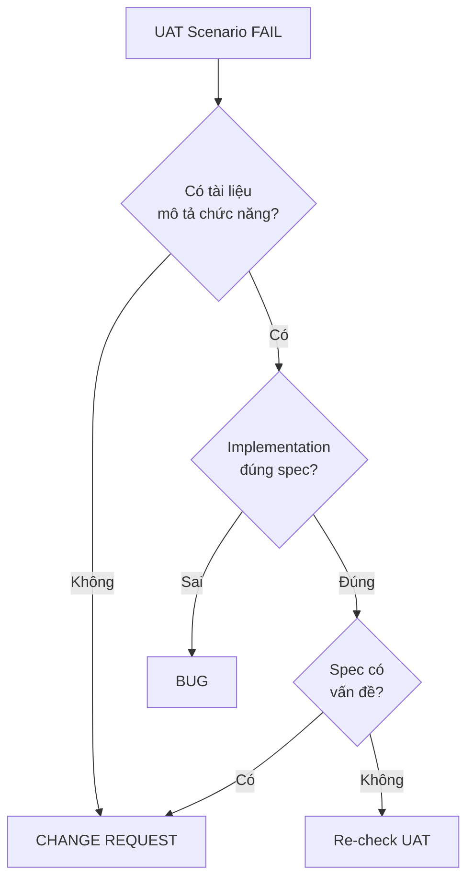

# UAT Classification Guide v6.0
## Honda Dealer Management System

**Version**: 6.0  
**Date**: 2026-01-30  
**Authority**: Antigravity - Design Authority & UAT Decision Maker  
**Reference**: UAT Plan Full System v5.0  
**Status**: OFFICIAL CLASSIFICATION GUIDE

---

## 📋 OVERVIEW

Tài liệu này hướng dẫn cách phân loại kết quả UAT execution thành **BUG** hoặc **CHANGE REQUEST** (CR) dựa trên UAT Plan v5.0 với phương pháp 8 nhóm (A-H).

**Nguyên tắc cốt lõi**:
- ✅ **BUG**: Implementation sai so với tài liệu hiện hành (ERD/FRD/API Spec/UI Spec)
- 🔁 **CHANGE REQUEST**: Yêu cầu thay đổi tài liệu hiện hành

---

## 🎯 CLASSIFICATION DECISION TREE



---

## 📊 CLASSIFICATION RULES BY UAT GROUP

### 🅰 NHÓM A – CREATE & SAVE

#### Scenario FAIL Examples

**Example 1: Missing Required Field Validation**
```
Scenario: A-CRM-LEADS-CREATE-001
Expected: Error when phone is missing (NOT NULL constraint)
Actual: Record created with NULL phone
```

**Classification Decision**:
1. Check ERD: `leads.phone` có NOT NULL constraint? → ✅ Có
2. Check API Spec: `POST /api/crm/leads` yêu cầu phone? → ✅ Có
3. Implementation: Không validate → ❌ Sai spec

**Result**: ✅ **BUG** - Implementation thiếu validation

---

**Example 2: New Field Not in Spec**
```
Scenario: A-CRM-LEADS-CREATE-002
Expected: Create lead with "priority" field
Actual: API returns 400 - Unknown field "priority"
```

**Classification Decision**:
1. Check ERD: `leads` có field `priority`? → ❌ Không
2. Check API Spec: `POST /api/crm/leads` có field priority? → ❌ Không
3. Check FRD: SCR-CRM-001 có yêu cầu priority? → ❌ Không

**Result**: 🔁 **CHANGE REQUEST** - Cần thêm field vào ERD/API Spec/FRD

---

### 🅱 NHÓM B – READ / PERSIST

#### Scenario FAIL Examples

**Example 1: Data Not Persisting After Reload**
```
Scenario: B-CRM-CUSTOMERS-READ-001
Expected: Customer data persists after F5
Actual: Customer data disappears after reload
```

**Classification Decision**:
1. Check ERD: `customers` table tồn tại? → ✅ Có
2. Check API Spec: `POST /api/crm/customers` có save to DB? → ✅ Có
3. Implementation: Không save to DB → ❌ Sai spec

**Result**: ✅ **BUG** - Implementation không persist data

---

### 🅲 NHÓM C – UPDATE

#### Scenario FAIL Examples

**Example 1: Update Endpoint Not Found**
```
Scenario: C-CRM-SCORING-UPDATE-001
Expected: Update scoring rule
Actual: 404 - Endpoint not found
```

**Classification Decision**:
1. Check API Spec: Có `PUT /api/crm/scoring/rules/{id}`? → ❌ Không
2. Check API Spec: Có `PUT /api/crm/scoring/rules` (bulk)? → ✅ Có
3. Check FRD: SCR-CRM-003 yêu cầu individual update? → ❌ Không

**Result**: 🔁 **CHANGE REQUEST** - Spec chỉ có bulk update, cần thêm individual update

---

**Example 2: Update Not Working**
```
Scenario: C-CRM-CUSTOMERS-UPDATE-001
Expected: Customer name updated
Actual: Name not changed after update
```

**Classification Decision**:
1. Check API Spec: `PUT /api/crm/customers/{id}` tồn tại? → ✅ Có
2. Check ERD: `customers.name` có thể update? → ✅ Có
3. Implementation: Không update → ❌ Sai spec

**Result**: ✅ **BUG** - Implementation không update đúng

---

### 🅳 NHÓM D – DELETE

#### D1: Soft Delete

**Example: Soft Delete Not Working**
```
Scenario: D-CRM-CUSTOMERS-DELETE-001
Expected: Customer soft deleted (deleted_at set)
Actual: Customer hard deleted (record removed)
```

**Classification Decision**:
1. Check ERD: `customers` có field `deleted_at`? → ✅ Có
2. Check API Spec: `DELETE /api/crm/customers/{id}` soft delete? → ✅ Có
3. Implementation: Hard delete thay vì soft → ❌ Sai spec

**Result**: ✅ **BUG** - Implementation sai delete logic

---

#### D2: Hard Delete

**Example: Delete Endpoint Missing**
```
Scenario: D-CRM-SCORING-DELETE-001
Expected: Delete scoring rule
Actual: 404 - Endpoint not found
```

**Classification Decision**:
1. Check API Spec: Có `DELETE /api/crm/scoring/rules/{id}`? → ❌ Không
2. Check FRD: SCR-CRM-003 có yêu cầu delete? → ❌ Không
3. Check ERD: `scoring_rules` có business rule về delete? → ❌ Không

**Result**: 🔁 **CHANGE REQUEST** - Spec không có delete, cần thêm vào

---

#### D3: Delete with Constraint

**Example: FK Constraint Not Enforced**
```
Scenario: D-CRM-CUSTOMERS-DELETE-002
Expected: Error when customer has active contracts
Actual: Customer deleted, contracts orphaned
```

**Classification Decision**:
1. Check ERD: `customers` có FK từ `contracts`? → ✅ Có
2. Check API Spec: Business rule prevent delete? → ✅ Có (BR-CRM-042)
3. Implementation: Không check FK → ❌ Sai spec

**Result**: ✅ **BUG** - Implementation không enforce FK constraint

---

### 🅴 NHÓM E – FILE / ATTACHMENT

#### Scenario FAIL Examples

**Example 1: File Upload Not Working**
```
Scenario: E-PDS-FILE-UPLOAD-001
Expected: Photo uploaded and saved
Actual: 500 - File upload failed
```

**Classification Decision**:
1. Check ERD: `pds_checklists.photos` field tồn tại? → ✅ Có (JSON)
2. Check API Spec: `POST /api/sales/pds/{id}/photos` tồn tại? → ✅ Có
3. Implementation: Upload logic lỗi → ❌ Sai spec

**Result**: ✅ **BUG** - Implementation upload logic lỗi

---

**Example 2: File Download Endpoint Missing**
```
Scenario: E-INSURANCE-FILE-DOWNLOAD-001
Expected: Download claim document
Actual: 404 - Endpoint not found
```

**Classification Decision**:
1. Check API Spec: Có `GET /api/insurance/claims/{id}/documents/{fileId}`? → ❌ Không
2. Check FRD: SCR-INS-005 có yêu cầu download? → ⏸️ Cần check
3. Check FRD SCR-INS-005: → ❌ Không có yêu cầu download

**Result**: 🔁 **CHANGE REQUEST** - Spec không có download, cần thêm vào

---

### 🅵 NHÓM F – STATE / WORKFLOW

#### Scenario FAIL Examples

**Example 1: Invalid Transition Allowed**
```
Scenario: F-LEADS-WORKFLOW-001
Expected: Error when transition DEAD → WON
Actual: Transition allowed
```

**Classification Decision**:
1. Check FRD: SCR-CRM-001 định nghĩa workflow? → ✅ Có
2. Check Workflow: DEAD → WON allowed? → ❌ Không
3. Implementation: Không validate transition → ❌ Sai spec

**Result**: ✅ **BUG** - Implementation không validate workflow

---

**Example 2: New State Not in Spec**
```
Scenario: F-QUOTATIONS-WORKFLOW-002
Expected: Quotation status "ON_HOLD"
Actual: Error - Invalid status
```

**Classification Decision**:
1. Check ERD: `quotations.status` có enum ON_HOLD? → ❌ Không
2. Check FRD: SCR-SAL-002 có state ON_HOLD? → ❌ Không
3. Check API Spec: Có status ON_HOLD? → ❌ Không

**Result**: 🔁 **CHANGE REQUEST** - Cần thêm state vào ERD/FRD/API Spec

---

### 🅶 NHÓM G – VALIDATION & ERROR

#### Scenario FAIL Examples

**Example 1: UNIQUE Constraint Not Enforced**
```
Scenario: G-CRM-CUSTOMERS-UNIQUE-001
Expected: Error when duplicate phone
Actual: Duplicate customer created
```

**Classification Decision**:
1. Check ERD: `customers.phone` có UNIQUE constraint? → ✅ Có
2. Check API Spec: Validate unique phone? → ✅ Có
3. Implementation: Không validate → ❌ Sai spec

**Result**: ✅ **BUG** - Implementation không enforce UNIQUE

---

**Example 2: ENUM Validation Not Working**
```
Scenario: G-USERS-ENUM-001
Expected: Error when role = "INVALID"
Actual: User created with invalid role
```

**Classification Decision**:
1. Check ERD: `users.role` có enum constraint? → ✅ Có
2. Check API Spec: Validate enum values? → ✅ Có
3. Implementation: Không validate (SQLite limitation) → ❌ Sai spec

**Result**: ✅ **BUG** - Implementation cần application-level validation

---

### 🅷 NHÓM H – CROSS-SCREEN / E2E

#### Scenario FAIL Examples

**Example 1: Data Not Linking Across Screens**
```
Scenario: H1-LEAD-TO-CONTRACT
Expected: Lead data appears in Customer after conversion
Actual: Customer created but missing lead data
```

**Classification Decision**:
1. Check FRD: SCR-CRM-001 → SCR-CRM-002 flow? → ✅ Có
2. Check API Spec: Convert lead copies data? → ✅ Có
3. Implementation: Không copy data → ❌ Sai spec

**Result**: ✅ **BUG** - Implementation không copy data đúng

---

**Example 2: Missing E2E Flow**
```
Scenario: H16-NEW-FLOW
Expected: Campaign → Lead → Quotation → Contract flow
Actual: No integration between Campaign and Quotation
```

**Classification Decision**:
1. Check FRD: Có flow Campaign → Quotation? → ❌ Không
2. Check API Spec: Có API link Campaign to Quotation? → ❌ Không
3. Check BRD: Có yêu cầu flow này? → ❌ Không

**Result**: 🔁 **CHANGE REQUEST** - Flow mới, cần thêm vào spec

---

## 🔍 CLASSIFICATION CHECKLIST

Khi phân loại một UAT FAIL scenario, làm theo checklist này:

### Step 1: Identify Scenario Details
- [ ] Scenario ID (e.g., A-CRM-LEADS-CREATE-001)
- [ ] UAT Group (A/B/C/D/E/F/G/H)
- [ ] Entity (e.g., `leads`)
- [ ] Action Type (CREATE/READ/UPDATE/DELETE/FILE/STATE/E2E)
- [ ] Actual Result (what happened)
- [ ] Expected Result (what should happen)

### Step 2: Trace to Documentation
- [ ] Check ERD v1.2: Entity/field/constraint tồn tại?
- [ ] Check FRD v1.0: Screen/feature yêu cầu chức năng này?
- [ ] Check API Spec v1.0: Endpoint/business rule định nghĩa?
- [ ] Check UI Spec v1.0: UI behavior mô tả?

### Step 3: Compare Actual vs Expected
- [ ] Tài liệu có mô tả chức năng này? (Có/Không)
- [ ] Implementation có tuân thủ tài liệu? (Có/Không)
- [ ] Nếu không tuân thủ, lý do gì? (Bug/Missing feature/Spec unclear)

### Step 4: Make Classification Decision

**Decision Matrix**:

| Tài liệu mô tả? | Implementation đúng? | Classification |
|-----------------|----------------------|----------------|
| ✅ Có | ✅ Đúng | ⚠️ Re-check UAT |
| ✅ Có | ❌ Sai | ✅ **BUG** |
| ❌ Không | - | 🔁 **CHANGE REQUEST** |
| ⚠️ Unclear | - | ⏸️ **PENDING** (cần clarify) |

### Step 5: Document Classification

**For BUG**:
```markdown
**🔍 CLASSIFICATION**: ✅ BUG

**Lý do**:
- Tài liệu YÊU CẦU [chức năng X]
- Implementation [không làm / làm sai]
- Code không tuân thủ spec

**Phạm vi ảnh hưởng**:
- 💻 BE: [Fix gì]
- 🗄️ DB: [Thay đổi gì]
- 📄 Tài liệu: KHÔNG cần cập nhật (đã đúng)
- 🧪 Test: Re-run [Scenario ID]

**Hành động tiếp theo**:
1. ✅ Xác nhận BUG
2. ✅ KHÔNG cập nhật tài liệu
3. 🐛 Chỉ định OpenCode sửa code
4. 🧪 Re-run UAT
```

**For CHANGE REQUEST**:
```markdown
**🔍 CLASSIFICATION**: 🔁 CHANGE REQUEST

**Lý do**:
- Tài liệu KHÔNG MÔ TẢ chức năng [X]
- API Spec KHÔNG ĐỊNH NGHĨA [endpoint/rule]
- FRD KHÔNG YÊU CẦU tính năng này
- Đây là yêu cầu mới, không phải lỗi implementation

**Phạm vi ảnh hưởng**:
- 📄 FRD: Cần cập nhật [Screen ID] thêm [chức năng]
- 📄 API Spec: Cần thêm [API endpoint]
- 📄 ERD: Cần thêm [field/constraint] (nếu cần)
- 💻 BE: Sau khi có spec mới, implement
- 🧪 Test: Re-run [Scenario ID] sau khi implement

**Hành động tiếp theo**:
1. ⏸️ KHÔNG cho OpenCode sửa code
2. 📝 Antigravity cập nhật tài liệu
3. 📝 Tăng version: [Doc] vX.Y
4. ✅ Sau đó mới cho OpenCode implement
```

---

## 📊 COMMON CLASSIFICATION PATTERNS

### Pattern 1: Missing CRUD Operation

**Symptom**: 404 - Endpoint not found

**Classification Logic**:
1. Check API Spec: Endpoint có trong spec? → Không → **CR**
2. Check FRD: Screen có yêu cầu chức năng? → Không → **CR**
3. Check ERD: Entity tồn tại? → Có → **CR** (entity có nhưng API không)

**Result**: 🔁 **CHANGE REQUEST** - Cần thêm API vào spec

---

### Pattern 2: Soft Delete Not Working

**Symptom**: Record physically deleted instead of soft deleted

**Classification Logic**:
1. Check ERD: Entity có `deleted_at` field? → Có → Spec yêu cầu soft delete
2. Check API Spec: DELETE endpoint mô tả soft delete? → Có
3. Implementation: Hard delete → Sai spec

**Result**: ✅ **BUG** - Implementation sai delete logic

---

### Pattern 3: Constraint Not Enforced

**Symptom**: Duplicate/invalid data created

**Classification Logic**:
1. Check ERD: Constraint (UNIQUE/NOT NULL/FK) tồn tại? → Có
2. Check API Spec: Validation yêu cầu? → Có
3. Implementation: Không validate → Sai spec

**Result**: ✅ **BUG** - Implementation thiếu validation

---

### Pattern 4: Workflow Violation

**Symptom**: Invalid state transition allowed

**Classification Logic**:
1. Check FRD: Workflow định nghĩa? → Có
2. Check transition: Allowed? → Không
3. Implementation: Không validate → Sai spec

**Result**: ✅ **BUG** - Implementation không enforce workflow

---

### Pattern 5: New Feature Request

**Symptom**: Feature không tồn tại

**Classification Logic**:
1. Check tất cả docs: Feature có trong spec? → Không
2. User yêu cầu feature mới → Không phải bug

**Result**: 🔁 **CHANGE REQUEST** - Feature mới, cần spec

---

## 🎯 SPECIAL CASES

### Case 1: SQLite Limitations

**Example**: ENUM validation không work (SQLite không hỗ trợ ENUM)

**Classification**:
- Tài liệu yêu cầu ENUM validation → ✅ Có
- SQLite không hỗ trợ → Database limitation
- Cần application-level validation → Implementation thiếu

**Result**: ✅ **BUG** - Cần implement application-level validation

---

### Case 2: Ambiguous Spec

**Example**: Spec không rõ ràng về behavior

**Classification**:
- Tài liệu mô tả không rõ → ⏸️ PENDING
- Cần clarify với stakeholder
- Sau khi clarify → Phân loại lại

**Result**: ⏸️ **PENDING** - Cần clarify spec

---

### Case 3: Spec Conflict

**Example**: ERD và API Spec mâu thuẫn

**Classification**:
- ERD nói A, API Spec nói B → Conflict
- Cần resolve conflict trước
- Sau khi resolve → Phân loại lại

**Result**: ⏸️ **PENDING** - Cần resolve conflict

---

## 📝 CLASSIFICATION TEMPLATE

```markdown
### ❌ FAIL #[N]: [Scenario ID] - [Title]

**Scenario ID**: [ID]  
**Entity**: [Entity Name]  
**Action**: [CREATE/READ/UPDATE/DELETE/FILE/STATE/E2E]  
**Status**: ❌ FAIL / ⚠️ PARTIAL FAIL / ✅ FIXED  

**Actual Result**:
- [What happened]
- [Error message]
- [Unexpected behavior]

**Expected Result** (theo tài liệu):
- **FRD**: [Screen ID] - [Requirement]
- **API Spec**: [API ID] - [Endpoint/Rule]
- **ERD**: [Table/Field/Constraint]

**Trace Analysis**:
- ✅/❌ FRD [Screen ID]: [Finding]
- ✅/❌ API Spec [Section]: [Finding]
- ✅/❌ ERD [Table]: [Finding]
- ✅/❌ Implementation: [Finding]

**🔍 CLASSIFICATION**: ✅ BUG / 🔁 CHANGE REQUEST / ⏸️ PENDING

**Lý do**:
- [Reason 1]
- [Reason 2]
- [Conclusion]

**Phạm vi ảnh hưởng**:
- 💻 **BE**: [Changes needed]
- 🗄️ **DB**: [Changes needed]
- 📄 **Tài liệu**: [Updates needed]
- 🧪 **Test**: [Re-run scenarios]

**Hành động tiếp theo**:
1. [Action 1]
2. [Action 2]
3. [Action 3]
```

---

## 🔒 GOVERNANCE RULES

### Rule 1: Authority
- ✅ **Antigravity** là người DUY NHẤT được phân loại BUG vs CHANGE REQUEST
- ❌ **OpenCode** KHÔNG được tự phân loại
- ❌ **Không có file phân loại** → OpenCode KHÔNG được sửa

### Rule 2: Documentation First
- 🔁 **CHANGE REQUEST** → Update docs FIRST, code LATER
- ✅ **BUG** → Fix code IMMEDIATELY, NO docs update

### Rule 3: Traceability
- Mọi classification phải trace về tài liệu (ERD/FRD/API Spec)
- Mọi thay đổi phải có version control

### Rule 4: Version Control
- Update docs → Tăng version (v1.0 → v1.1)
- Track changes trong change log
- Maintain backward compatibility

### Rule 5: Re-test
- Sau mỗi fix → Re-run UAT scenario
- Update UAT Execution Log
- Verify fix hoàn toàn

---

## 📊 CLASSIFICATION SUMMARY FORMAT

```markdown
## 📊 CLASSIFICATION SUMMARY

### By Classification Type

| Classification | Count | Percentage | Status |
|----------------|-------|------------|--------|
| ✅ **BUG** | X | Y% | Fix code |
| 🔁 **CHANGE REQUEST** | X | Y% | Update docs |
| ⏸️ **PENDING** | X | - | Need more info |
| **TOTAL** | X | 100% | - |

### BUG List

| ID | Scenario | Entity | Action | Status | Priority |
|----|----------|--------|--------|--------|----------|
| ... | ... | ... | ... | ... | ... |

### CHANGE REQUEST List

| ID | Scenario | Entity | Action | Docs to Update | Priority |
|----|----------|--------|--------|----------------|----------|
| ... | ... | ... | ... | ... | ... |

### PENDING List

| ID | Scenario | Entity | Action | Reason | Next Step |
|----|----------|--------|--------|--------|-----------|
| ... | ... | ... | ... | ... | ... |
```

---

## 🎯 NEXT STEPS AFTER CLASSIFICATION

### For Antigravity (Design Authority)

**For CHANGE REQUESTS**:
1. Update FRD (if needed)
2. Update API Spec (if needed)
3. Update ERD (if needed)
4. Update UI Spec (if needed)
5. Increase version numbers
6. Notify OpenCode to implement

**For BUGS**:
1. Verify classification
2. Create bug report
3. Assign to OpenCode
4. Track fix progress

**For PENDING**:
1. Gather more information
2. Clarify with stakeholders
3. Resolve conflicts
4. Re-classify

### For OpenCode (Implementation)

**For BUGS**:
1. Fix code according to spec
2. Add unit tests
3. Re-run UAT scenarios
4. Update execution log

**For CHANGE REQUESTS**:
1. WAIT for updated docs
2. Review new specs
3. Implement according to new specs
4. Add unit tests
5. Run UAT scenarios

---

## 📚 RELATED DOCUMENTS

- [UAT Plan v5.0](file:///C:/Honda/Antigravity/docs/design/testing/uat_plan_full_system_v5.0.md)
- [UAT Coverage Matrix v5.0](file:///C:/Honda/Antigravity/docs/design/testing/uat_coverage_matrix_v5.0.md)
- [ERD v1.2](file:///C:/Honda/Antigravity/docs/design/database/erd/erd_description_v1.2.md)
- [FRD Index](file:///C:/Honda/Antigravity/docs/requirements/FRD/README.md)
- [API Spec Index](file:///C:/Honda/Antigravity/docs/design/api/api_spec_index_v1.0.md)

---

**Document Status**: OFFICIAL CLASSIFICATION GUIDE  
**Version**: 6.0  
**Maintained By**: Antigravity - Design Authority & UAT Decision Maker  
**Approved**: ✅ APPROVED FOR USE

**Note**: Tài liệu này sẽ được sử dụng khi có UAT Execution Log thực tế. Hiện tại là guide hướng dẫn, chưa có classification thực tế.
