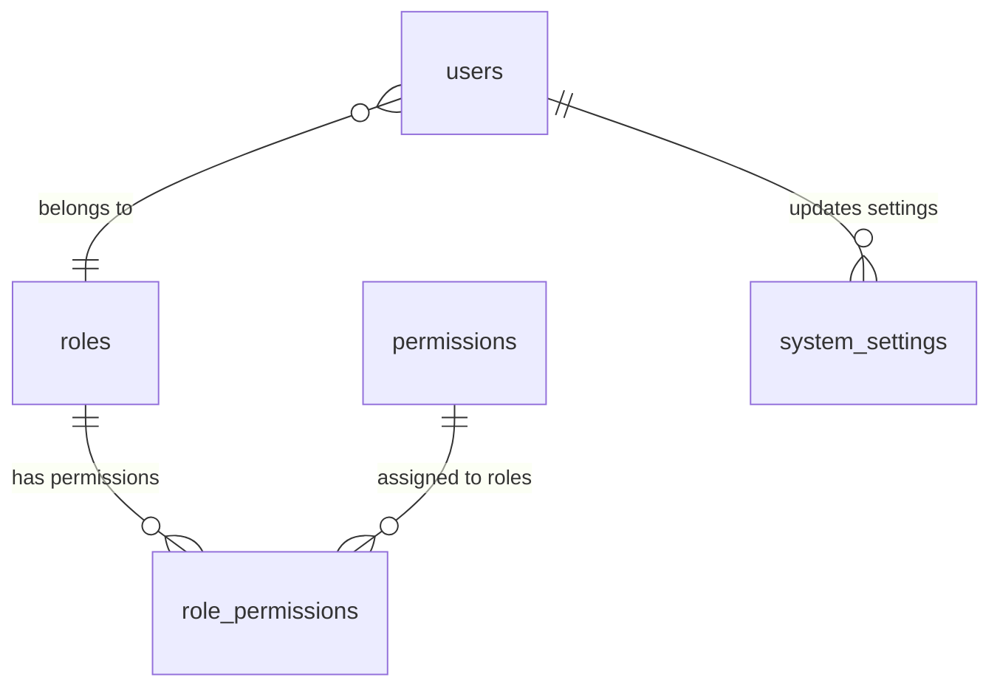

# Honda DMS - Database Migration Plan v1.1

**Version**: 1.1  
**Date**: 31/01/2026  
**CR**: CR-20250131-002  
**Module**: Admin Module (RBAC & System Settings)  
**Migration Type**: Schema Enhancement  

---

## 📋 Executive Summary

This migration plan outlines the implementation of Role-Based Access Control (RBAC) and System Settings functionality as specified in ERD v1.1. The migration adds 4 new tables and updates the existing `users` table with new security and audit columns.

---

## 🗂️ Migration Overview

### Migration Files
- **Primary File**: `migration_admin_module_v1.1.sql`
- **Purpose**: Implement RBAC and System Settings
- **Database**: SQLite (as per Prisma schema)

---

## 📊 Tables Affected

### New Tables (4)

#### 1. `roles`
- **Purpose**: Define user roles (e.g., SALES_REP, ADMIN)
- **Impact**: New entity for RBAC
- **Foreign Keys**: None (parent table)

#### 2. `permissions`
- **Purpose**: Granular permissions (e.g., `lead.create`)
- **Impact**: New entity for permission management
- **Foreign Keys**: None (parent table)

#### 3. `role_permissions`
- **Purpose**: Mapping Role-to-Permission (N:M)
- **Impact**: Junction table for RBAC relationships
- **Foreign Keys**: 
  - `role_id` → `roles(id)`
  - `permission_id` → `permissions(id)`

#### 4. `system_settings`
- **Purpose**: System-wide configuration
- **Impact**: New entity for system configuration
- **Foreign Keys**: 
  - `updated_by` → `User(id)`

### Modified Tables (1)

#### `users` (existing)
- **New Columns**:
  - `role_id` (FK to `roles`)
  - `last_login` (TIMESTAMP)
  - `failed_login_attempts` (INTEGER)
  - `password_changed_at` (TIMESTAMP)
- **Foreign Keys Added**:
  - `role_id` → `roles(id)`

---

## 🔗 Foreign Key Relationships

### RBAC Relationships


### Detailed FK Constraints
| Table | Column | References Table | References Column | On Delete | On Update |
|-------|--------|------------------|------------------|-----------|-----------|
| `role_permissions` | `role_id` | `roles` | `id` | CASCADE | CASCADE |
| `role_permissions` | `permission_id` | `permissions` | `id` | CASCADE | CASCADE |
| `User` | `role_id` | `roles` | `id` | SET NULL | CASCADE |
| `system_settings` | `updated_by` | `User` | `id` | SET NULL | CASCADE |

---

## 📈 Indexes Created

### Performance Indexes
| Table | Index Name | Columns | Purpose |
|-------|------------|---------|---------|
| `roles` | `idx_roles_name` | `name` | Role lookup |
| `roles` | `idx_roles_is_system` | `is_system` | System role filtering |
| `permissions` | `idx_permissions_module` | `module` | Module-based queries |
| `permissions` | `idx_permissions_action` | `action` | Action-based queries |
| `permissions` | `idx_permissions_module_action` | `module, action` | Composite lookup |
| `role_permissions` | `idx_role_permissions_permission_id` | `permission_id` | Reverse permission lookup |
| `system_settings` | `idx_system_settings_key` | `key` | Setting lookup |
| `system_settings` | `idx_system_settings_category` | `category` | Category filtering |
| `system_settings` | `idx_system_settings_data_type` | `data_type` | Type filtering |
| `system_settings` | `idx_system_settings_updated_by` | `updated_by` | Audit trail |
| `User` | `idx_users_role_id` | `role_id` | Role-based queries |

---

## 📊 Data Migration

### Default Data Inserted

#### 1. Default Roles (7)
- ADMIN (System Administrator)
- MANAGER (Department Manager)
- SALES (Sales Representative)
- SERVICE (Service Advisor/Technician)
- PARTS (Parts Department Staff)
- ACCOUNTING (Accounting Department Staff)
- INSURANCE (Insurance Department Staff)

#### 2. Default Permissions (40+)
Covering all modules:
- User Management (CRUD)
- Role Management (CRUD)
- Permission Management (CRUD)
- Lead Management (CRUD)
- Customer Management (CRUD)
- Sales Management (Quotations, Contracts)
- Service Management
- Parts Management
- System Settings
- Reports

#### 3. Default Role-Permission Mappings
- **ADMIN**: All permissions (full access)
- **MANAGER**: Most permissions (no user/role/permission delete)
- **SALES**: Sales-related permissions (lead, customer, quotation, contract)
- **SERVICE**: Service-related permissions
- **PARTS**: Parts-related permissions
- **ACCOUNTING**: Read-only for sales/contracts
- **INSURANCE**: Read-only for customer data

#### 4. Default System Settings (20+)
- General Settings (company name, VAT, currency)
- Email Settings (SMTP configuration)
- Security Settings (password policies, login attempts)
- Feature Settings (lead scoring, quotations, deposits)
- Service Settings (labor rate, appointments)

---

## 🚨 Risk Assessment

### Low Risk
- **New tables**: No existing data affected
- **Schema changes**: Only adding columns (no data loss)
- **Foreign keys**: Properly defined with constraints
- **Default data**: Controlled insertion

### Considerations
1. **Existing users**: Will have `role_id = NULL` until assigned
2. **Backward compatibility**: Existing code continues to work
3. **Performance**: New indexes may slightly slow write operations
4. **Storage**: Additional storage required for new tables

---

## ⚡ Performance Impact

### Positive Impact
- **Role-based queries**: Optimized with indexes
- **Permission checks**: Efficient with composite indexes
- **System settings**: Fast lookup with unique index

### Potential Impact
- **Write operations**: Slight increase due to new indexes
- **Memory usage**: Minimal increase for RBAC data

---

## ✅ Validation Plan

### Pre-Migration
1. **Backup database**
2. **Check table existence**
3. **Verify foreign key references**

### Post-Migration
1. **Verify all tables created**
2. **Check foreign key constraints**
3. **Validate default data insertion**
4. **Test role-permission relationships**
5. **Verify system settings accessibility**

---

## 🔄 Rollback Plan

### Rollback Steps
1. **Drop new tables** (in reverse order of creation):
   ```sql
   DROP TABLE IF EXISTS role_permissions;
   DROP TABLE IF EXISTS system_settings;
   DROP TABLE IF EXISTS permissions;
   DROP TABLE IF EXISTS roles;
   ```

2. **Remove new columns** from `users` table:
   ```sql
   ALTER TABLE User DROP COLUMN role_id;
   ALTER TABLE User DROP COLUMN last_login;
   ALTER TABLE User DROP COLUMN failed_login_attempts;
   ALTER TABLE User DROP COLUMN password_changed_at;
   ```

### Rollback Considerations
- **Data loss**: Any new data created after migration will be lost
- **Downtime**: System restart required
- **Testing**: Full testing required after rollback

---

## 📅 Timeline

| Phase | Duration | Description |
|-------|----------|-------------|
| Preparation | 15 min | Backup, validation |
| Migration | 5 min | Execute migration script |
| Validation | 30 min | Post-migration testing |
| Total | ~50 min | Complete migration process |

---

## 📞 Support

### Migration Issues
- **Contact**: Database Administrator
- **Documentation**: ERD v1.1, Data Dictionary
- **Monitoring**: Check database logs for errors

### Post-Migration
- **Monitoring**: Application logs for RBAC functionality
- **Testing**: Comprehensive testing of admin features
- **Documentation**: Update system documentation

---

**Migration Status**: ✅ Ready for Deployment  
**Approval**: Required before execution  
**Next Step**: Schedule maintenance window