# Business Requirement Document
## Honda Dealer Management System

---

## 📋 Document Control

| Thông Tin | Chi Tiết |
|-----------|----------|
| **Dự Án** | Honda Dealer Management System (Honda DMS) |
| **Phiên Bản BRD** | 2.2 - Master Data Enhancement |
| **Ngày Tạo** | 28/01/2026 |
| **Cập Nhật** | 31/01/2026 (CR-MD-002/003/004) |
| **Loại Tài Liệu** | Business Requirements Document |
| **Phạm Vi** | Toàn bộ hệ thống quản lý đại lý |

---

## 📖 Mục Lục

1. [Executive Summary](#1-executive-summary)
2. [Business Objectives](#2-business-objectives)
3. [Scope & Boundaries](#3-scope--boundaries)
4. [Actors & Stakeholders](#4-actors--stakeholders)
5. [Business Requirements](#5-business-requirements)
   - [5.1 Master Data Management](#51-master-data-management)
   - [5.2 CRM & Customer Management](#52-crm--customer-management)
   - [5.3 Sales Operations](#53-sales-operations)
   - [5.4 Service Operations](#54-service-operations)
   - [5.5 Parts & Inventory](#55-parts--inventory)
   - [5.6 Insurance Management](#56-insurance-management)
   - [5.7 Financial Management](#57-financial-management)
   - [5.8 System Administration](#58-system-administration)
6. [Business Rules & Constraints](#6-business-rules--constraints)
7. [Success Criteria](#7-success-criteria)

---

## 1. Executive Summary

### 1.1 Bối Cảnh Dự Án

Honda Oto Cộng Hòa cần một hệ thống quản lý toàn diện để tối ưu hóa quy trình kinh doanh từ tiếp thị, bán hàng, dịch vụ sau bán đến quản lý tài chính. Hệ thống hiện tại phân mảnh, thiếu tích hợp, dẫn đến:

- ❌ Mất thông tin khách hàng tiềm năng
- ❌ Quy trình bán hàng chậm, thủ công
- ❌ Khó theo dõi lịch sử dịch vụ khách hàng
- ❌ Quản lý tồn kho phụ tùng không hiệu quả
- ❌ Báo cáo tài chính chậm, thiếu chính xác

### 1.2 Giải Pháp

Xây dựng Honda DMS - một nền tảng quản lý tích hợp, số hóa toàn bộ quy trình nghiệp vụ, cung cấp khả năng:

✅ **Quản lý khách hàng 360°** - Từ lead đến khách hàng trung thành  
✅ **Tự động hóa quy trình bán hàng** - Báo giá, đặt cọc, giao xe  
✅ **Tối ưu dịch vụ sau bán** - Lịch hẹn, sửa chữa, bảo dưỡng  
✅ **Kiểm soát tồn kho** - Phụ tùng, VIN, backorder  
✅ **Minh bạch tài chính** - Báo cáo real-time, phân tích lợi nhuận  

### 1.3 Lợi Ích Kinh Doanh

| Lĩnh Vực | Lợi Ích Mong Đợi |
|----------|------------------|
| **Doanh Thu** | Tăng 15-20% conversion rate từ lead |
| **Hiệu Quả** | Giảm 30% thời gian xử lý báo giá |
| **Khách Hàng** | Tăng 25% customer retention |
| **Vận Hành** | Giảm 40% thời gian quản lý tồn kho |
| **Tài Chính** | Báo cáo real-time thay vì end-of-month |

> **Lưu ý UI/UX**: Toàn bộ giao diện người dùng sẽ được triển khai dựa trên UI References hiện có của dự án. BRD này tập trung vào business logic và flows.

---

## 2. Business Objectives

### 2.1 Mục Tiêu Chính

#### OBJ-001: Tăng Hiệu Quả Chuyển Đổi Lead
**Mục tiêu**: Tăng tỷ lệ chuyển đổi từ lead sang khách hàng từ 15% lên 25%

**Cách đo lường**:
- Lead conversion rate hàng tháng
- Thời gian trung bình từ lead → customer
- Số lead lost và lý do

**Yêu cầu hệ thống**:
- Lead scoring tự động
- Workflow quản lý lead theo stage
- Reminder tự động cho follow-up
- Báo cáo hiệu quả nguồn lead

---

#### OBJ-002: Cải Thiện Trải Nghiệm Khách Hàng
**Mục tiêu**: Đạt CSAT score ≥ 4.5/5.0

**Cách đo lường**:
- Customer satisfaction surveys
- Net Promoter Score (NPS)
- Repeat purchase rate
- Service appointment no-show rate

**Yêu cầu hệ thống**:
- Lịch sử tương tác 360° với khách hàng
- Chương trình loyalty tự động
- Nhắc nhở bảo dưỡng định kỳ
- Xử lý khiếu nại có tracking

---

#### OBJ-003: Tối Ưu Quy Trình Bán Hàng
**Mục tiêu**: Giảm 50% thời gian từ báo giá đến ký hợp đồng

**Cách đo lường**:
- Thời gian trung bình tạo báo giá
- Số báo giá được approve
- Thời gian từ deposit → delivery

**Yêu cầu hệ thống**:
- Template báo giá chuẩn
- Auto-calculate pricing
- Workflow approval
- Tracking VIN allocation

---

#### OBJ-004: Nâng Cao Hiệu Quả Dịch Vụ
**Mục tiêu**: Tăng 30% số lượng appointments và giảm 20% waiting time

**Cách đo lường**:
- Số appointments/tháng
- Bay utilization rate
- Average repair time
- First-time-fix rate

**Yêu cầu hệ thống**:
- Online appointment booking
- Bay management & scheduling
- Parts availability check
- Service history tracking

---

#### OBJ-005: Kiểm Soát Tồn Kho Phụ Tùng
**Mục tiêu**: Giảm 25% vốn tồn kho và tăng inventory turnover

**Cách đo lường**:
- Inventory turnover ratio
- Stock-out rate
- Obsolete inventory value
- Fill rate for service orders

**Yêu cầu hệ thống**:
- Real-time inventory tracking
- Auto reorder point
- Aging analysis
- Demand forecasting

---

### 2.2 Mục Tiêu Phụ

- **Compliance**: Đảm bảo tuân thủ quy định thuế, kế toán Việt Nam
- **Scalability**: Hỗ trợ mở rộng lên 3-5 showrooms
- **Integration**: Sẵn sàng tích hợp với Honda Vietnam systems
- **Mobility**: Hỗ trợ truy cập từ tablet cho sales/service staff

---

## 3. Scope & Boundaries

### 3.1 In Scope

#### ✅ Chức Năng Nghiệp Vụ

| Module | Chức Năng |
|--------|-----------|
| **Master Data** | VehicleModel, Accessory, ServiceCatalog, ServiceBay, ScoringRule, SystemSetting management |
| **CRM** | Lead management, Customer 360, Loyalty program, Marketing campaigns, Complaint handling |
| **Sales** | Quotation, Test drive scheduling, Deposit management, VIN allocation, PDS & Delivery |
| **Service** | Appointment booking, Reception, Repair orders, Technician workflow, QC, Settlement |
| **Parts** | Inventory management, Stock movements, Purchase requisition, Aging analysis, Pricing |
| **Insurance** | Contract management, Claims processing, Renewal reminders |
| **Accounting** | P&L, Balance sheet, Cash flow, AR/AP, Tax reports, Fixed assets |
| **Admin** | User management, System monitoring, Audit logs |

#### ✅ Tích Hợp

- Email notifications (SMTP)
- SMS gateway (cho reminders)
- Export to Excel/PDF
- Backup & restore

### 3.2 Out of Scope

#### ❌ Không Bao Gồm

- ❌ Mobile apps (iOS/Android native)
- ❌ Tích hợp với Honda Vietnam DMS
- ❌ E-commerce / Online sales
- ❌ Chatbot / AI assistant
- ❌ Video call / Virtual showroom
- ❌ Blockchain / Cryptocurrency payment
- ❌ IoT vehicle tracking

### 3.3 Assumptions

1. **Infrastructure**: Đại lý có internet ổn định (≥10 Mbps)
2. **Devices**: Users có desktop/laptop (Windows/Mac)
3. **Data**: Dữ liệu khách hàng hiện tại sẽ được migrate
4. **Training**: Staff sẽ được đào tạo sử dụng hệ thống
5. **Support**: Có IT support nội bộ hoặc outsource

### 3.4 Constraints

1. **Budget**: Giới hạn ngân sách cho phase 1
2. **Timeline**: Go-live trong 6 tháng
3. **Resources**: Team size giới hạn
4. **Technology**: Sử dụng tech stack hiện có (Next.js, Prisma)
5. **Compliance**: Tuân thủ PDPA (Personal Data Protection Act)

---

## 4. Actors & Stakeholders

### 4.1 Primary Actors (Người Dùng Trực Tiếp)

#### 👤 Sales Consultant
**Vai trò**: Nhân viên bán hàng

**Trách nhiệm**:
- Tiếp nhận và quản lý leads
- Tạo báo giá cho khách hàng
- Sắp xếp lịch lái thử
- Theo dõi deposits và giao xe
- Chăm sóc khách hàng sau bán

**Quyền hạn trong hệ thống**:
- ✅ Tạo/sửa/xóa leads (của mình)
- ✅ Tạo/gửi quotations
- ✅ Book test drives
- ✅ Ghi nhận deposits
- ✅ View customer history
- ❌ Không truy cập accounting
- ❌ Không truy cập admin

---

#### 👤 Service Advisor
**Vai trò**: Cố vấn dịch vụ

**Trách nhiệm**:
- Tiếp nhận xe khách hàng
- Tạo repair orders
- Tư vấn dịch vụ và phụ tùng
- Theo dõi tiến độ sửa chữa
- Thanh toán và giao xe

**Quyền hạn trong hệ thống**:
- ✅ Tạo appointments
- ✅ Tạo/cập nhật repair orders
- ✅ Request parts
- ✅ Create service invoices
- ✅ View customer service history
- ❌ Không truy cập sales data
- ❌ Không truy cập accounting

---

#### 👤 Technician (KTV)
**Vai trò**: Kỹ thuật viên

**Trách nhiệm**:
- Nhận công việc từ service advisor
- Thực hiện sửa chữa/bảo dưỡng
- Cập nhật tiến độ công việc
- Yêu cầu phụ tùng bổ sung
- Báo cáo vấn đề phát sinh

**Quyền hạn trong hệ thống**:
- ✅ View assigned jobs
- ✅ Update job status
- ✅ Request parts
- ✅ Upload photos/notes
- ❌ Không tạo repair orders
- ❌ Không truy cập pricing

---

#### 👤 Parts Manager
**Vai trò**: Quản lý phụ tùng

**Trách nhiệm**:
- Quản lý tồn kho phụ tùng
- Xử lý nhập/xuất kho
- Tạo purchase requisitions
- Kiểm kê định kỳ
- Phân tích aging và obsolete stock

**Quyền hạn trong hệ thống**:
- ✅ Full access Parts module
- ✅ Create purchase requisitions
- ✅ Adjust inventory
- ✅ Set pricing
- ✅ View parts reports
- ❌ Không truy cập sales/service details

---

#### 👤 Accountant
**Vai trò**: Kế toán

**Trách nhiệm**:
- Ghi nhận các giao dịch tài chính
- Tạo báo cáo tài chính
- Quản lý công nợ
- Kê khai thuế
- Đối chiếu ngân hàng

**Quyền hạn trong hệ thống**:
- ✅ Full access Accounting module
- ✅ View all financial transactions
- ✅ Generate reports
- ✅ Manage AR/AP
- ❌ Không sửa sales/service data
- ❌ Không truy cập admin

---

#### 👤 Manager
**Vai trò**: Quản lý điều hành

**Trách nhiệm**:
- Giám sát hoạt động kinh doanh
- Phê duyệt discounts, refunds
- Phân tích KPIs
- Đưa ra quyết định chiến lược
- Quản lý nhân sự

**Quyền hạn trong hệ thống**:
- ✅ View-only access tất cả modules
- ✅ Access all reports & analytics
- ✅ Approve workflows
- ✅ View audit logs
- ❌ Không tạo/sửa transactions trực tiếp

---

#### 👤 System Administrator
**Vai trò**: Quản trị hệ thống

**Trách nhiệm**:
- Quản lý users và permissions
- Cấu hình hệ thống
- Giám sát performance
- Backup & restore
- Troubleshooting

**Quyền hạn trong hệ thống**:
- ✅ Full system access
- ✅ User management
- ✅ System configuration
- ✅ View audit logs
- ✅ Database management

---

### 4.2 Secondary Stakeholders

| Stakeholder | Vai Trò | Mối Quan Tâm |
|-------------|---------|--------------|
| **Dealer Owner** | Chủ đại lý | ROI, business growth, compliance |
| **Honda Vietnam** | Nhà sản xuất | Brand standards, data reporting |
| **Customers** | Khách hàng | Service quality, transparency |
| **Suppliers** | Nhà cung cấp | Order processing, payment |
| **IT Support** | Hỗ trợ kỹ thuật | System stability, maintenance |

---

## 5. Business Requirements

> **Lưu ý**: Tất cả các màn hình và giao diện người dùng sẽ được triển khai dựa trên **UI References** hiện có của dự án. Phần này tập trung vào business logic và workflows.

---

### 5.1 Master Data Management

#### BR-MD-001: VehicleModel Master Data Management

**Business Need**:  
Quản lý danh mục xe (VehicleModel) để chuẩn hóa dữ liệu và loại bỏ việc nhập tay không nhất quán.

**Actors**: Admin, Sales Consultant, Service Advisor

**Business Context**:

Trong nghiệp vụ bán xe, **danh mục xe (VehicleModel)** là master data quan trọng nhất. Hiện tại hệ thống không có màn hình quản lý, dẫn đến:

1. **Inconsistent Data**: Sales nhập tay `model_interest` trong Lead → Sai chính tả, không chuẩn
   - Ví dụ: "Honda City", "HONDA CITY", "City", "city", "City 2024" → Không thể báo cáo

2. **Manual Pricing**: Base price hardcoded trong code → Khó cập nhật khi có thay đổi giá

3. **No Product Control**: Không kiểm soát được danh sách xe đang bán, xe ngừng bán

**Business Flow**:

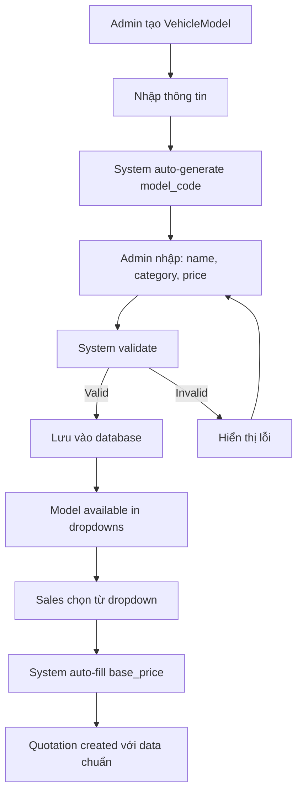

**Business Rules**:
- BR-MD-001-R1: Model code format MOD/YYYY/XXX, auto-generated
- BR-MD-001-R2: Model name must be unique (case-insensitive)
- BR-MD-001-R3: Base price must be > 0
- BR-MD-001-R4: Status ACTIVE = available in dropdowns, INACTIVE = soft deleted
- BR-MD-001-R5: Cannot hard delete if referenced by Quotation/Vehicle (data integrity)

**Success Criteria**:
- ✅ 100% data consistency (no typos in model names)
- ✅ 90% user adoption (Sales không nhập tay)
- ✅ Sales Dashboard có thể group by model chính xác
- ✅ Time saved: 50% faster data entry cho Sales

**UI Reference**: Sử dụng pattern tương tự PartsStockTake.tsx (table + search + filters)

---

#### BR-MD-002: Accessory Master Data Management

**Business Need**:  
Quản lý phụ kiện xe để chuẩn hóa giá và tăng doanh thu từ upselling.

**Actors**: Admin, Sales Consultant

**Business Context**:

**Phụ kiện (Accessory)** là sản phẩm bổ sung quan trọng trong nghiệp vụ bán xe:
- Tăng doanh thu: Phụ kiện có margin cao (30-50%)
- Upsell opportunity: Sales suggest phụ kiện khi tạo Quotation
- Customization: Khách hàng cá nhân hóa xe

**Vấn đề hiện tại**:
- Hardcoded list trong `QuotationForm.tsx` → Không thể cập nhật
- Không có giá chính thức → Sales tự ước lượng
- Không track được phụ kiện nào bán chạy

**Business Flow**:

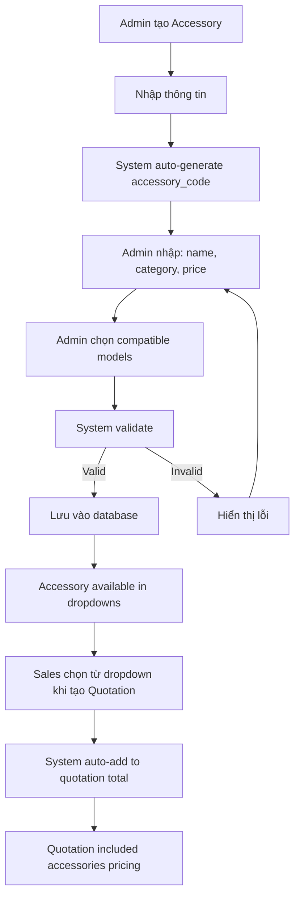

**Business Rules**:
- BR-MD-002-R1: Accessory code format ACC-XXX, auto-generated
- BR-MD-002-R2: Accessory name must be unique (case-insensitive)
- BR-MD-002-R3: Price must be > 0 and tracked in history
- BR-MD-002-R4: Status ACTIVE = available in dropdowns, INACTIVE = soft deleted
- BR-MD-002-R5: Compatibility matrix required - at least 1 model per accessory
- BR-MD-002-R6: Pricing changes logged to history for audit trail

**Success Criteria**:
- ✅ 100% pricing consistency for accessories
- ✅ 20% increase in accessories attachment rate
- ✅ Accurate accessories revenue reporting
- ✅ Time saved: 60% faster accessory selection

**UI Reference**: Sử dụng pattern tương tự PartsPricing.tsx (table + search + filters)

---

#### BR-MD-003: ServiceCatalog Master Data Management

**Business Need**:  
Quản lý danh mục dịch vụ để chuẩn hóa pricing và labor hours.

**Actors**: Admin, Service Advisor

**Business Context**:

**Danh mục dịch vụ (ServiceCatalog)** chuẩn hóa các dịch vụ bảo trì:
- **Standard Services**: Oil Change, Tire Rotation, Brake Inspection
- **Repair Services**: Engine Repair, Transmission Repair
- **Inspection Services**: 10,000km Inspection, 20,000km Inspection

**Vấn đề hiện tại**:
- Service Advisor nhập tay tên dịch vụ → Không chuẩn
- Labor hours và labor rate hardcoded → Khó điều chỉnh
- Không thể tính toán tự động chi phí dịch vụ

**Business Flow**:

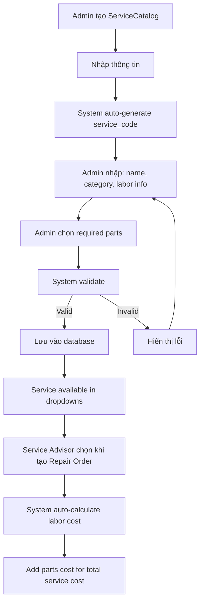

**Business Rules**:
- BR-MD-003-R1: Service code format SVC-XXX, auto-generated
- BR-MD-003-R2: Service name must be unique (case-insensitive)
- BR-MD-003-R3: Labor hours must be > 0 and ≤ 100
- BR-MD-003-R4: Labor rate must be > 0 and configurable
- BR-MD-003-R5: Total cost = (labor_hours × labor_rate) + sum(parts.price)
- BR-MD-003-R6: Service packages can bundle multiple services with discount

**Success Criteria**:
- ✅ 100% pricing consistency for services
- ✅ 15% increase in service package sales
- ✅ 40% faster service quote creation
- ✅ Accurate labor cost tracking

**UI Reference**: Sử dụng pattern tương tự PartsPricing.tsx (table + search + filters)

---

#### BR-MD-004: Other Masters Data Management

**Business Need**:  
Quản lý các master data còn lại: ServiceBay, ScoringRule, SystemSetting.

**Actors**: Admin, Service Manager, Sales Manager

**Business Context**:

**3 Master Data entities còn thiếu UI**:
1. **ServiceBay**: Quản lý bays trong service center
2. **ScoringRule**: Quản lý lead scoring logic
3. **SystemSetting**: Quản lý system configuration

**Vấn đề hiện tại**:
- ServiceBay: Không thể quản lý bays → Hardcoded
- ScoringRule: Không thể customize scoring → Fixed logic
- SystemSetting: Không thể config qua UI → Phải sửa code

**Business Flow**:

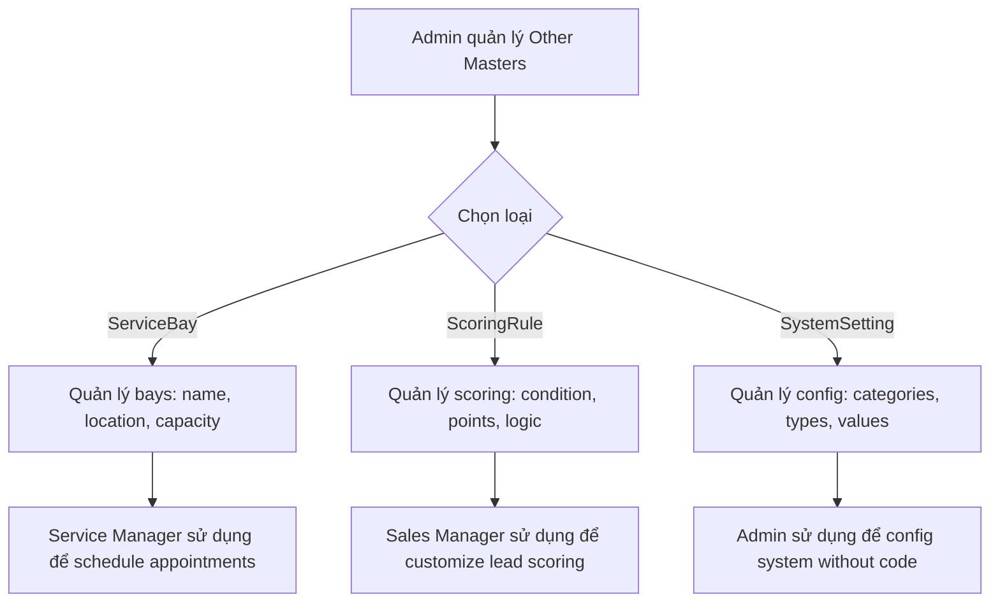

**Business Rules**:
- BR-MD-004-R1: ServiceBay capacity must be > 0 and track utilization
- BR-MD-004-R2: ScoringRule must have valid JSON structure and testable
- BR-MD-004-R3: SystemSetting must have valid data_type and value validation
- BR-MD-004-R4: All settings must be type-safe (string, number, boolean, json)
- BR-MD-004-R5: Configuration changes must be logged and auditable

**Success Criteria**:
- ✅ 100% master data có UI management
- ✅ 0 code deployments for config changes
- ✅ Bay utilization tracking enabled
- ✅ Customizable lead scoring logic

**UI Reference**: 
- ServiceBay: Table pattern with utilization indicators
- ScoringRule: JSON editor with test simulator
- SystemSetting: Category tabs with type-safe editors

---

### 5.2 CRM & Customer Management

#### BR-CRM-001: Lead Management

**Business Need**:  
Quản lý khách hàng tiềm năng từ nhiều nguồn, theo dõi tiến độ chuyển đổi, tối ưu hóa follow-up.

**Actors**: Sales Consultant, Manager

**Business Flow**:

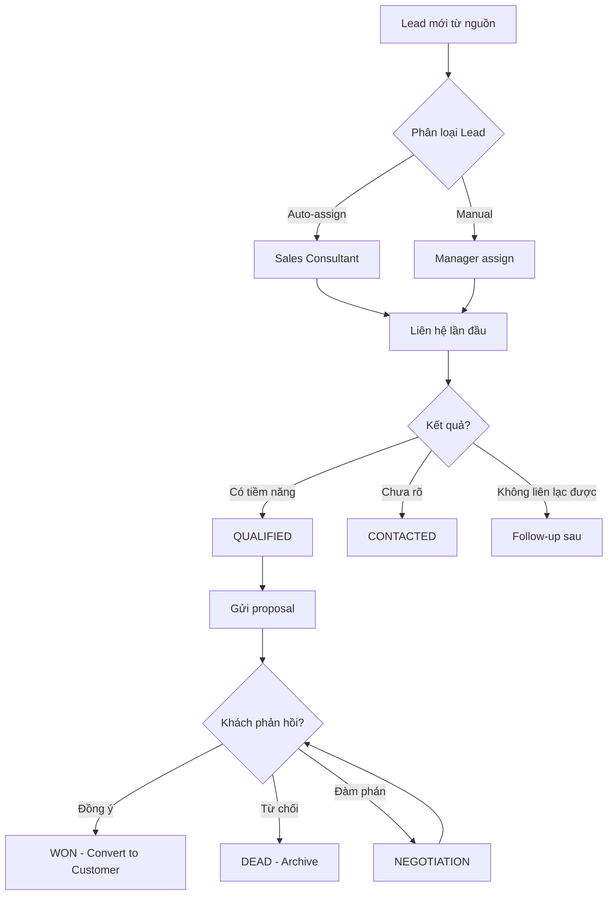

**Business Rules**:
- BR-CRM-001-R1: Lead phải có tối thiểu Name + Phone
- BR-CRM-001-R2: Lead tự động score dựa trên criteria
- BR-CRM-001-R3: Lead không contact trong 30 ngày → Alert
- BR-CRM-001-R4: Chỉ convert lead có status ≥ QUALIFIED

**Success Criteria**:
- ✅ 100% leads được track trong hệ thống
- ✅ Lead response time < 2 hours
- ✅ Conversion rate tăng 15%

**UI Reference**: Sử dụng UI hiện có cho Lead Board (Kanban), Lead Form, Lead Detail

---

#### BR-CRM-002: Customer 360° View

**Business Need**:  
Cung cấp cái nhìn toàn diện về khách hàng: lịch sử mua hàng, dịch vụ, tương tác, loyalty points.

**Actors**: Sales Consultant, Service Advisor, Manager

**Business Flow**:

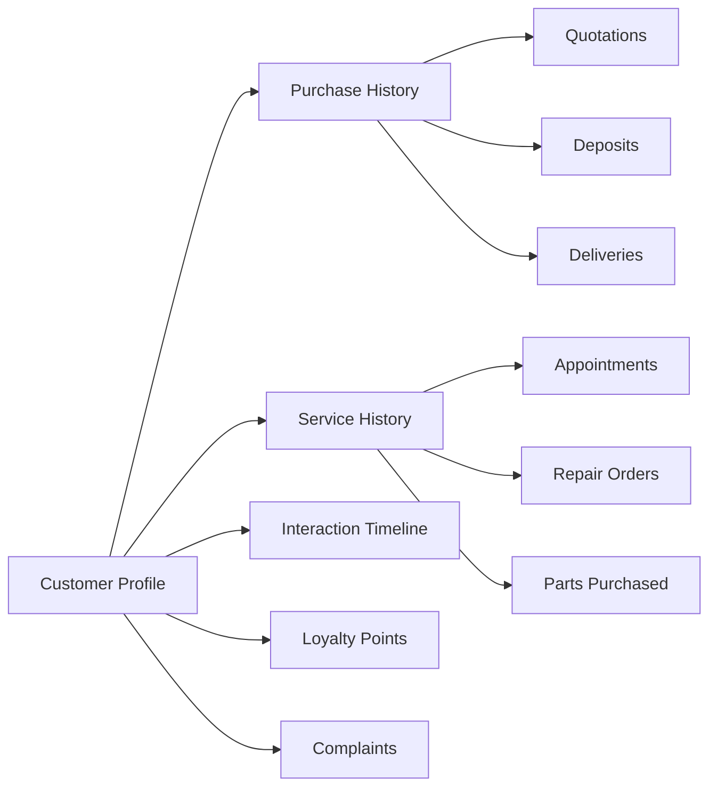

**Business Rules**:
- BR-CRM-002-R1: Phone number là unique identifier
- BR-CRM-002-R2: Tự động merge duplicate customers
- BR-CRM-002-R3: Lịch sử không được xóa (soft delete only)
- BR-CRM-002-R4: Loyalty points tự động tính khi có transaction

**Success Criteria**:
- ✅ Staff truy cập customer info trong < 5 giây
- ✅ 0% duplicate customers
- ✅ 100% transactions được log

**UI Reference**: Sử dụng UI hiện có cho Customer Detail Page

---

#### BR-CRM-003: Loyalty Program

**Business Need**:  
Khuyến khích khách hàng quay lại bằng chương trình tích điểm và phần thưởng.

**Actors**: Sales Consultant, Service Advisor, Customer

**Business Flow**:

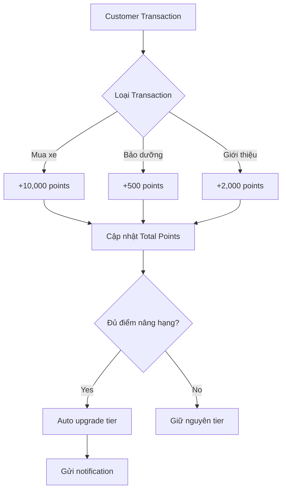

**Tier Structure**:
- BRONZE: 0-999 điểm (0% discount)
- SILVER: 1,000-4,999 điểm (3% discount)
- GOLD: 5,000-9,999 điểm (5% discount)
- PLATINUM: 10,000-19,999 điểm (7% discount)
- DIAMOND: 20,000+ điểm (10% discount)

**Business Rules**:
- BR-CRM-003-R1: Points không expire
- BR-CRM-003-R2: Tier không downgrade (lifetime)
- BR-CRM-003-R3: Points chỉ cộng khi payment confirmed
- BR-CRM-003-R4: Discount áp dụng cho service, không cho xe mới

**Success Criteria**:
- ✅ 80% customers enrolled trong loyalty program
- ✅ Repeat purchase rate tăng 25%
- ✅ 0% errors trong tính điểm

**UI Reference**: Sử dụng UI hiện có cho Loyalty Dashboard

---

#### BR-CRM-004: Marketing Campaigns

**Business Need**:  
Chạy các chiến dịch marketing targeted để tăng engagement và conversion.

**Actors**: Manager, Sales Consultant

**Business Flow**:

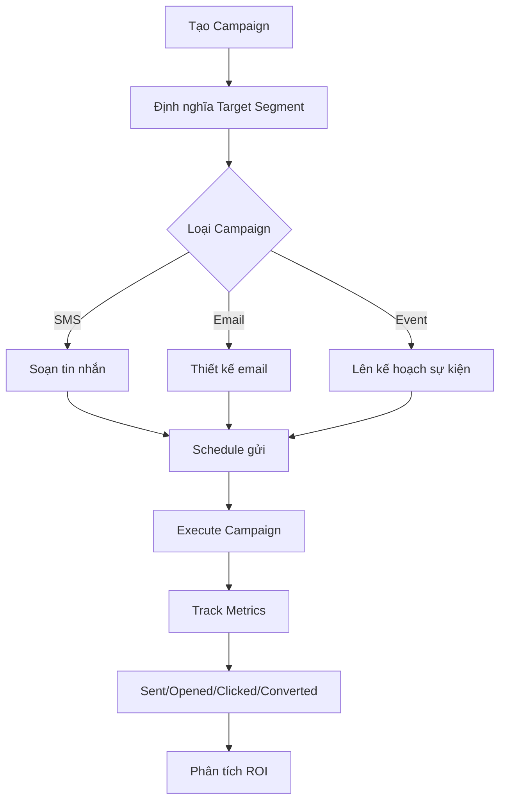

**Campaign Types**:
- SMS: Tin nhắn quảng cáo, nhắc nhở
- EMAIL: Newsletter, promotion
- SOCIAL: Facebook/Zalo ads
- EVENT: Lái thử, ra mắt xe mới
- ZALO: Zalo OA messages
- FACEBOOK: Messenger campaigns

**Business Rules**:
- BR-CRM-004-R1: Customers có thể opt-out khỏi marketing
- BR-CRM-004-R2: Không gửi quá 2 campaigns/tuần cho 1 customer
- BR-CRM-004-R3: Campaign phải có budget approval
- BR-CRM-004-R4: Track conversion trong 30 ngày

**Success Criteria**:
- ✅ Campaign ROI > 3:1
- ✅ Opt-out rate < 5%
- ✅ Open rate > 25% (email), Click rate > 3%

**UI Reference**: Sử dụng UI hiện có cho Marketing Dashboard

---

### 5.2 Sales Operations

#### BR-SALES-001: Quotation Management

**Business Need**:  
Tạo báo giá nhanh, chính xác, chuyên nghiệp cho khách hàng.

**Actors**: Sales Consultant

**Business Flow**:

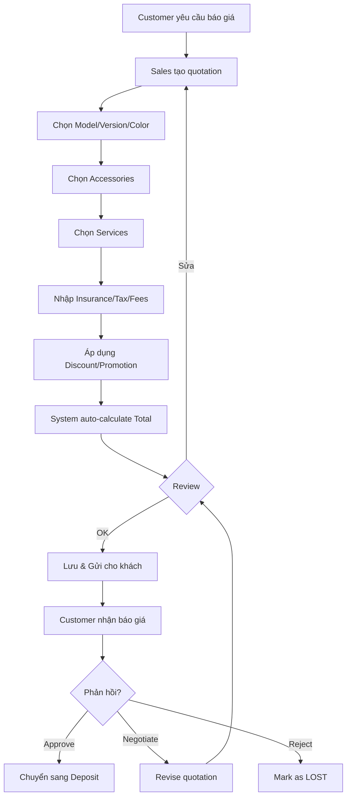

**Pricing Calculation**:
```
Total = Base Price 
      + Accessories Total 
      + Services Total 
      + Insurance 
      + Registration Tax 
      + Registration Fee 
      + Other Fees 
      - Discount 
      - Promotion Value
```

**Business Rules**:
- BR-SALES-001-R1: Quotation valid trong 7 ngày (default)
- BR-SALES-001-R2: Discount > 10% cần Manager approval
- BR-SALES-001-R3: Base price lấy từ master data (không edit)
- BR-SALES-001-R4: Quotation number auto-generate (QT-YYYYMMDD-XXX)

**Success Criteria**:
- ✅ Thời gian tạo quotation < 10 phút
- ✅ 95% quotations không có lỗi tính toán
- ✅ Quotation approval rate > 30%

**UI Reference**: Sử dụng UI hiện có cho Quotation Form, Quotation List

---

#### BR-SALES-002: Test Drive Management

**Business Need**:  
Quản lý lịch lái thử, tối ưu hóa sử dụng xe demo, tăng conversion.

**Actors**: Sales Consultant, Customer

**Business Flow**:

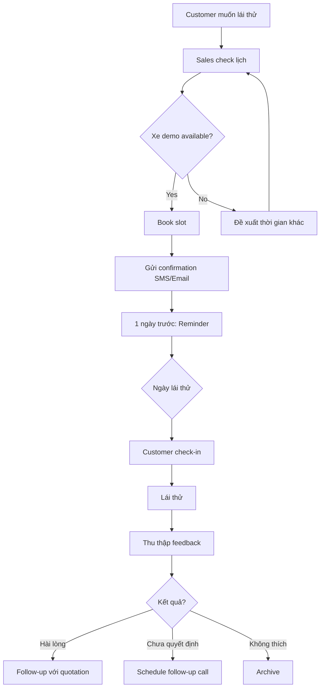

**Business Rules**:
- BR-SALES-002-R1: Mỗi slot lái thử = 1 giờ
- BR-SALES-002-R2: Max 8 slots/ngày/xe demo
- BR-SALES-002-R3: Customer phải có GPLX hợp lệ
- BR-SALES-002-R4: Reminder gửi trước 24h
- BR-SALES-002-R5: No-show 2 lần → Blacklist

**Success Criteria**:
- ✅ Test drive conversion rate > 40%
- ✅ No-show rate < 10%
- ✅ Demo car utilization > 60%

**UI Reference**: Sử dụng UI hiện có cho Test Drive Calendar, Test Drive List

---

#### BR-SALES-003: Deposit & VIN Allocation

**Business Need**:  
Quản lý tiền đặt cọc và phân bổ VIN cho đơn hàng.

**Actors**: Sales Consultant, Manager

**Business Flow**:

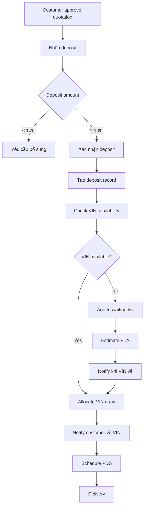

**Business Rules**:
- BR-SALES-003-R1: Deposit tối thiểu 10% total price
- BR-SALES-003-R2: Deposit refundable trong 30 ngày
- BR-SALES-003-R3: VIN allocation theo thứ tự deposit (FIFO)
- BR-SALES-003-R4: Sau 90 ngày không giao xe → Refund tự động

**Success Criteria**:
- ✅ 100% deposits được track
- ✅ VIN allocation time < 7 ngày
- ✅ Refund disputes < 1%

**UI Reference**: Sử dụng UI hiện có cho Deposit List, VIN Allocation

---

#### BR-SALES-004: Pre-Delivery Service (PDS)

**Business Need**:  
Kiểm tra chất lượng xe trước giao, đảm bảo customer satisfaction.

**Actors**: Sales Consultant, Technician

**Business Flow**:

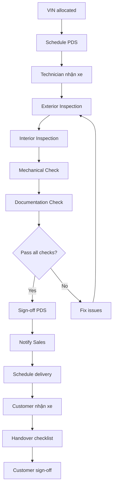

**PDS Checklist**:
- ✅ Exterior: Paint, body panels, lights, tires
- ✅ Interior: Seats, dashboard, electronics, AC
- ✅ Mechanical: Engine, transmission, brakes, steering
- ✅ Documentation: VIN, invoice, warranty, manual

**Business Rules**:
- BR-SALES-004-R1: PDS phải hoàn thành trước delivery 24h
- BR-SALES-004-R2: Tất cả items phải PASS
- BR-SALES-004-R3: Photos bắt buộc cho mỗi section
- BR-SALES-004-R4: Customer phải ký xác nhận nhận xe

**Success Criteria**:
- ✅ 100% xe qua PDS trước giao
- ✅ 0% delivery delays do PDS issues
- ✅ Customer satisfaction > 4.8/5

**UI Reference**: Sử dụng UI hiện có cho PDS Checklist, Delivery Form

---

### 5.3 Service Operations

#### BR-SERVICE-001: Appointment Booking

**Business Need**:  
Cho phép khách hàng đặt lịch bảo dưỡng/sửa chữa, tối ưu hóa bay utilization.

**Actors**: Customer, Service Advisor

**Business Flow**:

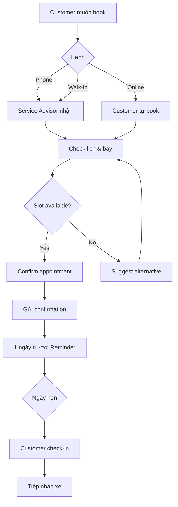

**Business Rules**:
- BR-SERVICE-001-R1: Booking trước tối thiểu 1 ngày
- BR-SERVICE-001-R2: Max 8 appointments/bay/ngày
- BR-SERVICE-001-R3: VIP customers ưu tiên (trong 24h)
- BR-SERVICE-001-R4: No-show → Charge phí (nếu không cancel trước 4h)

**Success Criteria**:
- ✅ Online booking rate > 40%
- ✅ No-show rate < 5%
- ✅ Bay utilization > 80%

**UI Reference**: Sử dụng UI hiện có cho Appointment Calendar

---

#### BR-SERVICE-002: Repair Order (RO) Management

**Business Need**:  
Quản lý quy trình sửa chữa từ tiếp nhận đến giao xe.

**Actors**: Service Advisor, Technician, Parts Manager

**Business Flow**:

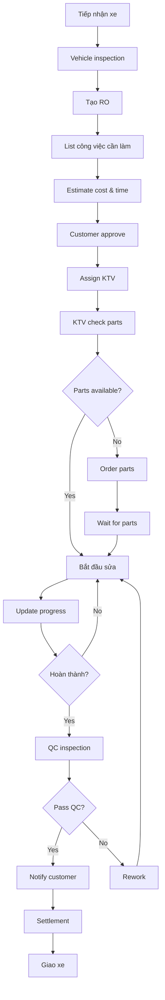

**RO Statuses**:
- PENDING: Chờ xử lý
- IN_PROGRESS: Đang sửa
- WAITING_PARTS: Chờ phụ tùng
- QC: Đang kiểm tra chất lượng
- COMPLETED: Hoàn thành
- INVOICED: Đã xuất hóa đơn

**Business Rules**:
- BR-SERVICE-002-R1: RO number auto-generate (RO-YYYYMMDD-XXX)
- BR-SERVICE-002-R2: Customer phải approve estimate trước khi sửa
- BR-SERVICE-002-R3: Actual cost > estimate 20% → Re-approve
- BR-SERVICE-002-R4: QC mandatory cho tất cả ROs

**Success Criteria**:
- ✅ Average repair time giảm 20%
- ✅ First-time-fix rate > 95%
- ✅ Customer satisfaction > 4.5/5

**UI Reference**: Sử dụng UI hiện có cho RO List, RO Detail, Technician View

---

### 5.4 Parts & Inventory

#### BR-PARTS-001: Inventory Management

**Business Need**:  
Kiểm soát tồn kho phụ tùng, tránh stock-out và overstock.

**Actors**: Parts Manager, Service Advisor, Technician

**Business Flow**:

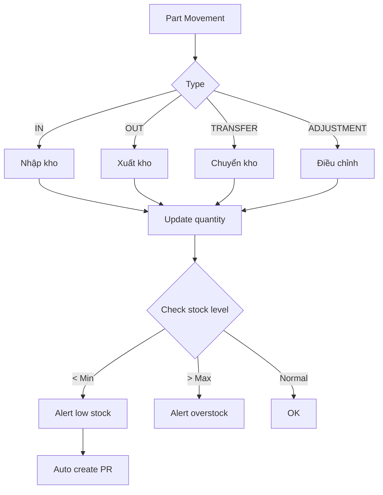

**Business Rules**:
- BR-PARTS-001-R1: Real-time inventory update
- BR-PARTS-001-R2: Min stock = 10 units (default)
- BR-PARTS-001-R3: Auto PR khi < 5 units
- BR-PARTS-001-R4: FIFO (First In First Out) cho xuất kho
- BR-PARTS-001-R5: Kiểm kê định kỳ 6 tháng/lần

**Success Criteria**:
- ✅ Stock-out rate < 2%
- ✅ Inventory turnover > 6 lần/năm
- ✅ Obsolete inventory < 5% total value

**UI Reference**: Sử dụng UI hiện có cho Parts Inventory, Stock Movements

---

### 5.5 Insurance Management

#### BR-INSURANCE-001: Contract Management

**Business Need**:  
Quản lý hợp đồng bảo hiểm xe, nhắc nhở gia hạn.

**Actors**: Sales Consultant, Customer

**Business Flow**:

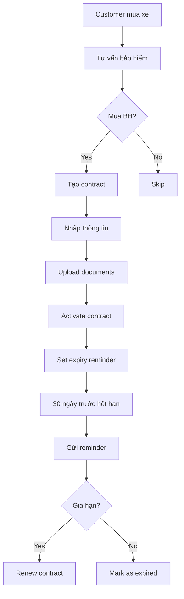

**Business Rules**:
- BR-INSURANCE-001-R1: Contract phải có scan policy
- BR-INSURANCE-001-R2: Reminder gửi 30, 15, 7 ngày trước expiry
- BR-INSURANCE-001-R3: Renewal discount 5% cho existing customers
- BR-INSURANCE-001-R4: Track commission cho sales

**Success Criteria**:
- ✅ Insurance penetration rate > 80%
- ✅ Renewal rate > 70%
- ✅ 0% expired contracts không được nhắc

**UI Reference**: Sử dụng UI hiện có cho Insurance Dashboard, Contract List

---

### 5.6 Financial Management

#### BR-FINANCE-001: Financial Reporting

**Business Need**:  
Cung cấp báo cáo tài chính real-time cho management.

**Actors**: Accountant, Manager, Owner

**Business Flow**:

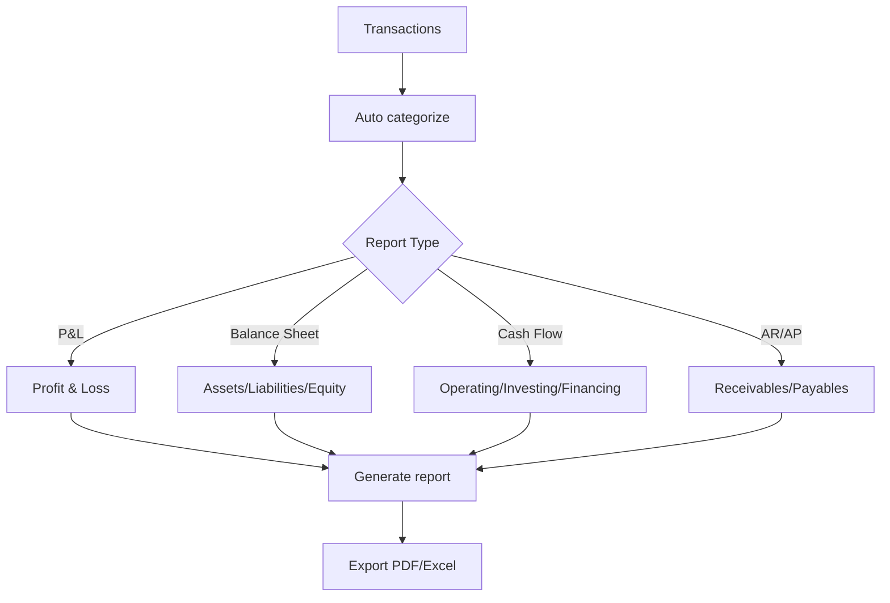

**Reports Required**:
- **P&L**: Revenue, COGS, Operating expenses, Net profit
- **Balance Sheet**: Assets, Liabilities, Equity
- **Cash Flow**: Cash in/out by category
- **AR Aging**: 0-30, 31-60, 61-90, 90+ days
- **AP Aging**: 0-30, 31-60, 61-90, 90+ days
- **Tax Reports**: VAT input/output

**Business Rules**:
- BR-FINANCE-001-R1: Reports available real-time
- BR-FINANCE-001-R2: Period: MTD, QTD, YTD, Custom
- BR-FINANCE-001-R3: Drill-down to transaction level
- BR-FINANCE-001-R4: Export to Excel/PDF

**Success Criteria**:
- ✅ Reports available within 1 minute
- ✅ 100% accuracy vs manual books
- ✅ Management access reports 24/7

**UI Reference**: Sử dụng UI hiện có cho Accounting Dashboard, Reports

---

### 5.7 System Administration

#### BR-ADMIN-001: User Management

**Business Need**:  
Quản lý users, roles, permissions để đảm bảo security và compliance.

**Actors**: System Administrator

**Business Flow**:

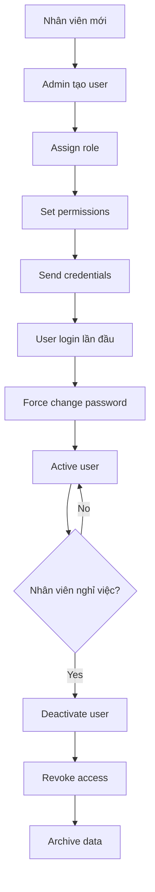

**Business Rules**:
- BR-ADMIN-001-R1: Password phải có ≥8 ký tự, bao gồm chữ hoa, số, ký tự đặc biệt
- BR-ADMIN-001-R2: Password expire sau 90 ngày
- BR-ADMIN-001-R3: Lock account sau 5 lần login failed
- BR-ADMIN-001-R4: Audit log tất cả admin actions

**Success Criteria**:
- ✅ 100% users có role phù hợp
- ✅ 0% unauthorized access
- ✅ Password compliance rate 100%

**UI Reference**: Sử dụng UI hiện có cho User Management

---

## 6. Business Rules & Constraints

### 6.1 Global Business Rules

| ID | Rule | Rationale |
|----|------|-----------|
| GBR-001 | Tất cả giá tiền tính bằng VNĐ | Compliance với luật Việt Nam |
| GBR-002 | Tất cả dates theo format DD/MM/YYYY | Chuẩn Việt Nam |
| GBR-003 | Phone numbers phải unique | Tránh duplicate customers |
| GBR-004 | Soft delete cho tất cả records | Audit trail |
| GBR-005 | Tất cả critical actions phải log | Compliance & troubleshooting |
| GBR-006 | Session timeout sau 30 phút inactive | Security |
| GBR-007 | Backup tự động hàng ngày 2:00 AM | Data protection |
| GBR-008 | VAT rate = 10% (configurable) | Tax compliance |

### 6.2 Data Validation Rules

| Field | Validation |
|-------|------------|
| **Email** | Valid email format, max 100 chars |
| **Phone** | 10-11 digits, starts with 0 |
| **VIN** | 17 characters, alphanumeric |
| **License Plate** | Format: 51A-12345 |
| **VAT Number** | 10-13 digits |
| **Discount** | 0-100%, max 10% without approval |
| **Deposit** | Min 10% of total price |

### 6.3 Workflow Constraints

| Workflow | Constraint |
|----------|----------|
| **Lead → Customer** | Chỉ convert khi status ≥ QUALIFIED |
| **Quotation → Deposit** | Quotation phải status = APPROVED |
| **Deposit → Delivery** | Phải có VIN allocated |
| **RO → Invoice** | Phải pass QC |
| **Parts OUT** | Phải có RO reference |

---

## 7. Success Criteria

### 7.1 Business KPIs

| KPI | Baseline | Target | Timeline |
|-----|----------|--------|----------|
| **Lead Conversion Rate** | 15% | 25% | 6 months |
| **Customer Retention** | 60% | 80% | 12 months |
| **Average Deal Size** | 600M VNĐ | 650M VNĐ | 6 months |
| **Service Revenue** | 500M/month | 650M/month | 12 months |
| **Parts Turnover** | 4x/year | 6x/year | 12 months |
| **CSAT Score** | 4.0/5 | 4.5/5 | 6 months |

### 7.2 System Performance

| Metric | Target |
|--------|--------|
| **Page Load Time** | < 2 seconds |
| **API Response Time** | < 500ms |
| **System Uptime** | 99.5% |
| **Concurrent Users** | 100 users |
| **Data Backup** | Daily, retention 30 days |
| **Recovery Time** | < 4 hours |

### 7.3 User Adoption

| Metric | Target |
|--------|--------|
| **User Training Completion** | 100% |
| **Daily Active Users** | > 80% of total users |
| **Feature Utilization** | > 70% of features used |
| **Support Tickets** | < 5 tickets/week after 3 months |

---

## 📝 Appendix

### A. Glossary

| Term | Definition |
|------|------------|
| **Lead** | Khách hàng tiềm năng chưa mua xe |
| **Customer** | Khách hàng đã mua xe hoặc sử dụng dịch vụ |
| **RO** | Repair Order - Lệnh sửa chữa |
| **PDS** | Pre-Delivery Service - Kiểm tra trước giao xe |
| **VIN** | Vehicle Identification Number - Số khung xe |
| **Bay** | Khoang sửa chữa |
| **KTV** | Kỹ thuật viên |
| **CSAT** | Customer Satisfaction Score |
| **PR** | Purchase Requisition - Yêu cầu mua hàng |

### B. References

- Honda Vietnam Dealer Standards Manual
- Vietnam Tax Law 2019
- Personal Data Protection Act (PDPA)
- UI References (hiện có trong dự án)

---

## Change Log

### v2.0 (28/01/2026) - Initial Version
- Initial BRD created for Honda DMS
- Added BR-MD-001: VehicleModel Management
- Added all business requirements and rules

### v2.1 (31/01/2026) - CR-MD-001
- Updated BR-MD-001 with VehicleModel details
- Enhanced business flow diagrams
- Added UI Reference patterns

### v2.2 (31/01/2026) - CR-MD-002/003/004
- **Added BR-MD-002: Accessory Master Data Management**
- **Added BR-MD-003: ServiceCatalog Master Data Management**
- **Added BR-MD-004: Other Masters Data Management**
- Updated business flow diagrams for all new entities
- Enhanced success criteria to include new master data
- Updated scope to include all 6 master data entities
- Added 19 new business rules (BR-MD-002-R1 to BR-MD-004-R5)

---

**End of Document**