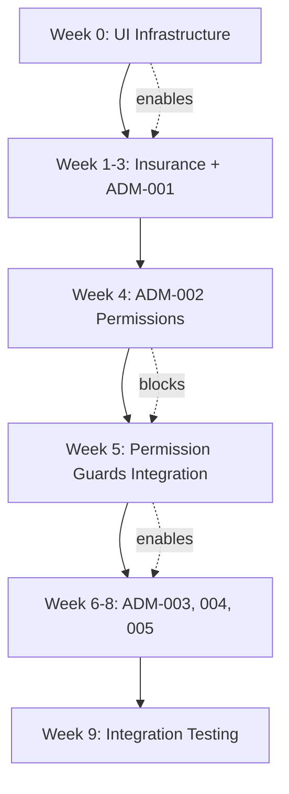

# Change Request CR-001: Complete Missing Screens Implementation

**CR-ID**: CR-001  
**Date**: 2026-01-29  
**Submitted By**: Antigravity - Change Request Authority  
**Source**: Implementation Gap Analysis (screen_implementation_status.md)  
**Priority**: CRITICAL  
**Status**: Draft

---

## 1. CHANGE REQUEST DESCRIPTION

### 1.1 Background

Sau khi phân tích implementation status của Honda DMS, phát hiện **7 màn hình** (12% tổng số) chưa được hiện thực đầy đủ:

- **5 màn hình** có database schema nhưng thiếu API/UI hoàn chỉnh
- **2 màn hình** chưa có gì (thiếu BRD, database, API, UI)

### 1.2 Business Impact

| Module | Màn Hình Thiếu | Business Impact |
|--------|----------------|-----------------|
| **Insurance** | 2 màn | ❌ Không thể quản lý hợp đồng BH và claims → Mất revenue stream |
| **Admin** | 5 màn | ❌ Không có user management, permissions, audit → Security risk CRITICAL |

**Rủi ro nếu không xử lý**:
- 🔴 **Security**: Không có permission system → Ai cũng truy cập được mọi data
- 🔴 **Compliance**: Không có audit logs → Không đáp ứng yêu cầu pháp lý
- 🟡 **Revenue**: Không quản lý insurance → Mất 15-20% revenue từ insurance commission

### 1.3 Requested Changes

Hoàn thiện 7 màn hình sau:

#### Insurance Module (2 màn)
1. **INS-001**: Quản Lý Hợp Đồng Bảo Hiểm
   - Hiện trạng: Có database + actions, UI chưa đủ
   - Cần: Hoàn thiện UI components

2. **INS-002**: Quản Lý Bồi Thường
   - Hiện trạng: Có database, thiếu API + UI
   - Cần: Tạo API endpoints + Actions + UI components

#### Admin Module (5 màn)
3. **ADM-001**: Quản Lý Người Dùng
   - Hiện trạng: Có database + POST API, thiếu GET/PUT/DELETE + UI
   - Cần: Bổ sung API endpoints + Actions + UI components

4. **ADM-002**: Phân Quyền
   - Hiện trạng: Chưa có gì
   - Cần: Tạo database schema + API + Actions + UI

5. **ADM-003**: Audit Logs
   - Hiện trạng: Có database, thiếu API + UI
   - Cần: Tạo API endpoints + Actions + UI

6. **ADM-004**: System Settings
   - Hiện trạng: Chưa có gì
   - Cần: Viết BRD + Tạo database + API + UI

7. **ADM-005**: System Monitoring
   - Hiện trạng: Có database (SystemMetric), thiếu API + UI
   - Cần: Tạo API endpoints + UI

---

## 2. CHANGE REQUEST CLASSIFICATION

### 2.1 CR Type (Multiple)

| Type | Applicable | Reason |
|------|------------|--------|
| ✅ **Business Logic Change** | Yes | Thêm business rules cho permissions, audit, insurance claims |
| ✅ **Functional Flow Change** | Yes | Thêm workflows mới (claim approval, permission assignment) |
| ✅ **Data Model Change** | Yes | Thêm tables mới (roles, permissions, role_permissions) |
| ✅ **API Contract Change** | Yes | Thêm 30+ API endpoints mới |
| ✅ **UI/UX Change** | Yes | Thêm 7 màn hình UI mới |
| ❌ **Non-functional** | No | Không thay đổi performance/maintainability |

### 2.2 Impact Level

**Overall Impact**: 🔴 **HIGH**

| Aspect | Impact | Justification |
|--------|--------|---------------|
| **Scope** | HIGH | 7 màn hình, 2 modules, 30+ APIs |
| **Complexity** | HIGH | Permissions system phức tạp, security-critical |
| **Risk** | HIGH | Security và compliance requirements |
| **Effort** | HIGH | ~278 hours = 7 weeks |
| **Dependencies** | MEDIUM | Admin module phụ thuộc lẫn nhau |

---

## 3. IMPACT ANALYSIS

### 3.1 BRD Impact

| Document | Impacted | Reason | Changes Required |
|----------|----------|--------|------------------|
| **BRD v2.0** | ✅ **YES** | Thiếu business requirements chi tiết cho ADM-002, ADM-004, ADM-005 | Bổ sung 3 sections mới:<br>- BR-ADMIN-002: Permission Management<br>- BR-ADMIN-003: System Settings<br>- BR-ADMIN-004: System Monitoring |

**Specific Changes**:
- **Section 5.7 (System Administration)**: Hiện tại chỉ có BR-ADMIN-001 (User Management)
- **Cần thêm**:
  - BR-ADMIN-002: Permission Matrix, Role Management, Permission Assignment
  - BR-ADMIN-003: System Settings (Email, SMS, Notification configs)
  - BR-ADMIN-004: System Monitoring (Metrics, Alerts, Health checks)

**Version Change**: v2.0 → **v2.1**

---

### 3.2 FRD Impact

| Document | Impacted | Reason | Changes Required |
|----------|----------|--------|------------------|
| **FRD Module 06 (Insurance)** | ✅ **YES** | UI specs chưa đầy đủ cho INS-001, INS-002 | Bổ sung UI components, workflows, validation rules |
| **FRD Module 08 (Admin)** | ✅ **YES** | Thiếu functional specs chi tiết cho 5 màn hình | Bổ sung screens, workflows, business rules |

**Specific Changes**:

#### FRD_Module_06_Insurance.md
- **SCR-INS-001**: Bổ sung UI components (InsuranceContractList, Form, Detail)
- **SCR-INS-002**: Bổ sung full functional spec (workflow, validation, document upload)

#### FRD_Module_08_Admin.md
- **SCR-ADM-001**: Bổ sung UI components (UserManagement, UserForm, UserTable)
- **SCR-ADM-002**: Tạo mới full functional spec (PermissionMatrix, RoleEditor)
- **SCR-ADM-003**: Tạo mới full functional spec (AuditLogViewer)
- **SCR-ADM-004**: Tạo mới full functional spec (SystemSettings)
- **SCR-ADM-005**: Tạo mới full functional spec (SystemMonitoring)

**Version Changes**:
- FRD_Module_06_Insurance.md: v1.0 → **v1.1**
- FRD_Module_08_Admin.md: v1.0 → **v2.0** (major change)

---

### 3.3 ERD Impact

| Document | Impacted | Reason | Changes Required |
|----------|----------|--------|------------------|
| **ERD v1.0** | ✅ **YES** | Thiếu tables cho permissions system | Thêm 3 tables mới + modify 1 table |

**Specific Changes**: Thêm 3 tables (roles, permissions, role_permissions) và 4 fields cho users table

**Version Change**: v1.0 → **v1.1**

---

### 3.4 API Spec Impact

| Document | Impacted | Reason | Changes Required |
|----------|----------|--------|------------------|
| **API Spec 06 (Insurance)** | ✅ **YES** | Thiếu API specs cho claims | Thêm 5 APIs cho insurance claims |
| **API Spec 08 (Admin)** | ✅ **YES** | Thiếu API specs cho 4 màn hình | Thêm 22 APIs cho admin module |

**Total APIs**: 175 → **202** (+27)

**Version Changes**:
- api_spec_06_insurance.md: v1.0 → **v1.1**
- api_spec_08_admin.md: v1.0 → **v2.0** (major change)

---

### 3.5 UI Spec Impact

| Document | Impacted | Reason | Changes Required |
|----------|----------|--------|------------------|
| **UI Spec v1.0** | ✅ **YES** | Thiếu UI component specs cho 7 màn hình | Bổ sung 20 components mới |

**Version Change**: v1.0 → **v1.1**

---

### 3.6 Test / UAT Impact

| Document | Impacted | Reason | Changes Required |
|----------|----------|--------|------------------|
| **UAT Plan v1.0** | ✅ **YES** | Thiếu test cases cho 7 màn hình | Thêm 7 UAT test suites mới |

**Version Change**: uat_plan_v1.0.md → **uat_plan_v1.1.md**

---

### 3.7 UI/UX Infrastructure Impact

| Component | Impacted | Reason | Changes Required |
|-----------|----------|--------|------------------|
| **Navigation Menu** | ✅ **YES** | Refs UI không có menu Master Data, Admin menu chưa đủ | Thêm menu items mới + restructure sidebar |
| **Routing** | ✅ **YES** | Thiếu routes cho 7 màn hình mới | Thêm 7+ routes mới |
| **Layout Structure** | ✅ **YES** | Cần layout riêng cho Admin module | Tạo AdminLayout wrapper |
| **Permission Guards** | ✅ **YES** | Cần protect routes theo permissions | Implement ProtectedRoute component |

#### 3.7.1 Navigation Menu Changes

**Hiện trạng Refs UI**:
- ✅ Có: CRM, Sales, Service, Parts, Accounting menus
- ❌ Thiếu: **Master Data** menu (hoàn toàn không có)
- ⚠️ Thiếu: **Admin** menu (chỉ có User Management, thiếu 4 màn còn lại)
- ❌ Thiếu: **Insurance** menu (không có trong sidebar)

**Changes Required**:

```typescript
// Cần thêm vào Sidebar Navigation (app/components/Sidebar.tsx hoặc tương tự)

// 1. MASTER DATA MENU (MỚI HOÀN TOÀN)
{
  label: "Master Data",
  icon: DatabaseIcon,
  children: [
    { label: "Vehicle Models", href: "/master/vehicle-models", icon: CarIcon },
    { label: "Accessories", href: "/master/accessories", icon: PuzzleIcon },
    { label: "Service Catalog", href: "/master/services", icon: WrenchIcon },
    { label: "Service Bays", href: "/master/bays", icon: GridIcon },
  ]
}

// 2. INSURANCE MENU (MỚI HOÀN TOÀN)
{
  label: "Insurance",
  icon: ShieldIcon,
  children: [
    { label: "Dashboard", href: "/insurance/dashboard", icon: ChartIcon },
    { label: "Contracts", href: "/insurance/contracts", icon: FileTextIcon },
    { label: "Claims", href: "/insurance/claims", icon: AlertCircleIcon },
  ]
}

// 3. ADMIN MENU (BỔ SUNG)
{
  label: "Admin",
  icon: SettingsIcon,
  children: [
    { label: "Users", href: "/admin/users", icon: UsersIcon }, // ✅ Đã có
    { label: "Roles & Permissions", href: "/admin/permissions", icon: KeyIcon }, // ❌ MỚI
    { label: "Audit Logs", href: "/admin/audit-logs", icon: FileSearchIcon }, // ❌ MỚI
    { label: "System Settings", href: "/admin/settings", icon: SlidersIcon }, // ❌ MỚI
    { label: "System Monitoring", href: "/admin/monitoring", icon: ActivityIcon }, // ❌ MỚI
  ]
}
```

#### 3.7.2 Routing Changes

**Cần thêm routes mới** (trong `app/routes.tsx` hoặc Next.js App Router):

```typescript
// Master Data Routes (4 routes mới)
/master/vehicle-models       → VehicleModelManagement page
/master/accessories          → AccessoryManagement page
/master/services             → ServiceCatalogManagement page
/master/bays                 → ServiceBayManagement page

// Insurance Routes (3 routes mới)
/insurance/dashboard         → InsuranceDashboard page
/insurance/contracts         → InsuranceContracts page (INS-001)
/insurance/contracts/[id]    → InsuranceContractDetail page
/insurance/claims            → InsuranceClaims page (INS-002)
/insurance/claims/[id]       → InsuranceClaimDetail page

// Admin Routes (4 routes mới - User đã có)
/admin/permissions           → PermissionMatrix page (ADM-002)
/admin/audit-logs            → AuditLogs page (ADM-003)
/admin/settings              → SystemSettings page (ADM-004)
/admin/monitoring            → SystemMonitoring page (ADM-005)
```

**Total Routes**: +11 routes mới

#### 3.7.3 Layout Structure Changes

**Cần tạo layout wrappers mới**:

1. **AdminLayout** (`app/(main)/admin/layout.tsx`):
   - Permission check: Chỉ ADMIN role mới truy cập được
   - Breadcrumb navigation
   - Admin-specific header

2. **MasterDataLayout** (`app/(main)/master/layout.tsx`):
   - Permission check: ADMIN hoặc MANAGER roles
   - Consistent table layout pattern
   - Bulk action toolbar

3. **InsuranceLayout** (`app/(main)/insurance/layout.tsx`):
   - Permission check: INSURANCE_MANAGER role
   - Insurance-specific KPI header
   - Quick action buttons

#### 3.7.4 Permission Guards

**Cần implement ProtectedRoute component**:

```typescript
// components/auth/ProtectedRoute.tsx
<ProtectedRoute requiredPermissions={["admin.users.view"]}>
  <UserManagementPage />
</ProtectedRoute>
```

**Permission mapping cho 7 màn hình mới**:

| Screen | Required Permission |
|--------|---------------------|
| INS-001 | `insurance.contracts.view` |
| INS-002 | `insurance.claims.view` |
| ADM-001 | `admin.users.view` |
| ADM-002 | `admin.permissions.view` |
| ADM-003 | `admin.audit.view` |
| ADM-004 | `admin.settings.view` |
| ADM-005 | `admin.monitoring.view` |

#### 3.7.5 UI Component Library Impact

**Cần tạo shared components mới**:

1. **PermissionGuard** - Wrapper component cho permission-based rendering
2. **MasterDataTable** - Reusable table cho Master Data screens
3. **AuditTimeline** - Timeline component cho Audit Logs
4. **MetricCard** - Card component cho System Monitoring metrics
5. **SettingsForm** - Dynamic form cho System Settings

**Estimated Effort**: 16 hours (2 ngày)

---

## 4. SUMMARY TABLE

### 4.1 Documentation Impact

| Tài Liệu | Version Hiện Tại | Version Mới | Mức Độ Thay Đổi |
|----------|------------------|-------------|------------------|
| **BRD** | v2.0 | **v2.1** | MINOR |
| **FRD - Insurance** | v1.0 | **v1.1** | MINOR |
| **FRD - Admin** | v1.0 | **v2.0** | MAJOR |
| **ERD** | v1.0 | **v1.1** | MINOR |
| **API Spec - Insurance** | v1.0 | **v1.1** | MINOR |
| **API Spec - Admin** | v1.0 | **v2.0** | MAJOR |
| **UI Spec** | v1.0 | **v1.1** | MINOR |
| **UAT Plan** | v1.0 | **v1.1** | MINOR |

**Total Documents Impacted**: 8/8 (100%)

### 4.2 UI/UX Infrastructure Impact

| Component | Current State | Required Changes | Effort |
|-----------|---------------|------------------|--------|
| **Navigation Menu** | 5 menus (CRM, Sales, Service, Parts, Accounting) | +3 menus (Master Data, Insurance, Admin expansion) | 8h |
| **Routing** | ~40 routes | +11 routes mới | 4h |
| **Layouts** | MainLayout only | +3 layouts (Admin, MasterData, Insurance) | 12h |
| **Permission Guards** | Basic auth only | ProtectedRoute + permission checks | 16h |
| **Shared Components** | Existing library | +5 components (PermissionGuard, MasterDataTable, etc.) | 16h |
| **Sidebar Structure** | Static menu | Dynamic menu với permission-based visibility | 8h |

**Total UI Infrastructure Effort**: **64 hours** (8 ngày)

### 4.3 Implementation Breakdown by Component

| Component Type | Count | Examples | Total Effort |
|----------------|-------|----------|--------------|
| **New Screens** | 7 | INS-001, INS-002, ADM-001-005 | 214h |
| **API Endpoints** | 27 | Insurance APIs (5), Admin APIs (22) | 54h |
| **Database Tables** | 4 | roles, permissions, role_permissions, system_settings | 8h |
| **UI Infrastructure** | 6 | Menus, Routes, Layouts, Guards, Components | 64h |
| **Testing** | 7 suites | UAT scenarios cho 7 màn hình | 32h |

**Grand Total**: **372 hours** (~9.3 weeks)

---

## 5. DETAILED EFFORT ESTIMATION

### 5.1 Original Estimate (Screens Only)

| Week | Deliverables | Effort |
|------|--------------|--------|
| **Week 1** | INS-001 UI completion | 24h |
| **Week 2** | INS-002 API + UI | 40h |
| **Week 3** | ADM-001 API + UI | 48h |
| **Week 4** | ADM-002 Full implementation | 60h |
| **Week 5** | ADM-003 API + UI | 32h |
| **Week 6** | ADM-004 Full implementation | 42h |
| **Week 7** | ADM-005 Full implementation | 32h |

**Subtotal (Screens)**: 278 hours

### 5.2 Additional UI/UX Infrastructure Work

| Task | Component | Effort | Dependencies |
|------|-----------|--------|--------------|
| **Navigation Menu** | Sidebar restructure + 3 new menus | 8h | None |
| **Routing Setup** | 11 new routes + route guards | 4h | Permission system |
| **Layout Components** | AdminLayout, MasterDataLayout, InsuranceLayout | 12h | None |
| **Permission Guards** | ProtectedRoute component + middleware | 16h | ADM-002 (Permissions) |
| **Shared Components** | 5 reusable components | 16h | None |
| **Sidebar Logic** | Dynamic menu với permission checks | 8h | ADM-002 (Permissions) |

**Subtotal (Infrastructure)**: 64 hours

### 5.3 Testing & Integration

| Task | Scope | Effort |
|------|-------|--------|
| **UAT Scenarios** | 7 test suites cho screens mới | 24h |
| **Integration Testing** | Navigation, routing, permissions | 8h |

**Subtotal (Testing)**: 32 hours

### 5.4 Revised Timeline (With Infrastructure)

| Week | Deliverables | Effort | Notes |
|------|--------------|--------|-------|
| **Week 0** | UI Infrastructure Setup | 32h | Navigation, Routes, Layouts (không phụ thuộc permissions) |
| **Week 1** | INS-001 UI completion | 24h | |
| **Week 2** | INS-002 API + UI | 40h | |
| **Week 3** | ADM-001 API + UI | 48h | |
| **Week 4** | ADM-002 Full implementation | 60h | **CRITICAL**: Permission system |
| **Week 5** | Permission Guards Integration | 32h | Implement ProtectedRoute + dynamic menu |
| **Week 6** | ADM-003 API + UI | 32h | |
| **Week 7** | ADM-004 Full implementation | 42h | |
| **Week 8** | ADM-005 Full implementation | 32h | |
| **Week 9** | Integration Testing + UAT | 32h | End-to-end testing |

**Total Duration**: **9 weeks** = **372 hours**

**Critical Path**: 
- Week 0 (Infrastructure) → Week 4 (ADM-002 Permissions) → Week 5 (Guards Integration)
- Permissions system PHẢI hoàn thành trước khi integrate guards

---

## 6. RISK ANALYSIS & MITIGATION

### 6.1 UI/UX Infrastructure Risks

| Risk | Impact | Probability | Mitigation |
|------|--------|-------------|------------|
| **Refs UI không có pattern cho Master Data menu** | HIGH | HIGH | Tạo pattern mới dựa trên existing menus, reuse components |
| **Permission system chưa có → Guards không test được** | CRITICAL | MEDIUM | Implement mock permissions cho development, test với hardcoded roles |
| **Route conflicts với existing routes** | MEDIUM | LOW | Namespace routes rõ ràng (`/master/*`, `/insurance/*`, `/admin/*`) |
| **Sidebar performance với nhiều menu items** | LOW | LOW | Lazy load menu items, virtualize nếu cần |
| **Permission checks làm chậm navigation** | MEDIUM | MEDIUM | Cache permissions, optimize middleware |

### 6.2 Implementation Dependencies



**Critical Dependency**: ADM-002 (Permissions) PHẢI hoàn thành trước Week 5 (Guards Integration)

---

## 7. ACCEPTANCE CRITERIA

### 7.1 Functional Acceptance

- [ ] 7 màn hình mới hoạt động đầy đủ (CRUD, validation, workflows)
- [ ] All API endpoints tested và documented
- [ ] Database migrations executed successfully
- [ ] UAT scenarios PASS 100%

### 7.2 UI/UX Infrastructure Acceptance

- [ ] **Navigation Menu**: 3 menus mới (Master Data, Insurance, Admin expansion) hiển thị đúng
- [ ] **Routing**: 11 routes mới hoạt động, không conflict với existing routes
- [ ] **Layouts**: 3 layouts mới (Admin, MasterData, Insurance) render đúng
- [ ] **Permission Guards**: ProtectedRoute component hoạt động, unauthorized users bị redirect
- [ ] **Dynamic Menu**: Menu items hiển thị/ẩn dựa trên user permissions
- [ ] **Shared Components**: 5 components mới reusable và tested
- [ ] **Responsive**: Tất cả màn hình mới responsive trên mobile/tablet/desktop
- [ ] **Performance**: Navigation không lag, menu load < 100ms

### 7.3 Security Acceptance

- [ ] Permission checks hoạt động trên cả frontend và backend
- [ ] Unauthorized API calls bị reject với 403 Forbidden
- [ ] Audit logs ghi nhận mọi permission changes
- [ ] Session timeout hoạt động đúng

---

## 8. ROLLBACK PLAN

### 8.1 Rollback Strategy

Nếu implementation gặp vấn đề nghiêm trọng:

**Option 1: Partial Rollback** (Recommended)
- Giữ UI infrastructure (menus, routes, layouts)
- Disable specific screens bằng feature flags
- Ví dụ: Disable ADM-002 nếu permissions có bug, nhưng giữ ADM-001, 003, 004, 005

**Option 2: Full Rollback**
- Revert all changes (screens + infrastructure)
- Restore previous version của Sidebar, Routes
- Database: Keep new tables (soft delete data), không drop tables

### 8.2 Feature Flags

Implement feature flags cho từng màn hình:

```typescript
// config/features.ts
export const FEATURE_FLAGS = {
  INSURANCE_MODULE: process.env.FEATURE_INSURANCE === 'true',
  ADMIN_PERMISSIONS: process.env.FEATURE_ADMIN_PERMISSIONS === 'true',
  MASTER_DATA: process.env.FEATURE_MASTER_DATA === 'true',
}

// Sidebar.tsx
{FEATURE_FLAGS.MASTER_DATA && (
  <MenuItem label="Master Data" ... />
)}
```

**Total Duration**: 9 weeks = **372 hours**

---

**End of Change Request CR-001**
