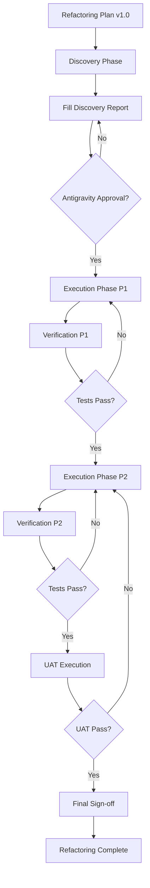

# Honda DMS - Refactoring Documentation

**Version**: 1.0  
**Last Updated**: 2026-01-28  
**Owner**: Antigravity (Refactoring Design Authority)

---

## 📚 Overview

Thư mục này chứa toàn bộ tài liệu refactoring cho Honda DMS project.

**Refactoring Principles**:
- ✅ Cải thiện cấu trúc code
- ✅ Tăng khả năng bảo trì
- ❌ KHÔNG thay đổi business logic
- ❌ KHÔNG thay đổi API contracts
- ❌ KHÔNG thay đổi DB schema

---

## 📁 Documents

### 1. Refactoring Plan
**File**: [`refactoring_plan_v1.0.md`](./refactoring_plan_v1.0.md)

**Purpose**: Master plan cho refactoring project

**Contents**:
- Overview & principles
- 2-phase approach (Discovery + Execution)
- Scope & non-goals
- Risk assessment
- Acceptance criteria
- Verification strategy
- UAT mini pack
- Timeline & milestones

**Status**: ✅ APPROVED for Discovery phase

---

### 2. Refactoring Checklist
**File**: [`refactoring_checklist_v1.0.md`](./refactoring_checklist_v1.0.md)

**Purpose**: Atomic task list cho OpenCode execution

**Contents**:
- Phase 1: Discovery tasks
- Phase 2: Execution tasks (P1 & P2)
- Phase 3: Verification tasks
- Sign-off checklist

**Status**: 📋 READY for execution

---

### 3. Discovery Report
**File**: [`refactoring_discovery_report_v1.0.md`](./refactoring_discovery_report_v1.0.md)

**Purpose**: Code analysis results và prioritized refactoring items

**Contents**:
- Scan results summary
- Detailed findings (file size, complexity, types, duplication, errors)
- Top 20 refactoring items
- Recommended execution plan
- Metrics & baselines

**Status**: 📝 TEMPLATE (to be filled by OpenCode after scan)

---

### 4. Change Log
**File**: [`refactoring_change_log.md`](./refactoring_change_log.md)

**Purpose**: Version history và change tracking

**Contents**:
- Version history
- Change request process
- Approval matrix
- Related documents

**Status**: ✅ ACTIVE

---

## 🚀 Quick Start

### For OpenCode (Implementation)

**Step 1: Discovery Phase**
```bash
# 1. Review refactoring plan
cat docs/technical/refactoring/refactoring_plan_v1.0.md

# 2. Run code scans
npm run analyze:code

# 3. Fill discovery report
# Edit: refactoring_discovery_report_v1.0.md

# 4. Get approval from Antigravity
```

**Step 2: Execution Phase**
```bash
# 1. Review checklist
cat docs/technical/refactoring/refactoring_checklist_v1.0.md

# 2. Execute P1 tasks (Week 1)
# Follow checklist items P1-001 to P1-005

# 3. Execute P2 tasks (Week 2)
# Follow checklist items P2-001 to P2-004

# 4. Verify
npm run test
npm run test:integration
npm run test:e2e
```

**Step 3: Sign-off**
```bash
# 1. Complete verification checklist
# 2. Execute UAT
# 3. Update change log
# 4. Get approval
```

---

### For Antigravity (Review)

**Review Points**:
1. ✅ Discovery Report accuracy
2. ✅ Execution plan feasibility
3. ✅ Risk assessment completeness
4. ✅ Verification coverage
5. ✅ No logic changes introduced

**Approval Process**:
1. Review Discovery Report
2. Approve/reject execution plan
3. Monitor execution progress
4. Review verification results
5. Final sign-off

---

## 📋 Workflow



---

## ✅ Acceptance Criteria

### No Logic Change Proof

**API Level**:
- ✅ Response schemas unchanged
- ✅ Status codes unchanged
- ✅ Error codes unchanged

**Database Level**:
- ✅ Query patterns unchanged
- ✅ Data writes unchanged

**UI Level**:
- ✅ User flows unchanged
- ✅ Visual behavior unchanged

**Testing**:
- ✅ All tests pass (100%)
- ✅ No new failures
- ✅ Coverage maintained

---

## 🔐 Non-Goals (LOCKED)

**Absolutely Prohibited**:
- ❌ Business logic changes
- ❌ API contract changes
- ❌ DB schema changes
- ❌ UI behavior changes

**Verification Required**:
Every change must prove "no logic change" via:
- Unit tests
- Integration tests
- API snapshots
- Manual UAT

---

## 📊 Current Status

| Phase | Status | Progress | Next Action |
|-------|--------|----------|-------------|
| Planning | ✅ COMPLETE | 100% | - |
| Discovery | ⏳ PENDING | 0% | OpenCode to execute scans |
| Execution P1 | ⏳ PENDING | 0% | Awaiting Discovery approval |
| Execution P2 | ⏳ PENDING | 0% | Awaiting P1 completion |
| Verification | ⏳ PENDING | 0% | Awaiting P2 completion |
| Sign-off | ⏳ PENDING | 0% | Awaiting verification |

---

## 📞 Contacts

**Refactoring Design Authority**: Antigravity  
**Implementation Authority**: OpenCode  
**Stakeholder**: [TBD]

---

## 📚 Related Documentation

- **Project Instructions**: `docs/instructions.md`
- **FRD**: `docs/requirements/FRD/`
- **ERD**: `docs/design/database/erd/`
- **API Spec**: `docs/design/api/`

---

**Last Updated**: 2026-01-28  
**Next Review**: After Discovery phase
